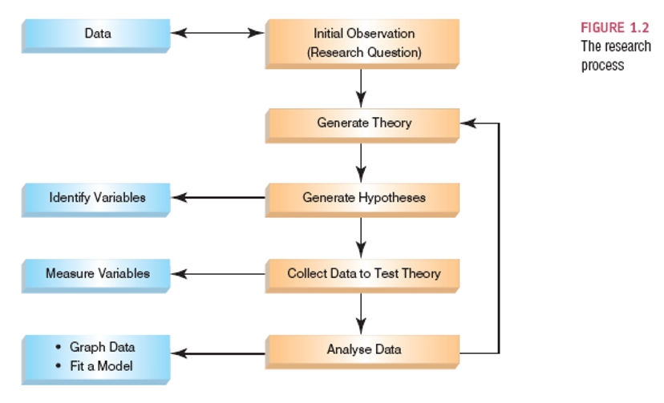
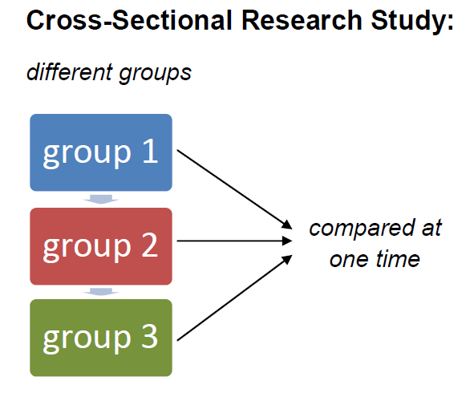

## Welcome to ANLY - 500 

- ANLY 500 will focus on the foundations of:

    - **Data Analytics,** 
    - **Research Methodology, and** 
    - **R programming Language.** 

- The first question we must ask ourselves in this course is: **What is Analytics?**
- **We should note analytics can be defined in two ways!**

## What is Analytics? - Possible Definition 1 

- The **utilization of:**

    - data,
    - information technologies *(R software, Python, SAS, etc.)*
    - statistical analysis
    - quantitative and qualitative methods, 
    - mathematical or computer based models to help decision making through improved insights. 

## What is Analytics? - Possible Definition 2 
        
- It is considered the **process of examining data to draw conclusions** about the information contained
- Which is improved/expanded with the aid of **specialized software.** 

## Scope of Analytics? 

- The focus of data analytics can be **defined under three scopes, including:**
      
    - **(1) Descriptive Analytics**
    - **(2) Predictive Analytics**
    - **(3) Prescriptive Analytics**

## What is Descriptive Analytics? (1) 

- **Definition** - the use of data to understand past and current business performance and make informed decisions. 
- We are asking **what happened?**

```{r, echo = FALSE, out.width="25%", fig.align='center'}
knitr::include_graphics("pictures/descriptive.png")
```

## An Example of what to Expect in Descriptive Analytics: Ex.1.1 

- **Dataset:** "Sunspot Trends from 1749-01-01 to 2013-09-01'"
- **Description:** Understand the Historical Trend of Sunspots from 1749 to 2013. 

    - Notice, we're accessing data. 
    - Here we use the *datasets* package available in R: 
    
```{r echo=TRUE, message=FALSE, warning=FALSE}
library(datasets) 
data("sunspot.month") # special way to load embedded data
head(sunspot.month)
```

## An Example of what to Expect in Descriptive Analytics: Ex.1.1 

- **Understand the datasets structure & data types:**

```{r}
str(sunspot.month)
```

## An Example of what to Expect in Descriptive Analytics: Ex.1.1 

- **Get Basic Stats from the dataset:**
- Here, will get some basic summary stats to better understand the data.
      
```{r}
summary(sunspot.month)
```

## An Example of what to Expect in Descriptive Analytics: Ex.1.1 

- **Visualize the trend of the dependent variable from the dataset:**
- Here, will visualize the data to better understand the sunspots historical trend from 1749 to 2013.
- In a few weeks, we will cover how to make these plots! 

```{r fig.height=3, fig.width=8, fig.align='center', message=FALSE}
library(ggplot2)
sunspot.month <- as.data.frame(sunspot.month)
sunspot.month$Time <- 1:nrow(sunspot.month)
ggplot(sunspot.month, aes(x = Time, y = x)) + 
  geom_point(alpha = 0.5) + 
  ylab("Number of Sunspots") + 
  xlab("Time") +
  theme_classic()
```

## What is Predictive Analytics? 

- **Definition** - *predict the future* by examining historical data, *detecting patterns or relationships in the data*, and then *extrapolating these relationships* forward in time. 
- We are asking **what could happen**?

```{r, echo = FALSE, out.width="50%", fig.align='center'}
knitr::include_graphics("pictures/predictive.png")
```

## What is Predictive Analytics? 

- On the next slide is a simple example of a predictive model using a simple/multiple linear regression model. 
- By the end of the course **you'll be able to build a linear model and interpret the results from this simple example.** 

## An Example of what to Expect in Predictive Analytics: Ex.2.1 

- Let's import some data from the quantmod package. 
- Provides access to both stock data, but also useful functions for stock analysis. 
- Understand the **Data Structure and Data Types**:

```{r message=FALSE, warning=FALSE}
library(quantmod)
start <- as.Date(Sys.Date()-(365*5))
end <- as.Date(Sys.Date()-2)
getSymbols("AMZN", src = "yahoo", from = start, to = end)
str(AMZN)
```

## An Example of what to Expect in Predictive Analytics: Ex.2.1 

- **Build a Model:**

```{r message=FALSE, warning=FALSE}
predictive_model <- lm(formula = AMZN.Close ~ AMZN.High + AMZN.Low + AMZN.Volume, 
                       data = AMZN[1:1199,])
summary(predictive_model)
```

## An Example of what to Expect in Predictive Analytics: Ex.2.1 
 
- **Visualize the Models Performance:**
 
```{r fig.height=4, fig.width=8, fig.align='center', message=FALSE, warning=FALSE}
par(mfrow=c(2,3))
plot(predictive_model,1)
plot(predictive_model,2)
plot(predictive_model,3)
plot(predictive_model,4)
plot(predictive_model,5)
```

## An Example of what to Expect Analytics: Ex.2.1 

- **Make a Prediction:**
     
```{r message=FALSE, warning=FALSE}
n <- length(AMZN[,1])
prediction <- stats::predict(predictive_model, AMZN[1200:n,])
tail(data.frame(prediction))
```

## An Example of what to Expect Analytics: Ex.2.1 

- **Make a Prediction:** 

```{r fig.height=4, fig.width=8, fig.align='center', message=FALSE, warning=FALSE}
plot(prediction, type = "l")
```

## What is Prescriptive Analytics? 

- **Definition** - identify the best alternatives to minimize or maximize some objective. 
- We are asking **what should we do**?
- Optimization is a recommendation!

```{r, echo = FALSE, out.width="25%", fig.align='center'}
knitr::include_graphics("pictures/prescriptive.png")
```

## What does this translate into? 

- **Analytics** is the **discovery, interpretation and communication** of meaningful patterns or summary of data using data analytics. 

    - Note that **Analytics is a mindset** and **Data Analytics is a process**.
    - So conducting **analytical research is based on a way of thinking and acting on data.**

- Now we should be asking the question: **What is Data Analytics?**
     
## What is Data Analytics? 

- It is the **process of examining data sets** in order to **draw conclusions** about the information it contains. 
- The question we should be asking now, is: **How to perform data analytics?**

## A Subcomponent of Data Analytics is Data Analysis! 

- Data Analytics **is a broad term** that includes **data analysis as a necessary subcomponent**.
- In other words analytics defines the science behind analysis. 

## A Subcomponent of Data Analytics is Data Analysis! 
  
- High level analysis techniques commonly used in data analytics include:

    -  **Exploratory Data Analysis (EDA):** which aims to find patterns and relationships in data.
    -  **Confirmatory Data Analysis (CDA):** which applies statistical techniques to determine  whether hypotheses about a data set are true or false.

- **However**, two other types of analysis may be considered.
          
## Other Types of Analysis 
       
- **Quantitative data analysis:** involves analysis of numerical data with quantifiable variables that can be compared or measured statistically. 
  
    - Testing theories using numbers.
                
- **Qualitative data analysis:** it is more interpretive. It focuses on understanding the content of non-numerical data like text, images, audio and video, including common phrases, themes and points of view. 

    - Testing theories using language. 

## How to Correctly Apply Data Analytics? 
     
- The **Research Process** should be used to conduct either quantitative or qualitative data analysis:
        
```{r, echo = FALSE, out.width="50%", fig.align='center'}

```

## Breaking Down the Research Process - The Initial Observation 

- **Find something that needs explaining.**

```{r, echo = FALSE, out.width="75%", fig.align='center'}
knitr::include_graphics("pictures/initial_obs.png")
```

## Breaking Down the Research Process - The Initial Observation 

- In other words, **formulate a question that needs to be answered.** 

    - Observe the real world
    - Read other research
    - Ask others about the problem
    
## Breaking Down the Research Process - The Initial Observation 
         
- **Test the concept:**

    - **Collect data** to see whether your hunch is correct.
    - To do this you need to define **variables**.
    - **Variables** are anything that can be measured and can differ across entities or time.

## Breaking Down the Research Process - Generating Theories 

- **Theory:**

    - **Definition** - A hypothesized general principle or set of principles that explains known findings about a topic and from which new hypotheses can be generated.
    
```{r, echo = FALSE, out.width="90%", fig.align='center'}
knitr::include_graphics("pictures/cartoon_theory.png")
```

## Breaking Down the Research Process - Creating a Hypothesis 

- **Hypothesis:**

    - **Definition** - A prediction from a theory.
    - Should be clear and understandable
    - Should be testable
    - Should be measurable

## Breaking Down the Research Process - Testing Theories & Hypotheses  

- **Falsification:**

    - **Definition** - The act of disproving a theory or hypothesis.
    
```{r, echo = FALSE, out.width="65%", fig.align='center'}
knitr::include_graphics("pictures/kp_false.png")
```

## Breaking Down the Research Process - Identifying the Variables 

- **Independent Variable:**
          
    - The proposed cause
    - A predictor variable
    - A manipulated variable (in experiments)
                 
- **Dependent Variable:**
          
    - The proposed effect
    - An outcome variable
    - Measured not manipulated (in experiments)

## What's After the Question & Identifying Variables? 

- An important element of analyzing the data is the different **levels of measurement** to consider. 
- Note we should be asking ourselves a question: **What exactly is data?**
                
## What is Data? 

- **Data** is a set of values/measurements of quantitative or qualitative variables. 

    - It is information in a raw or unstructured form. 
    - It can consist of fact, figure, characters, symbols, etc.

## Types of Measurements 

- In a dataset, we can **distinguish two types of variables:**

    - **(1) Categorical and,**
    - **(2) Continuous.**

## Categorical Variables 
       
- **Definition** - entities that are divided into distinct categories.
- **Includes the following:**
 
     - Binary variables
     - Nominal variables
     - Ordinal variables
                    
- **R stores categorical variables as a factor or character.** 
- Factors are the variables in R which take on a limited number of different values.

## Categorical Levels of Measurement - Binary 

- **Definition** - a binary variable is **only two categories.** 

    - Dead or alive
    - On or off

## Categorical Levels of Measurement - Nominal 

- **Definition** - A nominal variable is **more than two categories.**

  - Whether someone is an *Assistant, Associate, or Full Professor.*

## Categorical Levels of Measurement - Ordinal 

- **Definition** - A ordinal variable is the same as a nominal, but **the categories have a logical order.** 

    - Whether people got a fail, a pass, a merit or a distinction in their exam.
    - If you classify economic status, with three categories (low, medium and high).
               
- In addition to being able to classify values into categories, you can order the categories: first, second, third

## Continuous Variables 
    
- **Definition** - entities get a **distinct score.**
- Includes the following:
        
    - Interval variables
    - Ratio variables

## Continuous Levels of Measurement - Interval 

- **Definition** - A interval variable is **equal intervals on the variable.** It represents equal differences in the property being measured. This variable also does not have a true zero. 

    - i.e. The difference between 6 and 8 is equivalent to the difference between 13 and 15.
    - i.e. Temperature of zero does not represent an lack of temperature
    
## Continuous Levels of Measurement - Ratio 

- **Definition** - A ratio variable is the same as an interval variable, but the **ratios of scores on the scale must also make sense.** This variable does have a true zero. 

    - i.e. A score of 16 on an anxiety scale means that the person is, in reality, twice as anxious as someone scoring 8.

## Consider Measurement Error: 

- The accuracy of the measurements are key to your solutions.
- **Measurement Error:** - aka observational error
    
    - **Definition** -  The discrepancy between the actual value we're trying to measure, and the number we use to represent that value.
    
        - i.e. You (in reality) weigh 80 kg.
        - i.e. You stand on your bathroom scales and  they say 83 kg.
        - i.e. The measurement error is 3 kg.

## How Valid Are My Measures? 

- **Validity:** 
    
    - **Definition** - Whether an instrument measures what it set out to measure.

- Including the following: 

    - **Content validity** - Evidence that the content of a test corresponds to the content of the construct it was designed to cover.
    - **Ecological validity** - Evidence that the study, experiment or test can be applied, and allow inferences, to real-world conditions.

## Are My Measures Reliable? 

- **Reliability:** 

    - **Definition** - The ability of the measure to produce the same results under the same conditions.
               
- **Test-Retest Reliability:**
 
    - **Definition** - The ability of a measure to produce consistent results when the same entities are tested at two different points in time.

## Breaking Down the Research Process - Collecting the Data 

- To use measures in any research and test them we must now understand the following: **How to Measure?**
                         
- It is different for certain types of research, including:
      
    - Cross-sectional research 
    - Longitudinal research
    - Correlational research 
    - Experimental research
    

## Cross-Sectional Research 

- **Definition** - This term implies that data come from people at different age points, with different people representing each age point. 
            
```{r, echo = FALSE, out.width="40%", fig.align='center'}

```
    
## Longitudinal Research

- **Definition**: Research wherein the sample people are tested at different time points over their lives. 
            
## Correlational Research 

- **Definition** - Observing what naturally goes on in the world without directly interfering with it.
- Careful not to mix correlational research with correlation as a statistical analysis

## Experimental Research 

- **Definition** - One or more variables is **systematically manipulated to see their effect (alone or in combination) on an outcome variable.**

    - Statements can be made about cause and effect.

## Experimental Research - Methods 

- **Cause and Effect (Hume, 1748)** 

    - 1. Cause and effect must occur close together in time (contiguity). 
    - 2. The cause must occur before an effect does.
    - 3. The effect should never occur without the presence of the cause.

## Experimental Research - Methods 

- **Confounding variables: the 'Tertium Quid'**
    
    - A variable *(that we may or may not have measured)* other than the predictor variables that potentially affects an outcome variable.
    - The relationship between ice cream sales and accidental drowning is confounded by the weather.

## Experimental Research - Methods 

- **Ruling out confounds (Mill, 1865) **

    - An effect should be present when the cause is present and that when the cause is absent the effect should be absent also.
    - Control conditions: the cause is absent.
        
## Breaking Down the Research Process - Methods to Collect the Data  

- Considering the **what & how to measure**, we must now look at the **methods of data collection.** 
- **For instance:**

    - **Between-group/between-subject/independent**
       
        - Different entities in experimental conditions

    - **Repeated-measures (within-subject)**

        - The same entities take part in all experimental conditions.
        - Economical
        - Practice effects
        - Fatigue
           
## Types of Variation in the Data to Consider: 

- **Systematic Variation **

    - **Definition** - Differences in performance created by a specific experimental manipulation.
                
- **Unsystematic Variation **

    - **Definition** - Differences in performance created by unknown factors 
                  
- **Randomization **

    - **Definition** - random selection or assignment equalizes unsystematic variation in the study. 
        
## Breaking Down the Research Process - Analyzing the Data 

- The final piece to the research process is to analyze the data, which **consists of graphing and fitting the data to a model.** 
- However, to properly analyze the data you need to consider some conditions. 

## Population vs Sample 

- First, **populations and samples should be understood** so that your analysis is not misleading when interpreting results. 
    
- **Population **

    - **Definition** - the collection of units (be they people, plankton, plants, cities, suicidal authors, etc.) to which we want to generalize a set of findings or a statistical model.
                 
- **Sample ** 

    - **Definition** - A smaller (but hopefully representative) collection of units from a population used to determine truths about that population.
    
## Fitting Models 

- A **simple statistical model** can be used to analyze data. 

    - We use a statistical model to represent what is happening in the real world.
            
- **For instance,** the mean is a hypothetical value. 
    
    - It doesn't have to be a value that actually exists in the data set.
    - As such, the mean is simple statistical model.

## Fitting Models 
          
- **For Example:** The average sepal length of a flower in the iris dataset reflects such a value. 

```{r}
tapply(iris$Sepal.Length, iris$Species, mean)
```
          
## Statistical Modeling Parameters 

- **Parameters of population statistics and sample statistics.** 
- Numbers estimated from the **entire dataset is a representation of the population.**
     - The numbers estimated from a **single test/study/experiment are considered a sample.**
     
    - Parameters = Greek Symbols 
    - Statistics = Latin Letters
     
## Statistical Modeling Parameters 

- **For Example:** The mean of a flowers sepal length before gave us the population, but watch it changes as we randomly sample.

```{r}
sample <- iris[sample(nrow(iris), 15), ]
tapply(sample$Sepal.Length, sample$Species, mean) #sample
tapply(iris$Sepal.Length, iris$Species, mean) #population
```

## Applicable Statistical Models 

- **To analyze the data and generate interpretable results the following statistical models can be used:**
 
    - Frequency distribution, measures of shape
    - Central tendencies, measures of distance
    - Dispersion, measures of spread
    - Going beyond the data with z-scores and association.

## Summary

- In this lecture, you have learned:
  
    - An introduction to data analytics
    - Theories and hypotheses
    - Measurement of variables
    - Types of variables
    - Types of research design 
    - Issues and considerations for data analysis
