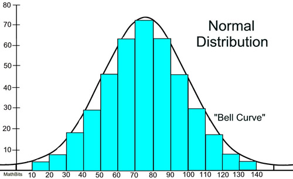
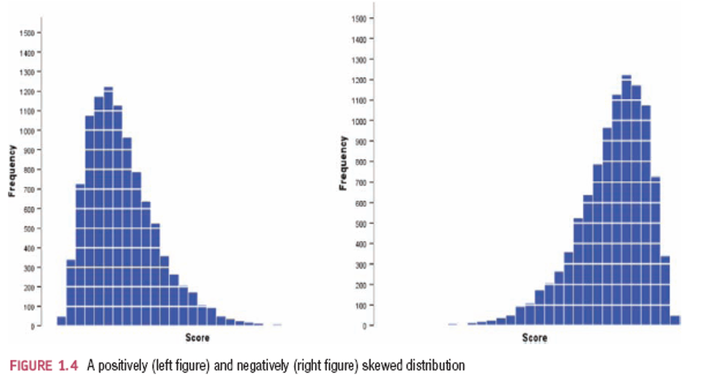
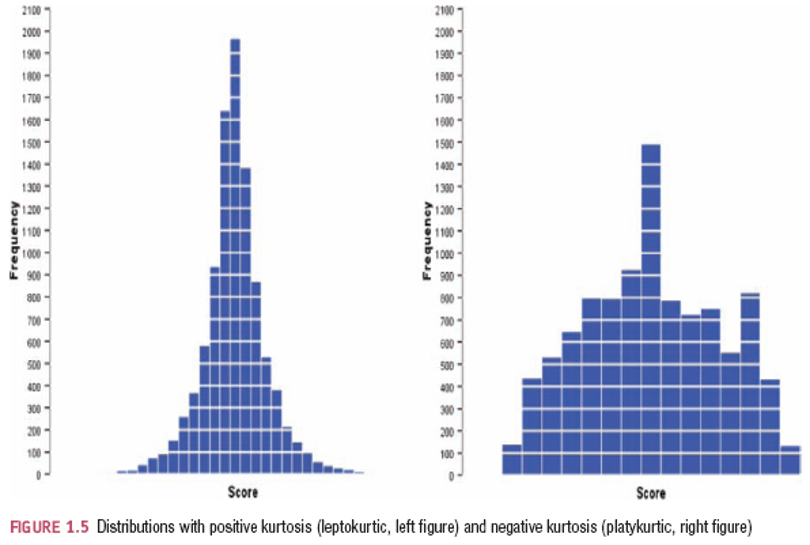
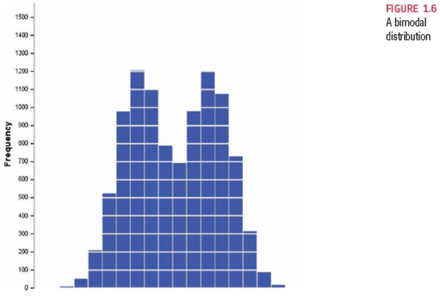
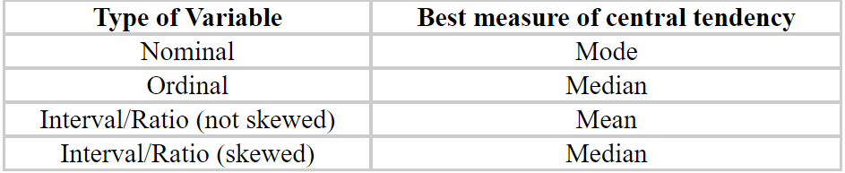
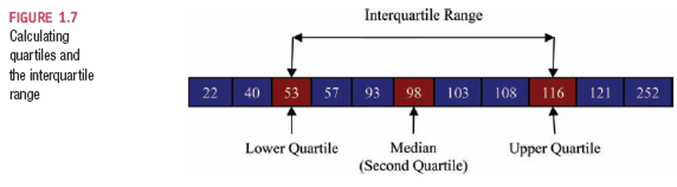

## Breaking Down the Research Process: A Review  

- **To analyze the data and generate interpretable results the following statistical models can be used:**
 
    - Frequency distribution, measures of shape
    - Central tendencies, measures of distance
    - Dispersion, measures of spread
    - Going beyond the data with z-scores and association.
          
## Frequency Distributions

- **Definition** - A graph plotting values of observations on the horizontal axis, with a bar showing how many times each value occurred in the data set.
- These are measures of shape or histograms 

## Frequency Distributions
         
- Understanding the distribution of the data can be done by looking at its shape, for instance:
              
- **The 'Normal' Distribution**

    - Bell-shaped
    - Symmetrical around the center

- **Normal Distribution Visualized**

```{r, echo = FALSE, out.width="25%", fig.align='center'}

```

## Frequency Distributions

- Frequency tables are useful to understand the distribution of data. 
- In R, you can capture a frequency table of the `quakes` dataset:

```{r echo=TRUE, message=FALSE, warning=FALSE}
library(datasets)
data("quakes")
str(quakes)
```

## Frequency Distributions: Tables

- You will learn that the **table() function** comes in quite handy to create a frequency table. 

```{r echo=TRUE, message=FALSE, warning=FALSE}
table(quakes$mag)
```

## Frequency Distributions: Plots

- Create a plot of the distribution:

```{r echo=TRUE, fig.height=3, fig.width=6, message=FALSE, warning=FALSE}
hist(quakes$mag, breaks = 24)
```

## Understanding Frequency Distributions 

- **Frequency distribution properties include** the following statistics:
 
    - **Skew** - The symmetry of the distribution.
          
        - Positive skew (scores bunched at low values with the tail pointing to high values).
        - Negative skew (scores bunched at high values with the tail pointing to low values).
                
    - **Kurtosis** - The 'heaviness' of the tails.
          
        - Leptokurtic = heavy tails.
        - Platykurtic = light tails.

## Skew Visualized 

```{r, echo = FALSE, out.width="60%", fig.align='center'}

```

## Kurtosis Visualized 

```{r, echo = FALSE, out.width="60%", fig.align='center'}

```

## Produce a Histogram 

- Now that we know these terms...what shape does our histogram have?

```{r echo=TRUE, fig.height=4, fig.width=8, message=FALSE, warning=FALSE}
hist(quakes$mag)
```

## Calculating Skewness

```{r message=FALSE}
library(moments)
skewness(quakes$mag)

library(psych)
describe(quakes$mag)
```

## Interpreting Skewness    
    
- How can you interpret the skewness number? 
- **Bulmer (1979)** - a classic - suggests this rule of thumb:
    
    - If skewness is **less than -1 or greater than +1**, the distribution is **highly skewed.**
    - If skewness is **between -1 and -0.5 or between +0.5 and +1**, the distribution is **moderately skewed.**
    - If skewness is **between -0.5 and +0.5**, the distribution is approximately **symmetric.**

## Calculating Kurtosis 

```{r}
#moments
kurtosis(quakes$mag)

#psych
describe(quakes$mag)
```

## Interpreting Kurtosis    
    
- **How can you interpret the kurtosis number?**

    - The reference standard is a **normal distribution**, which has a **kurtosis of 3.**
    - However, its common to consider the **excess kurtosis**, which is simply **kurtosis -3.** 
       
## Interpreting Excess Kurtosis       
       
- **Excess Kurtosis can be interpreted** using the following **rule of thumb:**

    - A normal distribution has kurtosis exactly 3 (excess kurtosis exactly 0, 3-3).
    - Any distribution with kurtosis 3 (excess 0) is called mesokurtic.
    - A distribution with kurtosis < 3 (excess kurtosis < 0) is called platykurtic.
    - Compared to a normal distribution, its tails are shorter and thinner, and  often its central peak is lower and broader.
    - A distribution with kurtosis > 3 (excess kurtosis > 0) is called leptokurtic. 
    - Compared to a normal distribution, its tails are longer and fatter, and often its central peak is higher and sharper.

- We will cover more on skew and kurtosis in the data screening section. 

## Central Tendency
   
- **Definition** - A measure of central tendency is a single value that attempts to describe a set of data by identifying the central position within that set of data. 
- As such, measures of central tendency are sometimes called measures of central location. 
- They are also called summary statistics.
 
```{r}
summary(quakes$mag)
```

## Other Summary Stat Functions 

- The **`pastecs`** package. 

```{r message = FALSE}
library(pastecs)
stat.desc(quakes)
```
 
## Other Summary Stat Functions 

- The **`Hmisc`** package.   

```{r message = FALSE}
library(Hmisc)
Hmisc::describe(quakes)
```

## Other Summary Stat Functions 

- The **`psych`** package.  

```{r message = FALSE}
library(psych)
psych::describe(quakes)
```

## The Mean 

- **Definition** - The sum of scores divided by the number of scores.
    
$$\bar{x} = \frac {\sum_{i=1}^{n}x_{i}} {n}$$

```{r}
mean(quakes$mag)
```

## The Median 

- **Definition** - The middle score when scores are ordered.

```{r}
median(quakes$mag)
```

## The Mode 

- **Definition** - The most frequent score

```{r message=FALSE}
getmode <- function(v) {
  uniqv <- unique(v)
  uniqv[which.max(tabulate(match(v, uniqv)))]
}

getmode(quakes$mag)
```

## More Than One Mode 

- **Bimodal**

    - Having two modes.

- **Multimodal**

    - Having several modes.

- **Example of Bimodal Distribution:**

```{r, echo = FALSE, out.width="40%", fig.align='center'}

```

## Which Measure of Central Tendency & When 
   
- Please use the following summary table to know what the best measure of central tendency is with respect to the different types of variables.

```{r, echo = FALSE, out.width="75%", fig.align='center'}

```

## Dispersion

- **Definition** - a measure of dispersion, is used to describe the variability in a sample or population.
- Often it is used in conjunction with a measure of central tendency, such as the mean or median, to provide an overall description of a set of data.
- A measure of spread gives us an idea of how well the central tendency represents the data.

- **We will be looking at the key measures of:**

    - Range, 
    - Quartiles, 
    - Variance, and 
    - Standard deviation.

## Range 

- **Definition** - The smallest score subtracted from the largest. 
    
    - Very biased by outliers. 

- **Calculate the range using the following:**

```{r}
range(quakes$mag)
psych::describe(quakes$mag)
```

## Interquartile Range 

- **Definition** - is the difference between the first and third quartiles, Q3 - Q1. 
            
- **Quartiles Definition** - The three values that split the sorted data into four equal parts.
       
    - Lower quartile  = median of lower half of the data (25%)
    - Second quartile = median (50%)
    - Upper quartile = median of upper half of the data (75%)
    
```{r, echo = FALSE, out.width="50%", fig.align='center'}

```

## Calculating Quartiles 

```{r}
quantile(quakes$mag)
summary(quakes$mag)
```

- You can specify the percentiles using a c() function to create a vector. See as followed:

```{r}
quantile(quakes$mag, c(0.05,0.50,0.75,0.95))
```

## Variance 
      
- **Definition** - The variance is the "average" of the squared deviations from the mean.

$$SD^2 = \frac {\sum_{i=1}^{n}(x_{i} - \bar{x})^2} {n}$$

```{r message=FALSE}
var(quakes$mag)
```

## Standard Deviation 

- **Definition** - The standard deviation is the square root of the variance.

```{r}
sd(quakes$mag)
```

## Using Standardized Values 

- **Definition** - A standardized value, commonly called a *z*-score, provides  a relative measure of the distance an observation is from the  mean, which is independent of the units of measurement.

$$Z = \frac{(x_{i} - \bar{x})} {SD}$$

- The z-score for the $i^{th}$ observation in a data set is calculated as follows:
            
```{r message = FALSE}
quakes$zscore <- scale(quakes$mag)
head(quakes$zscore)
str(quakes$zscore)
mean(quakes$mag)
sd(quakes$mag)
```

## Z-score properties 

- The numerator represents the distance that $x_i$ is from the sample mean.
- By dividing by the standard deviation, $SD$, we scale the distance from the mean to express it in units of standard deviations.

    - A negative value indicates that $x_i$ lies below the mean.
    - A positive value indicates that it lies above the mean.
  
## Z-score properties 

- **Properties:**

    - 1.96 cuts off the top 2.5% of the distribution.
    - (-)1.96 cuts off the bottom 2.5% of the distribution.
    - As such, 95% of z-scores lie between (-)1.96 and 1.96.
    - 99% of z-scores lie between (-)2.58 and 2.58.
    - 99.9% of them lie between (-)3.29 and 3.29. 

## Measures of Association

- Two variables have a strong statistical relationship with one another if they appear to move together.
- When two variables appear to be related, you might suspect a cause-and-effect relationship.
- Sometimes, however, statistical relationships exist even though a change in one variable is not caused  by a change in the other.
      
## Covariance 
    
- **Definition** is a measure of the linear association between two  variables, $X$ and $Y$.
- The covariance between X and Y is the average of the product of the deviations of each pair of observations from their respective means.
- This formula is for the population covariance (use *N-1* for sample covariance):

$$cov_{x,y} = \frac {\sum_{i=1}^{n}(x_{i} - \bar{x})(y_{i} - \bar{y})} {n}$$
    
```{r}
cov(quakes$mag, quakes$depth)
```

## Correlation 

- **Definition** - is a measure of the linear relationship between two  variables, $X$ and $Y$, which does not depend on the units of measurement. - Correlation is measured by the correlation coefficient, also known as the Pearson product moment correlation coefficient.
      
```{r message=FALSE, warning=FALSE}
cor(quakes$mag, quakes$depth)
```

## Correlation 

- Correlation can easily be visualized and help reveal patterns in the data. 

```{r echo=TRUE, fig.height=4, fig.width=8, message=FALSE, warning=FALSE}
library(corrplot)
corrplot(cor(quakes), order = "hclust")
```

## Summary

- In this section, you learned about:

  - Frequency Distributions: helping us understand shape: skew, kurtosis
  - Central tendency: mean, median, mode
  - Dispersion: spread of the data, variance, standard deviation, and z-scores
  - Association: covariance and correlation 
