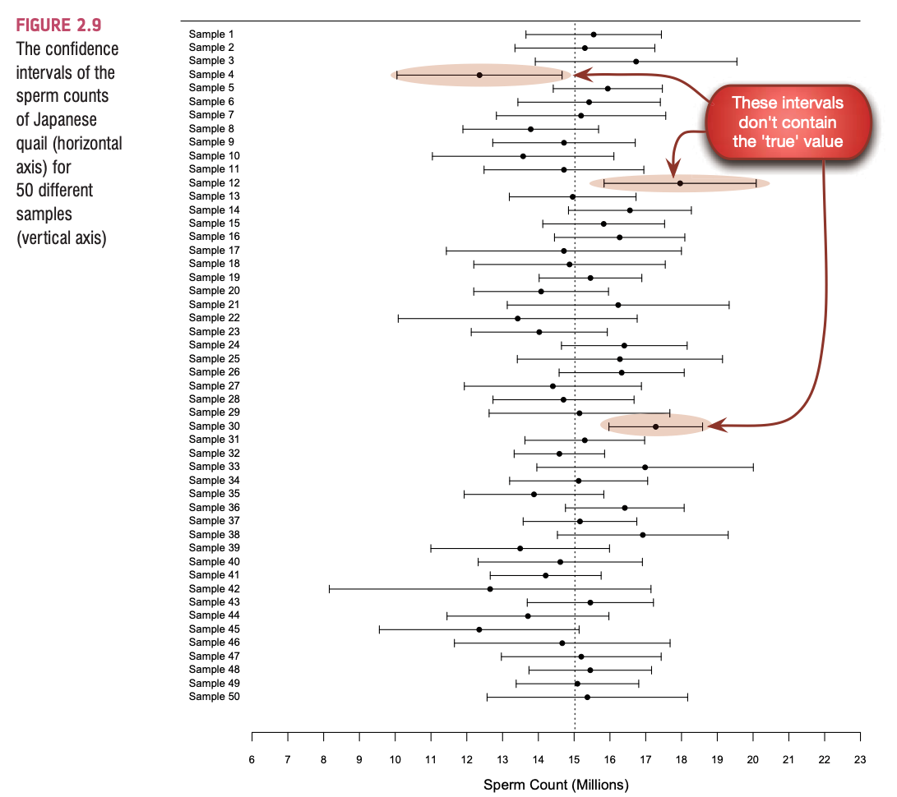
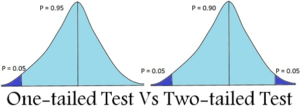

## All of Statistics

- The Only Equation You Will Ever Need!
- We fit models to our data, but we need to know how much error is associated.
- Often this process is called measuring fit - as the error should be small to conclude an accurate fit of the model to the data. 

$$Outcome_i = (Model) + error_i$$

## Measuring Fit 

- Measuring the fit of your statistical model lets us know how well it represents reality. 
- No statistical model is a perfect representation. 
- For instance, mean is a model of what happens in the real world as the "typical score".
- First, let's look at how to calculate multiple models at once with the `apply` family. 

## Utilizing the Power of the 'apply()' Functions 

- **apply()**

    - Arguments = apply(X, MARGIN, FUN)
    - Objective = Apply a function to the rows (1) or columns (2)
    - Input = Data frame or matrix
    - Output = vector, list, array
    
```{r}
options(scipen = 20)
#dataset, rows/columns, function 
round(apply(quakes, 2, mean), 2)
```

## Utilizing the Power of the 'lapply' Functions 

- **lapply()**

    - Arguments = lapply(X, FUN)
    - Objective = Apply a function to all the elements of the input
    - Input = List, vector or data frame
    - Output = list
    
- **For Example:**

```{r}
lapply(quakes, mean)
```

## Utilizing the Power of the 'sapply' Functions 

- **sapply()**
   
     - Arguments = sappy(X, FUN)
     - Objective = Apply a function to all the elements of the input.
     - Input = List, vector or data frame
     - Output = vector or matrix

```{r}
round(sapply(quakes, mean),2)
```

## Utilizing the Power of the 'tapply' Functions 

- **tapply()**

    - Arguments = tapply(X, INDEX, FUN = NULL)
    - Objective = It computes a measure (mean, median, min, max, etc..) or a function for each factor variable in a vector.
    - Input = List, vector or data frame

- **For Example:**

```{r}
tapply(quakes$mag, #dependent variable
       list(quakes$stations), #independent variable(s)
       mean) #function
```

## Measuring Fit  

- If we use the mean as our model, we may measure "fit" or error to the model by seeing how much scores vary around that mean. 
- We can start by thinking about raw deviations:

    - **Definition** - a deviation is the difference between the mean and an actual data point.
    - They can be calculated by taking each score and subtracting the mean from it
    $$ deviance = outcome_i - model_i $$

## Sum of Squared Errors 

- We could then add the deviations to find out the total error.
- Deviations cancel out because they are centered around the mean: thus, they always have positive and negative values that sum to zero. 
- Simple solution: **square each deviation**. 
- If we **add these squared deviations** we get the **Sum of Squared Errors (SS).**
- This equation is the numerator in our variance formula:

$$SD^2 = \frac {\sum_{i=1}^{n}(x_{i} - \bar{x})^2} {n}$$

## Mean Squared Error 

- Although the SS is a good measure of the accuracy of our model, it depends on the amount of data collected. 
    - To overcome this problem, we use:

$$ MSE = \frac {SS} {df} = \frac {\sum_{i=1}^{n}(outcome_i-model_i)^2} {N-1} $$

- This formula should look familiar - mean squared error is a different name for the variance.
- However, one critical difference:
  - For populations, when you know everyone: we use sample size on the denominator (N)
  - For samples, we use an adjusted value to account for our sampling error, (N-1), which is called degrees of freedom

## Calculating Degrees of Freedom 

- **Definition** - is the number of values in the final calculation of a statistic that are free to vary.
- Generally, this value is related to the number of independent variables in an analysis, because you need to keep at least **one** value constant to be able to set the mean for that variable. 
- We use degrees of freedom to help us account for our use of samples 

## Calculating Errors - Summary 

- Interpreting SD as a measure of model fit:
  
    - **Large values indicate poor model fit** - the mean is a poor representation because there is a lot of variability
    - **Small values indicate better model fit** - the mean is very close to the rest of the scores 
    - Remember that SD is based on the scale of the variable.
    - So always think about how much the scale can vary to see if you are estimating it well! (so we use SD, rather than variance because the scale is interpretable)

## The Standard Error 

- **Standard Deviation** tells us how well the mean represents the sample data.
- But, if we want to estimate this parameter in the population, then we need to take multiple samples.

```{r, echo = FALSE, out.width="50%", fig.align='center'}
knitr::include_graphics("pictures/standard_error.png")
```

## Standard Error Applied 

- The previous slides describe the concept of a sampling distribution.
- In real life, we may not actually run multiple samples. 
- Smart people have shown with Monte Carlos how these things work, which lead to the **Central Limit Theorem** and the **Law of Large Numbers**

    - As sample size increases, the distribution of sample means will approximate a normal distribution.
    - As the sample size increases, the sample mean will aproximate the population mean. 
    
## Standard Error Applied 
    
- Therefore, we can say that the mean approximates $\mu$ (the population mean) with large samples.
- However, the sampling distribution has a different dispersion than the sample distribution ... so we can estimate the standard deviation of the sample distribution (standard error) by dividing by the square root of N from our one sample. 
- The SD and the SE will tell you the same thing about model fit. 

```{r}
psych::describe(quakes$mag)
```

## Confidence Intervals 

- **Definition** - a confidence interval is a range of values between which the value of the population parameter is believed to be, along with a probability that the interval correctly estimates the true (unknown) population parameter.

    - This probability is called the *level of confidence*, denoted by 1 - $\alpha$, where $\alpha$ is a number between 0 and 1. 
    - The level of confidence is usually *expressed as a percent: common values are 90%, 95%, or 99%.*
    
```{r, echo = FALSE, out.width="50%", fig.align='center'}

```

## Confidence Intervals for Z-scores 

- We've already talked about how +/- 1.96 and +/- 2.58 are the Z-score cut offs for 95% and 99%.

    - We want to create an interval around the mean. But we want it to be in real units, not Z-scores.
    - Upper limit: Mean + Z-score cut off (SE)
    - Lower limit: Mean - Z-score cut off (SE)
    - Why use SE? Because these should approximate the population parameter, which we denoted was based on standard error. 
       
## Calculating Confidence Intervals 
       
- We use our z-score properties to to set the confidence we seek to express. 

```{r echo=TRUE, message=FALSE, warning=FALSE}
M <- apply(quakes, 2, mean)
SE <- apply(quakes, 2, function(x){ sd(x)/sqrt(length(x)) })
M + 1.96*SE # 95% confidence interval
M
M - 1.96*SE
```

## Testing Hypotheses - (NHST) 

- **The Null Hypothesis Significance Testing** involves drawing inferences about two contrasting propositions *(each called a hypothesis)* relating to the value of one or more population parameters.

    - H0:  Null hypothesis: describes an existing theory
    - H1:  Alternative hypothesis: the complement of H0 

- Using sample data, we either:
    
    - Reject H0 and conclude the sample data provides sufficient evidence to support H1 (significant).
    - Fail to reject H0 and conclude the sample data does not support H1 (not significant).

- Notice, we do not accept the null or accept the research!

## Interpreting NHST 

- Does performing an NHST tells us:

    - **The importance of an effect?**

         - No, importance and significance are not equal. 

    - **That the null hypothesis is false?**

         -  No, it is very unlikely.

    - **That the null hypothesis is true?**
  
         - No, it is never true, just likely.

- Another problem with NHST is that it encourages all or nothing thinking.
    
## Test Statistics 

- A Statistic for which the frequency of particular values is known.
- These are values like *t*, *F*: we know the values of these that:
  - Represent bigger than expected signal to noise (significant)
  - Represent small/smaller than expected signal to noise (non-significant)

$$Test Stat = \frac {signal}{noise} = \frac {model variance}{model error} = \frac {effect} {error}$$

## Types of Tests 

- One- and Two-Tailed Tests

```{r, echo = FALSE, out.width="50%", fig.align='center'}

```

## The Potential Errors 

- **Hypothesis testing** can result in one of four different outcomes: 

    1. H0 is true and the test correctly fails to reject H0
    2. H0 is false and the test correctly rejects H0
    3. H0 is true and the test incorrectly rejects H0 (called Type I error)
    4. H0 is false and the test incorrectly fails to reject H0 (called Type II error)
    
```{r, echo = FALSE, out.width="75%", fig.align='center'}
knitr::include_graphics("pictures/hypo_error_chart.png")
```

## Type I Errors 

- The probability of making a Type I error = $\alpha$ = P(rejecting H0 | H0 is true) 
- Occurs when we believe that there is a genuine effect in our population, when in fact there isn't.

## Type II Errors 

- The probability of making a Type II error = $\beta$ = P(not rejecting H0 | H0 is false)
-  Occurs when we believe that there is no effect in the population when, in reality, there is.

## Power 

- The probability of finding an effect that exists in our population = P(rejecting H0 | H0 is false)
- The probability is usually $1- \beta$ - however, we often use power to determine the appropriate sample size to create power = .80. 

## How do we control for these errors?

- **Use corrections**

    - Family wise, or other known as family-wise error rate is the probability of making one or more false discoveries, or type I errors when performing hypotheses tests. 
      
    - Experiment wise, or experiment-wise error rate is the proportion of experiments in which one or more Type I errors occur. 

- **Example corrections**

     - Bonferroni, Sidak-Bonferroni, Tukey, Scheffe, and more!

## Power of the Test 

- **Power is influenced by:**

    - Effect size,

         - SD
         - Mean differences

    - Alpha

    - Type of test

    - Sample size

## Effect Sizes 

- **Definition** - an effect size is a standardized measure of the size of an effect:

    - Standardized = comparable across studies.
    - Not (as) reliant on the sample size.
    - Allows people to objectively evaluate the size of observed effect.
  
## Effect Size Measures 

- There are **several effect size measures** that can be used:

    - Cohen's $d$
    - Pearson's $r$
    - Glass' $\Delta$
    - Hedges' $g$
    - $R^2$, etc.
    - Odds Ratio/Risk rates

## Effect Size Measures

- **r = .1, d = .2 (small effect):**

    - the effect explains 1% of the total variance.

- **r = .3, d = .5 (medium effect):**

    - the effect accounts for 9% of the total variance.

- **r = .5, d = .8 (large effect):**

    - the effect accounts for 25% of the variance.

- **Beware of these 'canned' effect sizes though:**

    - the size of effect should be placed within the research context.

## Example of an Effect Size  

```{r message = FALSE}
library(MOTE)
M <- tapply(quakes$mag, quakes$stations, mean)
STDEV <- tapply(quakes$mag, quakes$stations, sd)
N <- tapply(quakes$mag, quakes$stations, length)

head(M)

#compare station 10 to 11
effect <- d.ind.t(M[1], M[2],
        STDEV[1], STDEV[2],
        N[1], N[2], a = .05)
effect$d
```
    
## Summary

In this section, you've learned about:
  
  - Model Fit
  - Standard error and degrees of freedom
  - Confidence intervals
  - Null hypothesis testing
  - Power, Type I and II errors
  - Effect sizes 
