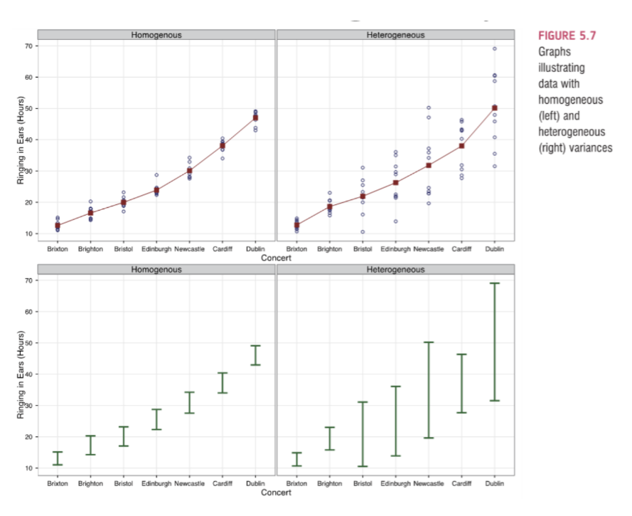
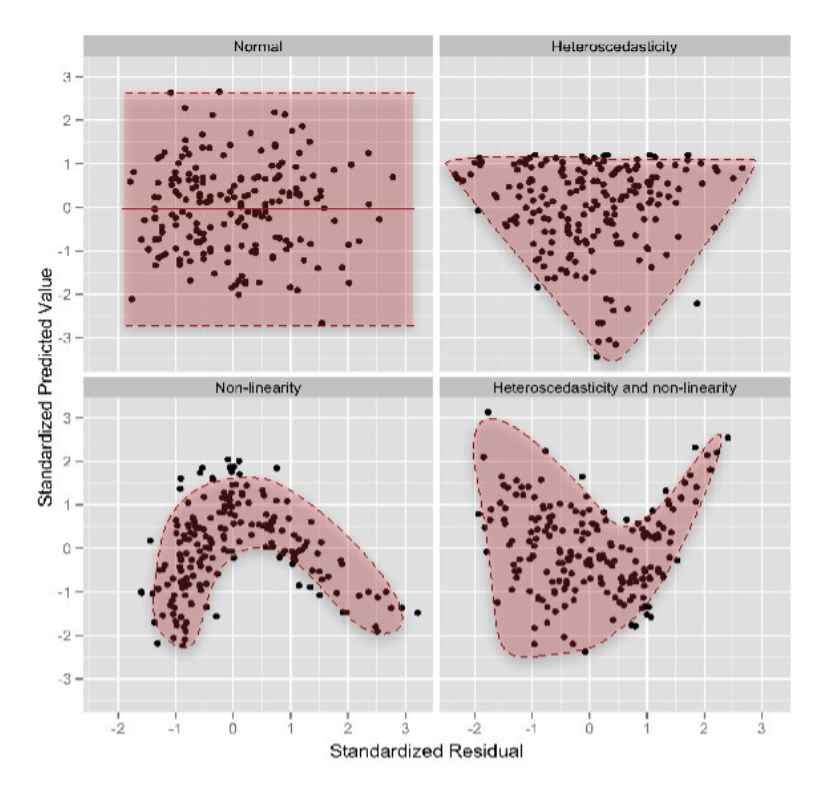

## Data Screening: Next Steps

- In the last lecture, we discussed:

    - Accuracy
    - Missing data
    - Outliers

- What else should we consider for checking our data? 

## Data Screening: Assumptions

- For parametric statistics, we should think about:

    - Independence
    - Additivity
    - Linearity
    - Normality 
    - Homogeneity (Sphericity), Homoscedasticity
    
## Data Screening: Assumptions

- The procedure:

    - We will use a 'fake' regression to help us analyze these assumptions.
    - It's 'fake' because it's not part of a real analysis, but just a way to calculate the numbers we need for assessment. 
    - When we run regression as a statistical analysis, we can use the real regression in the same way as described below. 

## Assumptions: Independence

- **Definition**: the errors in the model should not be related to each other. 
- If you do not have independence, confidence intervals and significance tests will be invalid.
- Independence is often a matter of the research design. 

## Assumptions: Additivity

- If you have several variables then their combined effect is best described by adding their effects together.
- If two variables are not additive, this implies that the variables are too related, which reduces power.

    - Why use the same variable twice? 
    - The "good" thing is called additivity, the violation or "bad" thing is called multicollinearity or singularity. 
    - Multicollinearity = r > .90
    - Singularity = r > .95

- This analysis is necessary when you have multiple continuous variables. If you only have one dependent variable, then you cannot run this check. 

## Assumptions: Additivity

- You can check this assumption by checking the correlation between the variables.
- If they are too high, you can combine the problematic ones or just one of them. 
- Note: we are starting with the same analysis as the last lecture, at the point we ended with. 

```{r echo = FALSE, message = FALSE, warning = FALSE}
library(rio)
master <- import("data/data_screening.csv")
notypos <- master #update the dataset with each step 
notypos$Sex <- factor(notypos$Sex, 
                     levels = c(1,2), #no 3
                     labels = c("Women", "Men"))
notypos$SES <- factor(notypos$SES, 
                     levels = c(1,2, 3),
                     labels = c("Low", "Medium", "High"))
notypos$Grade[ notypos$Grade > 15 ] <- NA
notypos[ , 6:19][ notypos[ , 6:19] > 7 ] <- NA
percentmiss <- function(x){ sum(is.na(x))/length(x) * 100 }
missing <- apply(notypos, 1, percentmiss)
replace_rows <- subset(notypos, missing <= 5) #5%
noreplace_rows <- subset(notypos, missing > 5)
replace_columns <- replace_rows[ , -c(1,2,4)]
noreplace_columns <- replace_rows[ , c(1,2,4)] #notice these are both replace_rows
library(mice)
temp_no_miss <- mice(replace_columns)
nomiss <- complete(temp_no_miss, 1) #pick a dataset 1-5 
all_columns <- cbind(noreplace_columns, nomiss)
all_rows <- rbind(noreplace_rows, all_columns)
mahal <- mahalanobis(all_columns[ , -c(1,4)],
                    colMeans(all_columns[ , -c(1,4)], na.rm=TRUE),
                    cov(all_columns[ , -c(1,4)], use ="pairwise.complete.obs"))
cutoff <- qchisq(1-.001, ncol(all_columns[ , -c(1,4)]))
noout <- subset(all_columns, mahal < cutoff)
```

```{r echo=TRUE, message=FALSE, warning=FALSE}
str(noout)
cor(noout[ , -c(1,4)])
```

## Assumptions: Additivity

```{r echo=TRUE, message=FALSE, warning=FALSE}
library(corrplot)
corrplot(cor(noout[ , -c(1,4)]))
```

## Assumptions: Linearity

- Assumption that the relationship between variables is linear and not **curved**.
- Most parametric statistics have this assumption including ANOVA, regression, etc.
- Linearity includes both univariate (every variable with every other variable) and multivariate (all the linear combinations together). 
- Generally, checking for multivariate linearity can allow you to assess.
- However, if this analysis appears like the assumption is not met, you can check each pairwise combination separately. 

## Assumptions: Fake Regression

- At this point, we will create and use our fake regression. 
- For many of the statistical tests you would run, there are diagnostic plots / assumptions built into them. 
- This guide lets you apply data screening to any analysis, if you wanted to learn one set of rules, rather than one for each analysis.
- But there are still things that only apply to ANOVA that you'd want to add when you run ANOVA. We will learn these in each analysis section. 

## Assumptions: Fake Regression

- For the fake regression, we will first create a fake regression. 
- As a reminder, we talked about using chi-square for Mahalanobis distance as our cut off score. 
- In a similar fashion, we will use chi-square because the errors should be chi-square distributed (lots of small errors, only a few big ones). 
- However, the standardized errors should be normally distributed around zero (because they have been standardized!). 

## Assumptions: Fake Regression

```{r}
random <- rchisq(nrow(noout), 7) #why 7? It works, any number bigger than 2
fake <- lm(random ~ ., #Y is predicted by all variables in the data
           data = noout) #You can use categorical variables now!
standardized <- rstudent(fake)
fitvalues <- scale(fake$fitted.values)
```

## Assumptions: Linearity

- With this setup, we can use a couple options to get a QQ plot (sometimes you'll see PP plots, same idea).

```{r}
{qqnorm(standardized)
abline(0,1)}

plot(fake, 2)
```

## Assumptions: Linearity

- What are the dots on these plots?
- Regression is a model that we've discussed: $Outcome_i = (bX_i) + error_i$
- We are predicting the outcome of a random variable, so the errors **should** be randomly distributed - lots of small numbers that are centered around zero. 
- We standardized the errors to help us interpret them by having a scale to compare to. 
- Each dot represents a person's standardized residual plotted against the theoretical residual for that area of the standardized distribution. 
- What should I look for? Remember how most of data is between -2 and 2 in a standardized distribution, so we want the dots to line up on the line between -2 and 2 especially. 
- Outside that range can be very hard to predict, so we check it, but less concerned if it curves away from the line. 

## Assumptions: Linearity

```{r}
{qqnorm(standardized)
abline(0,1)}
```

## Assumptions: Normality 

- This assumption tends to get incorrectly translated as *your data need to be normally distributed.*
- The actual assumption is that the **sampling distribution** is normally distributed. 
- Remember the Central Limit Theorem - at what point is the sample size large enough to assume normality?

    - N > 30
    - In practical terms, as long as your sample is fairly large, outliers are a much more pressing concern than normality.

- Check out the sample distribution of residuals as an approximation for multivariate normality.
    
    - The same idea applies - if multivariate normality is not met, you can check the distribution of each variable to determine which ones might be the problem. 
   
## Assumptions: Normality 

- From our earlier lectures, we covered how to check each variable individually - go back and check out those lectures for the comparison rules for concerning values. 

```{r echo=TRUE, message=FALSE, warning=FALSE}
hist(noout$RS1)
library(moments)
skewness(noout[ , -c(1,4)])
kurtosis(noout[ , -c(1,4)]) - 3 #to get excess kurtosis
```

## Assumptions: Normality 

- To check for multivariate normality, we can check a histogram of the standardized residuals. 
- We want our distribution to be centered over zero, with most of the data between -2 and 2.
- In this example, we might have slight positive skew, but it is mostly normal. 

```{r echo=TRUE, message=FALSE, warning=FALSE}
hist(standardized, breaks=15)
length(standardized)
```

## Assumptions: Homogeneity

- Assumption that the variances of the variables are roughly equal.
- **Ways to check:** you do *NOT* want p < .001:

    - Levene's - Univariate
    - Box's - Multivariate 
    - We will use those with their specific analysis. 

- **Sphericity** - the assumption that the differences between measurements in repeated measures have approximately the same variance and correlations.

    - Mauchley's Test 
    
## Assumptions: Homogeneity

```{r, echo = FALSE, out.width="100%", fig.align='center'}

```

## Assumptions: Homoscedasticity

- Spread of the variance of a variable is the same across all values of the other variable
- Therefore, the variance of Y is the same at each spot of X.

## Assumptions: Homogeneity and Homoscedasticity

```{r, echo = FALSE, out.width="100%", fig.align='center'}

```

## Assumptions: Homogeneity and Homoscedasticity

- Create a scatterplot of the fake regression.

    - X = Standardized Fitted values = the predicted score for a person in your regression.
    - Y = Standardized Residuals = the difference between the predicted score and a person's actual score in the regression $Y - \hat{Y}$.
    - Make them both standardized for an easier scale to interpret. 

- **In theory, the residuals should be randomly distributed (hence why we created a random variable to test with).**
- Therefore, they should look like a bunch of random dots (see below).

## Assumptions: Homogeneity and Homoscedasticity

```{r}
{plot(fitvalues, standardized) 
abline(0,0)
abline(v = 0)}
```

## Assumptions: Homogeneity and Homoscedasticity

- **Homogeneity** - is the spread above that line the same as below that 0, 0 line (both directions)?

    - You do not want a very large spread on one side and a small spread on the other side (looks like it's raining).

- **Homoscedasticity** - is the spread equal all the way across the x axis?

    - Look for megaphones, triangles, or big groupings of data.
    - It should appear to be an even random spread of dots.
```{r}
{plot(fitvalues, standardized) 
abline(0,0)
abline(v = 0)}
```

## Summary

- In this lecture, we have covered:

    - Independence
    - Additivity
    - Linearity
    - Normality 
    - Homogeneity (Sphericity), Homoscedasticity
    - How to plot, interpret, and understand each of these assumptions