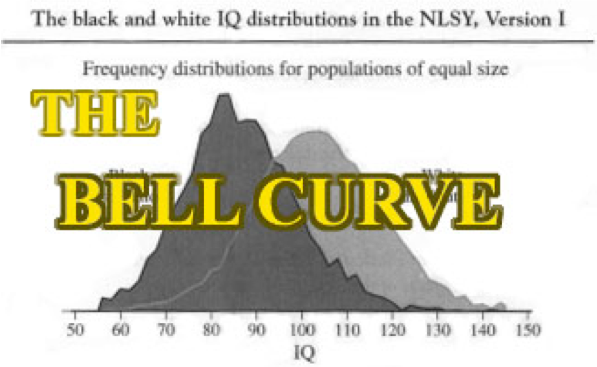

```{r echo = F}
options(scipen = 999)
```

## Language Topics Discussed

- Dialect!
- Varieties of language
- Sociolinguisitics

## Language Varieties 

- Pidgin: new language that develops where two languages come together
  - For example, "Tinglish" is a mixture of Thai and English
  - Vocabulary is often dominated by one language
  - As this develops into a full language, the grammar shifts away from the original two languages

## Language Varieties

- Creole: a pidgin that has developed into a mother tongue of a community
  - For example, Louisiana Creole is a blend of English and French
  - Most of the vocabulary is still from one language, but has a full range of grammatical functions
  
## Language Varieties

- Regional dialect: not a distinct language, but a variety of a language usually spoken in one area of the country 
  - For example, Northern/Southern accents in the United States
  - What area of the country is considered accent-less?
  - Accents and dialect are often confused - an accent is an inflection on word pronunciation
  - Dialect can include accent, but also includes regional word choices 

## Language Varieties

- Minority dialect: sometimes, language is more focused within a cultural group, rather than a regional group (although these ideas can overlap)
  - For example, Black English Vernacular
  - Used as marker of identity, sometimes left over from Indigenous groups that were colonized 

## Labov and BEV

```{r bell, echo=FALSE, out.height="500px", out.width="800px", fig.align="center"}

```

## Labov and BEV

- The Bell Curve
  - IQ is innate
  - Therefore, the inner city (black) kids are doing poorly on tests because they have low IQ 
  - Therefore, they have low language skills because of this low IQ

## Labov and BEV

- Black English Vernacular
  - Language "issues" aren't issues at all, they are sociological pressures
  - Power imbalance with the teacher
  - BEV is just as expressive, and somewhat more economical in speech than SAE
  - Why should we consider "Middle Class English" as intelligent?

## Labov and BEV

- Social interaction with children – you are in charge, so they have learned to deal with the stereotype threat
- If you change the situation to show that the interviewer and child were more equal, you see more equal verbal behavior
- Labov points out the issues with "research" on language, masquerading behind culture
- When you can’t understand someone’s language, they are considered "beneath you" and "inferior"
- Stephen Colbert example

## Examine the Data

- eWAVE: Electronic World Atlas of Varieties of English
- 20 randomly selected features from 76 varieties of English
- Also includes Latitude and Longitude of those varieties

## Load the Data

```{r}
library(Rling)
data(eWAVE)
head(eWAVE)
```

## Create a Geographic Map

```{r map, message = F}
library(rworldmap)
#get the world map
dialmap = getMap()
```

## Create a Geographic Map

```{r}
#plot the map
{plot(dialmap)

#add points
points(eWAVE[ , 23:24], #lat long
       pch = as.numeric(eWAVE$Type) + 20, #color ranges
       col = as.numeric(eWAVE$Type), #color by
       bg = as.numeric(eWAVE$Type))

#add a legend
legend("bottomleft", #where
       legend = levels(eWAVE$Type), #labels
       pch = as.numeric(eWAVE$Type) + 20, #color ranges
       col = as.numeric(eWAVE$Type), #color by
       pt.bg = as.numeric(eWAVE$Type),
       cex = 0.75) #make it fit by reducing or increasing size
       }
```

## The Map

```{r map2, echo = F}
#plot the map
{plot(dialmap)

#add points
points(eWAVE[ , 23:24], #lat long
       pch = as.numeric(eWAVE$Type) + 20, #color ranges
       col = as.numeric(eWAVE$Type), #color by
       bg = as.numeric(eWAVE$Type))

#add a legend
legend("bottomleft", #where
       legend = levels(eWAVE$Type), #labels
       pch = as.numeric(eWAVE$Type) + 20, #color ranges
       col = as.numeric(eWAVE$Type), #color by
       pt.bg = as.numeric(eWAVE$Type),
       cex = 0.75) #make it fit by reducing or increasing size
       }
```

## Multidimensional Scaling

- Like many of our other analyses we've learned it's a descriptive technique to help cluster variables
- You represent the space between variables in low dimensional space (i.e., 1-3 dimensions)
- Think of these as trying to draw boundaries at a school cafeterias - things that are similar would sit together, while things that are not similar would sit further apart


## Types of MDS

- Metric: Represent objects in space such that the distances are represented as precisely as possible
  - Classical MDS: Principal Coordinates Analysis
- Non-metric: Ranking of dissimilarities between objects and distances are represented as the differences in rank order of distances
  - Used when the rank ordering is more important than the original distances (non-parametric)
  
## Things to consider

- You want to represent the data as best as possible
- Stress: when information is lost
  - For example: the loss of representing geography as 2D space when it's really 3D
- Lower stress scores indicate a better fit of the data and the model

## Things to consider

- In theory, you could represent data in an MDS with (k - 1) dimensions where k is the number of variables
  - That might sound good in practice, but not very economical
  - Simpler solutions are better
  - Balance of stress to simplicity

## Dialect + Distance

- MDS assumes that the numbers between the variables are distance, so let's calculate the distance between geographical regions of dialect.

```{r distance, message = F}
library(fields)
geo.dist = rdist.earth(eWAVE[ , 23:24], miles = F)
geo.dist = as.dist(geo.dist)
```

## Perform the MDS

```{r}
geo.mds = cmdscale(geo.dist, #distances
                   k = 2, #number of dimensions
                   eig = T #calculate the eigenvalues
                   )
```

## Eigenvalues and Scree Plots

- Eigenvalues are a mathematical representation of the amount of variance accounted for by each dimension
  - They are useful at helping determine the optimal number of dimensions
  - You will get (k - 1), but only a few should be large
- A scree plot is a graph of those eigenvalues to help determine the optimal number of dimensions

## Make a scree plot

```{r}
barplot(geo.mds$eig, #plot the eigenvalues
        xlab = "Dimensions",
        ylab = "Eigenvalue",
        main = "Scree plot")
```

## Plot the MDS data

```{r}
{plot(geo.mds$points, #plot the MDS dimension points
     type = "n", #blank canvas plot
     main = "MDS of Geographic Distances")

  text(geo.mds$points, #plot the dimensions
       labels = rownames(eWAVE), #label them with the names
       cex = .6) #text sizing
  }
```

## Plot the MDS data

```{r mds_data, echo = F}
{plot(geo.mds$points, #plot the MDS dimension points
     type = "n", #blank canvas plot
     main = "MDS of Geographic Distances")

  text(geo.mds$points, #plot the dimensions
       labels = rownames(eWAVE), #label them with the names
       cex = .6) #text sizing
  }
```

## Interpretation

- The empty middle is because of the distances - as if you were looking from the pole outward
- Seems to split between the Eastern and Western Hemisphere
- Let's try three dimensions to see if we can also get the split between North and South Hemisphere

## Three Dimension MDS

```{r}
#run the MDS
geo.mds.3d = cmdscale(geo.dist, k = 3, eig = TRUE)

#plot 3d
library(rgl)
{
  plot3d(geo.mds.3d$points, type = "n")
  text3d(geo.mds.3d$points, texts = rownames(eWAVE), cex = .6)
}
```

## GOF 

- Goodness of fit, which is similar to $R^2$ statistics

```{r}
#2D model
geo.mds$GOF

#3D model
geo.mds.3d$GOF
```

## Stress

$$ \lbrack \frac{\Sigma_{i<j}(d_{ij} - \hat{d_{ij})^2}} {\Sigma_{i<j}d_{ij}^2} \rbrack^\frac{1}{2}$$

```{r}
sqrt(sum((geo.dist - dist(geo.mds.3d$points))^2)/sum(geo.dist^2))
```

## Interpreting Stress

- > .2 Poor
- .2 > Stress > .1 Fair
- .1 > Stress > .05 Good
- .05 > Excellent

## Where is misfit?

- A Shepard plot shows residuals or the mismatch between actual distance and modeled distance
- X axis shows the distance between each pair of dialects
- Y axis shows the estimated distance between each pair of dialects
- Perfect fit would be one dotted line
- Outliers would be dots that are far away from the diagonal

## Shepard Plot

```{r}
library(MASS)
#create the numbers
geo.sh = Shepard(geo.dist, #real numbers
                 geo.mds.3d$points) #modeled numbers

{
  plot(geo.sh, main = "Shepard Plot", pch = ".")
  lines(geo.sh$x, geo.sh$yf, type = "S")
}
```

## Shepard Plot

```{r sp, echo = F}
library(MASS)
#create the numbers
geo.sh = Shepard(geo.dist, #real numbers
                 geo.mds.3d$points) #modeled numbers

{
  plot(geo.sh, main = "Shepard Plot", pch = ".")
  lines(geo.sh$x, geo.sh$yf, type = "S")
}
```  

## Summary

- We talked about dialect and sociolinguistics, which examines the interaction of societal forces and language
- MDS is a good tool for visualization of large amounts of variables
- In contrast to cluster analysis, you can create dimensions of variation, rather than just clustering/groupings
- The downside is that you can't say much about about the location of the points to each other (but we can next week!)
- You can also use MDS on categorical variables calculating Gower distances before starting - 