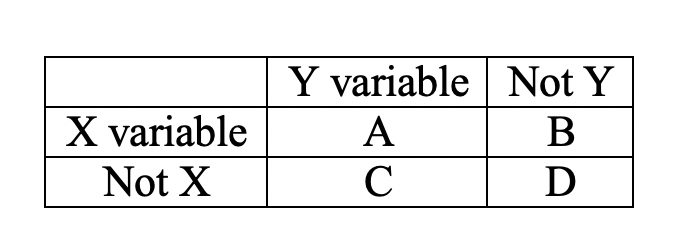

## Language Topics Discussed

- Collocations: words that occur together more frequently than expected due to chance (peanut-butter)
- *n*-grams: n words that occur together, so a bigram is two words occurring together
- https://books.google.com/ngrams
- https://xkcd.com/ngram-charts/
- https://www.ted.com/talks/what_we_learned_from_5_million_books?language=en

## Culturomics

- A term coined by the folks who used the Google Dataset to glean interesting information about humans based on the language that they used
- Looked at 4% of all printed books, digitized by Google
- Corpus of over 500 billion words across seven or more languages 

## Culturomics

- Estimated that English is around 1 million different words that are at least one per billion
- Showed that the dictionary only covers a small portion of these words
- Showed another proof for Zipf's law

## Culturomics

- Examined the competition of irregular and regular verbs (burnt, burned; found, finded; dwelt, dwelled)
- Looked at the frequency of naming for famous people - showed their rapid "fame rise", then the peak, followed by a half-life (decline in their listings)
  - The rise to fame was affected by job choice though - actors show the earliest peaks, followed by writers and politicians 

## Culturomics

- Censorship and Suppression: we can see when cultures (or those in charge) are suppressing certain instances of words across time
- You see across lots of countries:
  - Russia: Trotsky
  - Germany: Marc Chagall
  - China: Tiananmen Square
  - US: The Hollywood Ten

## Culturomics

```{r pic1, echo=FALSE, out.height="500px", out.width="500px", fig.align="center"}
knitr::include_graphics("lesson3-google.png")
```

## Some Considerations

- Optical Character Recognition (OCR) isn't perfect (s versus f)
- The meta-data is not perfect, so dates may be incorrect
- Synonymy: multiple meanings over the years can be difficult to interpret (tweet)

## Association Measures

```{r pic2, echo=FALSE, out.height="200px", out.width="200px", fig.align="center"}

```

- We can take any two variables we are interested in and calculate the relation between them using a basic contingency table.
  - A: Co-occurrence of X and Y
  - B: Number of occurrences of X without Y
  - C: Number of occurrences of Y without X
  - D: Number of occurrences that are not X or Y

## Association Measures

- Unidirectional/asymmetric: Association measures that change based on if you switch rows/columns in our frequency table
  - Conditional probabilities: P(X|Y) is not always equal to P(Y|X)
- Bidirectional/symmetric: Association measures that do not change based on the layout of the table

## Conditional Probability

```{r cellardoor, echo = T}
#collocate table for cellar (Y) and door (X)
#common to put collexeme on X, lexeme on Y
a = 146
b = 145429
c = 2622 
d = 560000000-a-b-c
#P(Y|X) probability of cellar given door (door to cellar)
a/(b+a) * 100
#P(X|Y) probability of door given cellar (cellar to door)
a/(c+a) * 100
```

## Conditional Probability

- Attraction: conditional probability of lexeme given construction
- Reliance/Faith: conditional probability of construction given lexeme
- As noted, these are not necessarily going to be the same

## Another consideration

- Contingency based measures: measures of associative strength that account for the other possible co-occurrences
- For example, category learning shows a distinct hierarchy of features that are important for categories (i.e., wings to bird versus eyes to bird)

## Example: We Can Do It!

```{r cando, include = T}
he = c(33582, 1229276, 4104220, (560000000 - 33582 - 1229276 - 4104220)) 
she = c(14180, 1229276, 2153862, (560000000 - 14180 - 1229276 - 2153862))
he_she = as.data.frame(rbind(he,she))
colnames(he_she) = c("a", "b", "c", "d")
he_she
```

## Attraction

- Attraction: probability of X given Y
- X here is can, Y is he or she

```{r attraction, include=T}
attraction = he_she$a/(he_she$a+he_she$c)*100
attraction
rownames(he_she)
```

## Reliance

- Reliance: probability of Y given X
- X here is can, Y is he or she

```{r reliance, include=T}
reliance = he_she$a/(he_she$a+he_she$b)*100
reliance
rownames(he_she)
```

## Delta-P

```{r deltaP, include = T}
#treats it as Y to X (lexeme to collexeme) so he-can, she-can similar to attraction
dp_YX = he_she$a / (he_she$a + he_she$c) - he_she$b / (he_she$b + he_she$d)
dp_YX

#treats as X to Y so can-he, can-she similar to reliance
dp_XY = he_she$a / (he_she$a + he_she$b) - he_she$c / (he_she$c + he_she$d)
dp_XY
```

## Probability based on Fisher's Test

- Fisher's Exact is a form of chi-square analysis that determines if there are associations in categorical variables
- You can take these *p*-values and log transform them 
- Interpretation is:
  - Positive numbers = mutual attraction 
  - Negative numbers = no attraction, "repelling"
  - Close to zero = no relation
- Good for low frequency variables

## LogP.Fisher

```{r fisher, include=T}
library(Rling)
#expected frequency
aExp = (he_she$a + he_she$b)*(he_she$a + he_she$c)/
  (he_she$a + he_she$b + he_she$c + he_she$d)
#p values
pvF = pv.Fisher.collostr(he_she$a, he_she$b, he_she$c, he_she$d)
#log based on expected frequency
logpvF = ifelse(he_she$a < aExp, log10(pvF), -log10(pvF))
logpvF
```

## Log Likelihood

- Ratio of probabilities of the likelihood of your lexeme-collexeme combination to not
- Positive indicates attraction type value
- Negative indicates repelling 

```{r LL, include=T}
LL = LL.collostr(he_she$a, he_she$b, he_she$c, he_she$d)
LL1 = ifelse(he_she$a < aExp, -LL, LL)
LL1
```

## Pointwise Mutual Information

- Ratio of the probability of Y given X divided by the probability of Y

```{r pmi, include = T}
PMI = log(he_she$a / aExp)^2
PMI
```

## Log Odds Ratio

- Ratio of the likelihood of Y given the presence of X to Y given not the presence of X

```{r OR, include = T}
logOR = log(he_she$a*he_she$d/(he_she$b*he_she$c))
logOR
```

## Which one?

- If these all give me the same basic answer, which one should I use?
  - What is typical in your field?
  - Small sample sizes: Fisher's Test, Log Likelihood
  - Larger sample sizes: PMI, others
  - Compare across datasets: Odds Ratios

## Summary

- Culturomics or ways that we can study culture through language 
- Different types of ways to calculate association based on X and Y frequencies


