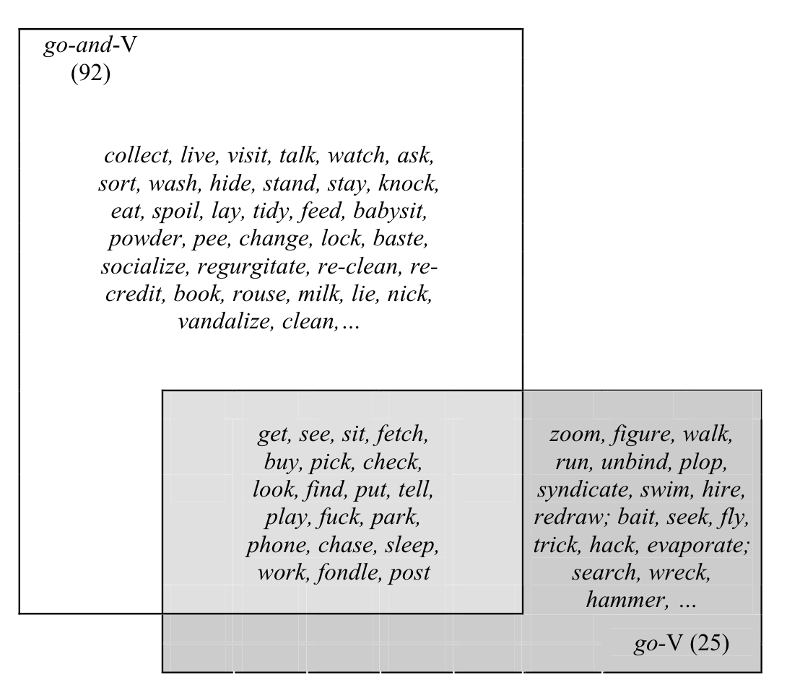

## Language Topics Discussed

- Grammar versus the Lexicon
- Constructions and collexemes
- Examples

## Grammar versus Lexicon 

- Generally, the lexicon is considered the mental dictionary with understandings of meaning, phonetics, orthographics
- While, grammar was viewed as the abstract syntactic rules. 
- Construction based approaches, such as Pattern Grammar and Lexical Chunks suggest an integration of lexicon and grammar, implying statistical language that does not distinguish the two. 

## Constructions and Collexemes

- Collostructional methods: investigating the interaction of words and constructions or understanding the structure of things together 
- Constructions: construction-based approach to language
  - Grammar consists of form-meaning pairs, which is not different from the semantic lexicon
- You can apply these methods to all levels of language - words, phrases, tense

## Constructions and Collexemes

- These methods help convert linguistic units into numbers, and therefore, allow you to apply statistical tests
- Similar in nature to the association measures discussed in the last chapter
- Objective way of identifying meaning of grammatical construction (what does *into the night* mean?)

## Constructions and Collexemes

- What restrictions does grammar create for what might go next? (i.e., are there slots to fill in the grammar and what lexemes fill those slots?)
- "A word may occur in a construction if it is semantically compatible with the meaning of the construction (or, more precisely, with the meaning assigned by the construction to the particular slot in which the word appears)"

## Types of Collexeme Analyses

- Collexeme analysis: measures the degree of attraction/repulsion of a word in a construction 
- Distinctive Collexeme analysis: measures the preference of one word over another in that particular construction 
  - Multiple DCA: expands to more constructions (i.e. not one just versus another)
- Covarying Collexeme analysis: measures the attraction of a word in one slot of a construction to words in another slot of the same construction 

## Examples 

- Therefore, this method uses co-occurrence frequencies to show preference of construction combinations 
- Wulff (2006) searched the British National Corpus for: 
  - go-and-V: Now, just keep polishing those glasses while I go and *check* the drinks.
  - go-V: Go *find* the books and show me. 
- Findings:
  - The verbs of each construction are not a subset of each other (therefore, not synonymous, and different semantically).
  
## Examples

```{r pic1, echo=FALSE, out.height="500px", out.width="500px", fig.align="center"}

```

## Examples

- Wulff et al. (2007): a similar analysis with American and British English
  - into (negative): He blackmailed me into doing it.
  - into (persuasive): She talked me into doing it. 
- This example will focus on American and British English versions of *quite*-ADJ combinations. 
  - This restaurant is quite good.
  - The results is quite extraordinary. 

## Understanding Quite

- Quite can operate in several ways (British):
  - Maximizer: usually paired with limit (sure, clear) and extreme adjectives (huge, astounding) - aking to increasing the adjective.
  - Moderator: usually paired with scalar adjectives like good, nice, interesting - akin to using it as a rather/fairly. 
  
## Understanding Quite

- However, in American English, we use to use quite to maximize scalar adjectives, similar to saying very or extremely (good).
- Often not used with extreme adjectives (maybe instead we use really?)
- Hypothesis: American quite constructions will include less extreme adjectives than British English.
- Hypothesis: More limit adjectives with quite in American English because it was around before we split from Britian. 

## Analysis 

- Pulled data from Corpus of Global Web Based English (GloWbE)
- Geographic differences of English in 20 countries

```{r datasets}
library(Rling)
data(quite_Am)
data(quite_Br)
```

## Data

```{r american}
head(quite_Am)
```

## Data

```{r british}
head(quite_Br)
```

## Basic Differences

```{r basic_diff}
nrow(quite_Br)
nrow(quite_Am)

sum(quite_Br$BrE)
sum(quite_Am$AmE)
```

## Simple DCA

- Use a 2X2 table like last week

|              | Construction A | Construction B|
|--------------|------------------|---------|
| Collexeme X  | a | b |
| X all other collexeme | c | d |

## Merge the data

- Since we aren't entering the data ourselves, let's merge these two datasets

```{r merge_data}
quite = merge(quite_Br, quite_Am, #two datasets to merge
              by = "Adj", #how to match them 
              all = TRUE) #return rows that don't match
head(quite)
```

## Clean up the data

```{r clean}
quite[is.na(quite)] = 0
head(quite)
```

## Summarize the data

```{r createabcd}
a = quite$BrE #all quite to adj British constructions
b = quite$AmE #all quite to adj American constructions
c = sum(quite$BrE) - quite$BrE #overall all other combinations British
d = sum(quite$AmE) - quite$AmE #overa0l all other combinations American
head(cbind(as.character(quite$Adj), a, b, c, d))
```

## Use an Association Measure

```{r expA}
#Calculated expected value of A
#Given row and column and sum totals, what should we expect to find in A
aExp = (a + b)*(a + c) / (a + b + c + d)
head(cbind(as.character(quite$Adj), a, aExp, b, c, d))
```

## logPF

```{r logpf}
#Calculate a chi-square for every combination
pvF = pv.Fisher.collostr(a, b, c, d)
#Convert to effect size measure
logpvF = ifelse(a < aExp, log10(pvF), -log10(pvF))
head(cbind(as.character(quite$Adj), a, aExp, b, c, d, logpvF))
```

## Interpreting the numbers

- Higher positive scores indicate that the collexeme is represented more in British English (attraction to BE)

```{r combine}
quite$logp = logpvF
quite = quite[ order(-quite$logp), ]
topBE = quite$Adj[1:20]
head(quite)
```

## Interpreting the numbers

- Higher negative scores indicate that the collexeme is represented more in American English (repulsion to BE)

```{r combine2}
quite = quite[ order(quite$logp), ]
topAE = quite$Adj[1:20]
head(quite)
```

## Examine the Tops

- BE: Scalar (big, nice, difficult); extreme (daunting, staggering, incredible); limit (right, prepared)
- AE: Limit (certain, possible different, aware)
- BE more negative than AE

```{r toplist}
as.character(topBE)
as.character(topAE)
```

## Summary

- We can extend the association measures learned last week to collexeme analysis, where the focus is specifically on grammatical slot differences.
- These analyses can show cultural or structural differences in a language.
- Applied use of chi-square analysis and interpretation of the qualitative results implies that grammar and semanticity are interwoven. 


