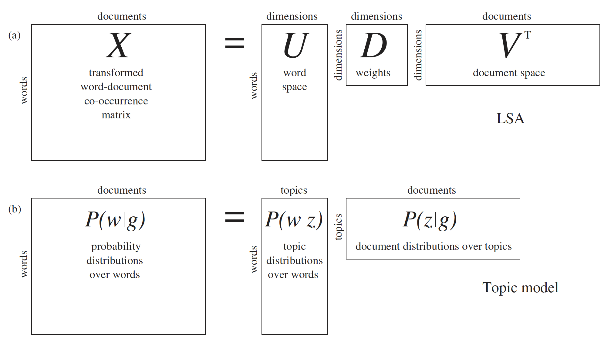

```{r echo = F}
options(scipen = 999)
```

## Language Topics Discussed

- Expansion of semantic vector models into Topics Models
- Types of relations
- How to differentiate topics and other models

## Topics Background

- What does it take to understand a sentence?
  - Retrieving concepts from memory
  - Dynamic process based on incoming information
  - Use the semantic context to create a "gist" representation

## Topics Background

- Pulling the right information from memory can be improved by predicting what concepts are going to be relevant (expectancy generation)
  - For example, *bank* might prime *federal* and *reserve*
  - However, multiple senses can sometimes make this difficult
  - Gist representation allows us to create an overarching topic to disambiguate sense

## Topics Background

- Four types of ways to think about relation:
  - Word-concept: knowledge that a word refers to some concept (physical letters dog refer to dog)
  - Concept-concept: knowledge that a concept is related to some other concept (dog is a type of animal)
  - Concept-precept/action: knowledge about what a concept looks like or does (dogs are furry and bark)
  - Word-word: knowledge that the word co-occurs with another word (dog-cat)

## Topics Background

```{r topicspic2, echo=FALSE, out.height="500px", out.width="800px", fig.align="center"}
knitr::include_graphics("lesson9-topics.png")
```

## Topics Background

- These are useful to understand, because they predict different ways to think about semantic memory. 
- What are people doing when they read a sentence and how can we represent that?
  - Translating words to concepts and using background knowledge to pull in other related concepts
  - Using word co-occurrence to predict the next words 

## Topics Background

- What do topics models propose people do?
  - Predict: people predict the next word or concept because it helps with retrieval
  - Disambiguation: of senses or meanings of words
  - Gist: creating a coherent representation of the text (mental model not individual words)
  
## Topics Background

```{r topicspic, echo=FALSE, out.height="500px", out.width="700px", fig.align="center"}

```

## Other thoughts

- Topics modeling could allow us to reveal topics present in text
- OR find ways to sort various texts into different groups
- Similar to clustering, classification, finds the natural groups in the corpus

## A little bit of math

- Latent Dirichlet allocation (LDA) is the most popular math
- Estimates topics based on the idea that every document includes a mix of topics, and every topic includes a mix of words
- That specification allows topics to overlap, such that they might have some of the same words/content 
- LDA is the middle group that finds both the words for each topic and the topics for each document 

## Getting started with raw data

- First, you would need to load the libraries for the Topic Modeling packages:

```{r libraries, echo = TRUE, eval = T, warning = F, message = F}
library(tm)
library(topicmodels)
library(tidyverse)
library(tidytext)
library(slam)
```

## Load a dataset or corpus

- Then, you could load a dataset you are interested in working with:

```{r dataset, echo = TRUE, eval = T}
importdf = read.csv('exam_answers.csv', header = F, stringsAsFactors = F)
```

## Convert to a Corpus

- From these documents, we will create a corpus (a set of text documents). 
- Because our data is in one column in our dataset, we will use `VectorSource()` to create the corpus:

```{r corpus, echo = TRUE, eval = T}
import_corpus = Corpus(VectorSource(importdf$V1))
```

## Clean up the text

- When you perform these analyses, you usually have to edit the text. 
- Therefore, we are going to lower case the words, take out the punctuation, and remove English stop words (like *the, an, a*). 
- This step will also transform the documents in a term (words) by document matrix. 

## Clean up the text

```{r clean_up, echo = TRUE, eval = T}
import_mat = 
  DocumentTermMatrix(import_corpus,
           control = list(stemming = TRUE, #create root words
                          stopwords = TRUE, #remove stop words
                          minWordLength = 3, #cut out small words
                          removeNumbers = TRUE, #take out the numbers
                          removePunctuation = TRUE)) #take out punctuation 
```

## Weight the matrix

- Then you would want to weight that matrix to help control for the sparsity of the matrix.
- That means you are controlling for the fact that not all words are in each document, as well as the fact that some words are very frequent. 
- Then you usually ignore very frequent words and words with zero frequency. 

## Weight the matrix

```{r weighting, echo = TRUE, eval = T}
#weight the space
import_weight = tapply(import_mat$v/row_sums(import_mat)[import_mat$i], 
                       import_mat$j, 
                       mean) *
  log2(nDocs(import_mat)/col_sums(import_mat > 0))

#ignore very frequent and 0 terms
import_mat = import_mat[ , import_weight >= .1]
import_mat = import_mat[ row_sums(import_mat) > 0, ]
```

## Parameters and terms 

- Alpha: a measure of the number of topics; low scores indicate a few dominant topics per document, high scores indicate more
- Beta: a measure of the number of words, low scores indicate each topic only composes of a few words
- Gamma: probability of that topic in that document
- Entropy: a measure of randomness

## A bit more math

- There are several model types:
  - The LDA Fit model is an analysis with VEM (variational expectation-maximization) algorithm and estimating an alpha.
    - The LDA Fixed model using the VEM algorithm with a fixed alpha value. 
    - Last, the LDA Gibbs option uses a Gibbs (Bayesian) algorithm to fit the data. 
    - CTM stands for correlated topics models, which allows the correlation between topics, and this method uses a VEM algorithm.

## Run the models

- First, you will pick a number of expected topics - which is the k option. 
- The SEED should be a random number to start the analysis on. 

```{r run_topics, echo = TRUE, eval = T}
k = 3 #set the number of topics

SEED = 2010 #set a random number 

LDA_fit = LDA(import_mat, k = k, 
              control = list(seed = SEED))

LDA_fixed = LDA(import_mat, k = k, 
                control = list(estimate.alpha = FALSE, seed = SEED))
```

## Run the models

```{r run_topics2, echo = TRUE, eval = T}

LDA_gibbs = LDA(import_mat, k = k, method = "Gibbs", 
                control = list(seed = SEED, burnin = 1000, 
                               thin = 100, iter = 1000))

CTM_fit = CTM(import_mat, k = k, 
              control = list(seed = SEED, 
                             var = list(tol = 10^-4), 
                             em = list(tol = 10^-3)))
```

## Get the alpha values 

- You can then get the alpha values, and smaller alpha values indicate higher percentages of documents that were classified to one single topic. 

```{r alpha, echo = TRUE, eval = T}

LDA_fit@alpha

LDA_fixed@alpha

LDA_gibbs@alpha
```

## Get the entropy values 

- You can also get entropy values where higher values indicate that topics are evenly spread.

```{r entropy, echo = TRUE, eval = T}

sapply(list(LDA_fit, LDA_fixed, LDA_gibbs, CTM_fit), 
       function (x) 
         mean(apply(posterior(x)$topics, 1, function(z) - sum(z * log(z)))))
```

## The actual topics

- The topic matrix indicates the rank of the number of topics for each document. 
- For instance, if you select to estimate 5 topics, you will see see which topic is covered most in each document, with less covered topics ranked lower. 
- Therefore, a score set of 5, 3, 1, 2, 4 indicates that the 5th topic was covered most in that document, and the 4th topic was covered least.

## The actual topics

```{r topic_ordering, echo = TRUE, eval = T}
topics(LDA_fit, k)
```

## The actual topics

```{r topic_ordering2, echo = TRUE, eval = T}
topics(LDA_gibbs, k)

##you can do all of them saving space
#topics(LDA_fixed, k)
#topics(CTM_fit, k)
```

## The terms for topics

- You can get the most frequent terms for each of the topics that were estimated.

```{r term_list, echo = TRUE, eval = T}
terms(LDA_fit,10)
```

## The terms for topics

```{r term_list2, echo = TRUE, eval = T}
terms(LDA_gibbs,10)

##again you can do all of them
#terms(LDA_fixed, 10)
#terms(CTM_fit,10)
```

## Make some pretty plots

```{r beta_graph, echo = T, eval = T}
#use tidyverse to clean up the the fit     
LDA_fit_topics = tidy(LDA_fit, matrix = "beta")

#create a top terms 
top_terms = LDA_fit_topics %>%
   group_by(topic) %>%
   top_n(10, beta) %>%
   ungroup() %>%
   arrange(topic, -beta)
```

## Make some pretty plots

- Some code to clean up the ggplot2 defaults

```{r beta_graph2, echo = T, eval = T}
cleanup = theme(panel.grid.major = element_blank(), 
                panel.grid.minor = element_blank(), 
                panel.background = element_blank(), 
                axis.line.x = element_line(color = "black"),
                axis.line.y = element_line(color = "black"),
                legend.key = element_rect(fill = "white"),
                text = element_text(size = 10))
```

## Make some pretty plots

```{r beta_graph3, echo = T, eval = T}
#make the plot
top_terms %>%
  mutate(term = reorder(term, beta)) %>%
  ggplot(aes(term, beta, fill = factor(topic))) +
  geom_bar(stat = "identity", show.legend = FALSE) +
  facet_wrap(~ topic, scales = "free") +
  cleanup +
  coord_flip()
```

## The plot

```{r beta_graph4, echo = F, eval = T}
#make the plot
top_terms %>%
  mutate(term = reorder(term, beta)) %>%
  ggplot(aes(term, beta, fill = factor(topic))) +
  geom_bar(stat = "identity", show.legend = FALSE) +
  facet_wrap(~ topic, scales = "free") +
  cleanup +
  coord_flip()
```

## Document classification

- We saw earlier with the `topics()` function, we could figure out the most to least likely topics. 
- This matrix is organized by gamma, which is the probability of that topic in for each document. 
- Let's visualize those numbers.

## Document classification

```{r classification, echo = T, eval = T}
LDA_gamma = tidy(LDA_fit, matrix = "gamma")

LDA_gamma %>%
  ggplot(aes(factor(topic), gamma)) +
  geom_point() + 
  cleanup
```

## Document classification

```{r classification2, echo = F, eval = T}
LDA_gamma = tidy(LDA_fit, matrix = "gamma")

LDA_gamma %>%
  ggplot(aes(factor(topic), gamma)) +
  geom_point() + 
  cleanup
```

## Summary

- We explored how the theoretical background for topics models is different than other semantic vector space models.
- We talked about how to build topics models with various settings.
- We talked about the output you can pull from a topic model.
- Extensions can be made to unsupervised classification and clustering. 
