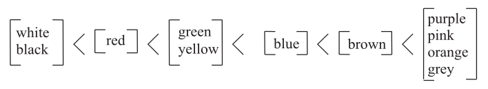

```{r setup, include=FALSE}
knitr::opts_chunk$set(echo = TRUE)
```

```{python echo = F}
import platform
if platform.system() == "Windows":
  import os
os.environ['MPLCONFIGDIR'] = 'C:/Users/EBuchanan.HU/Documents/tmp/'
os.environ['SCIKIT_LEARN_DATA'] = "C:/Users/EBuchanan.HU/py_stuff"
```

## What is this course about?

- Computational Linguistics
- Modeling Human Language
- Dealing with language (which is messy)
- Learning special analyses for language in *R* and *Python*
- Make reports of your work in *Rmarkdown*

## What will you learn?

- What is computational linguistics and language processing?
- How can we apply statistics to answer questions about qualitative data (i.e. language at any level)?
- What are the popular ways to measure language association and model human language?

## Syllabus

- You should read the syllabus for course policies and other important information. 
- You will use Canvas for all course related activities. 
- Let's check those things out now.

## Human Language

Things to think about:

- What was the last thing you said to someone?
- ... the last thing you wrote down?
- ... the last thing you heard?
- How exactly did you do those things?

## History of Studying Language

- Before/around 1900: Galton and Freud
- 1950s: Famous conference at Cornell, Dartmouth
- Chomsky and Skinner
- Influenced heavily by research on artificial intelligence, computing power increases, thinking about modeling language with computers

## What is Language?

- System of symbols and rules that enable us to communicate 
- Specifically, focusing on natural language - language from humans
- Computer language is developed by humans but we use that to study natural language

## Defining Human Language

- Hockett's Feature Design: communalities between languages that define language as separate from other communication systems (i.e., animals)

  - Semanticity: symbols are tied to meaning
  - Arbitrariness: symbols are arbitrary (not tied to meaning)
  - Discreteness: symbols can be broken down and recombined (morphemes)
  - Productivity: users can create and understand novel text (creativity)

## Parts to Human Language

- Biological: brain areas, mouth, tongue, larynx
- Cognitive: symbol systems, word order
- Social: knowledge of other users, social rules, attitudes

## Language Purpose

- Communication
- Emotional expression
- Social interaction
- Thinking

## Studying Language

- Linguistics: study of language
- Psycholinguistics: psychological processes involved in language and the individual (sometimes called cognitive linguistics)
- Computational linguistics: analysis of language through the lens of computer science 
- ... even more names, as we expand and cross over with other fields

## Studying Language

- All of these focus on meaning, use, cognitive processing, and language/reality relationship
  - Meaning: understanding semantics, figure out how people interpret meaning, how are words synonyms, how are words related to each other
  - Use of language: how does the language change based on speaker and scenario
  - Cognition: what cognitive functions are used to make, receive, and interpret language 
  - Language and reality is the relationship between words and their perceptions (slang, referents to the real world)
- Additionally, research focuses on language acquisition 
    - If we know how people *learn* or *acquire* language, we can program computers to do it too
    - Skinner versus Chomsky

## Areas of Study
  
- Phonetics and phonology: study of sounds in language, along with accent, tone, emphases
  - Phonemes: smallest unit of human sound for language
    - Useful at text-to-speech processing
  - Syllables: places of emphasis on words
- Syntax: study of the combination of words to produce meaning
- Semantics: study of meaning in language, also metaphors, analogies, etc. 
    - Lexical: mostly focusing on morphemes and syntax
    - Compositional: relationship between words and combinations of words into phrases and sentences
- Morphology: study of units of meaning (morphemes)

## Areas of Study

- Lexicon: study of the properties of words and phrases, the mental dictionary of language 
- Pragmatics: study of the use of language in different scenarios
- Discourse: study of language in larger chunks, conversations, paragraphs, etc. 
- Stylistics: study of language style, writing style 

## Basic Language Terminology

- Categories of words:
    - Nouns
    - Adjectives
    - Verbs
    - Adverbs
    - Determinants
    - Pronouns
    - Prepositions
    - Conjunctions

## Basic Language Terminology

- Phrases: group of words forming a grammatical unit
  - Noun phrase: group of words where the noun is the focus, often the subjects of a sentence
  - Verb phrase: group of words where the verb is the focus, often the action of a sentence
  - Prepositional phrase: group of words where the preposition is the focus, often acting as an adjective or adverb modifier
- Allows you to make tree diagrams of sentences

```{r echo=FALSE, out.height="300px", out.width="300px", fig.align="center"}
knitr::include_graphics("tree.png")
```

## Semantic Networks

- A model or pictorial depiction of the relations between words
  - Check one out: https://smallworldofwords.org/en/project/visualize
  - These models often focus on meaning, rather than grammar
    - Propositional logic: a way to quantify the relationship between items as true or false (a dog is a tree)
    - First order logic: a formal set of symbols that defines representation of knowledge (objects, relations, functions, properties), sometimes called ontologies

## Corpora

- Corpus: a large body of text 
- What can we do with a corpus?
  - Lots of stuff!
  - Commonly: part of speech tagging, stemming, lemmatization, creating and testing grammars, understanding roles and types of words
- Popular corpora:
  - Brown corpus: most overused corpus! first corpus published in a book, text in a few categories
  - LOB corpus: the British answer to the Brown corpus
  - CHILDES/TalkBank: children speeches/text, audio, video
  - WordNet: a hierarchically structured lexical database
  - Treebank: corpus for lemmatization, part of speech tagging
  - Reuters: a corpus of news articles that is often used for machine learning
  - ANC and BNC: American and British National Corpus; COCA: Corpus of Contemporary American English and Google N-gram - all the words!
  - Web/chat/email/tweets: many new corpora fall into these categories and are often hosted on kaggle 

## Applying Statistics to Language

- Originally, studying language was part of a qualitative skill set
- Statistics were  simple percentages/means
- Language was considered innate -> so all humans had the same underlying system
- We just had to figure out what that system was ...

## Applying Statistics to Language

- However: statistical language learning and the interaction with the environment could not be ignored
- Language knowledge is shaped by language use 
- As we learn and use a language, we are "intuitive statisticians" - this implies that language can be analyzed with statistics 

## Influence of Our Surroundings

- Frequency, frequency, frequency
- Cognitive mechanisms
    - Probabilistic structure of categories 
- Social mechanisms
    - Representations of word meanings
    - New words in your lifetime
    - Slang

## Language and Statistics Now

Examples:

- Model word choice
- Corpora!
- Behavioral profiles
- Semantic Vector models
- Along with experimental results relying on traditional statistics: t-tests, ANOVA, correlation, regression, etc. 

## An Example

- Berlin and Kay (1969) proposed a theory about our linguistic interpretations of colors, mainly that color vocabulary falls into universal categories:

```{r berlinkay, echo=FALSE, out.width="100%", fig.align="center"}

```

## Basic Color Terms

- Data is from the Corpus of Contemporary American English (COCA)
- Counts of adjective use of color terms
- Problems with simple frequency count is corpus size

```{r color, echo=T}
##r chunk
library(Rling)
data(colreg)
head(colreg)
```

## Basic Color Terms

- We know the corpus size (number of words) from looking at COCA statistics
- We can calculate the deviation of those proportions (like standard deviation)

```{r color2, echo=T}
##r chunk
freqreg <- c(95385672, 90344134, 91044778, 187245672)

dev_prop = function (observed_count, expected_count){
  DP_value = sum(abs(prop.table(observed_count) - prop.table(expected_count)))/2
  DP_normal = DP_value / (1-min(prop.table(expected_count)))
  return(DP_normal)
}
```

## Basic Color Terms

- Values close to zero indicate spread is similar given corpus size
- Values close to one indicates one of the subsets is favored more strongly 
- Theory appears to be supported!

```{r color3, echo=T}
##r chunk
dev_prop(colreg["black", ], freqreg)
dev_prop(colreg["gray", ], freqreg)
```

## What are we going to learn?

- You will learn *R* and *Python* and how to mix the two
- How to deal with categorical data: frequency counts, clustering 
- How to deal with continuous data: factor analysis
- Higher order modeling techniques: vector space models, Word2Vec, and information theory
- Each section will detail a language topic plus how to perform an analysis in that area 

