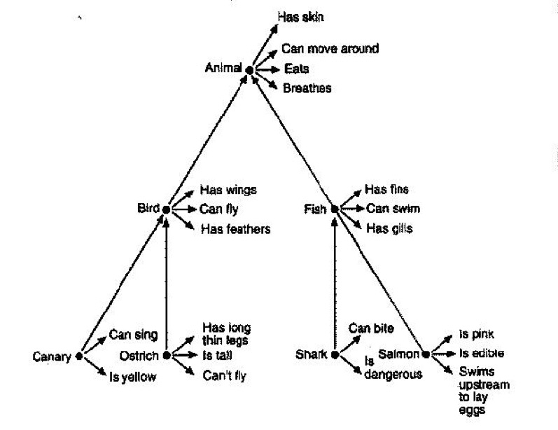
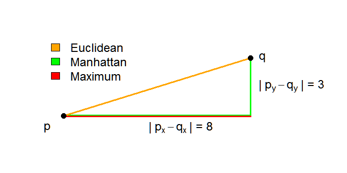

```{r echo = F}
options(scipen = 999)
```

## Language Topics Discussed

- Memory and semanticity
- Semantic networks (big lead in for Semantic Vector Models)
- Semantic feature models

## Memory Types

- Episodic memory – memory for events and episodes, diary
- Semantic memory – general fact based knowledge, encyclopedia
- Lexicon – our mental dictionary 

## Classic Semantics

- Denotation – its core essential meaning
- Conotation – all secondary meanings, emotional or evaluative associations
- Polysemy - words with multiple meanings, often difficult for models to capture

## Classic Semantics Theories

- Referential theory – words mean what they refer to 
- Intension – abstract specification that determines how a concept is related in meaning to other words
- Extension – what the word stands for in the world
- Model theoretic semantics – (truth theoretic semantics) – logical models of complex meaning 

## Semantic Networks

- Semantic network – concepts are linked because of their frequency (association) but also the links between concepts have meaning. 
- Collins and Quillian to Collins and Loftus 

## Collins and Quillian

```{r pic1, echo=FALSE, out.height="500px", out.width="500px", fig.align="center"}

```

## Collins and Quillian

- Developed to translate between languages
- Natural categories – like animals, trees
- Hierarchical Network – like biology arrangement
- Link types – ISA, HASA
- Used the sentence verification task talked about last week to show hierarchical structure 

## Issues

- Not all information can be represented that way
- Conjoint frequency – how frequently two words co-occur together 
- Relatedness effect – don’t reject all untrue statements equally slowly 
    - A pine is a church is slower than a pine is a flower
- Prototypicality effect – we are faster for items that are more typical of a category

## Collins and Loftus

```{r pic2, echo=FALSE, out.height="500px", out.width="500px", fig.align="center"}
knitr::include_graphics("collinsl.jpg")
```

## Collins and Loftus

- Spreading activation model – structure become more complex, links between nodes (circles) varied in strength
- Structure is not hierarchical 
- Connectionist model – things are linked together and priming is based on spreading activation to other concepts. 

## Semantic Features

- Semantic features – smaller units of meaning (markers, attributes) 
- Break down words into features
- Work well for simple domains
- Semantic primitives – represent the meanings of words as combinations of as few features as possible

## Semantic Features

- Katz & Fodor - Sentence meaning can be built from combining individual word meanings
  - 1st: semantic decomposition – breaking down the words into features
  - 2nd: Selection restraints – combination of features based on restraints
  - Kick – you expect to kick something like ball

## Behavioral Profiles

- Often used in a similar approach as last class, to classify or group instances based on other linguistic variables
- Generally considered for a large set of categorical data, as the data is transformed into proportions
- For example, you might take representative sentences and code each one for lexical information
- This approach is useful for understanding polysemy

## Behavioral Profiles

- Let's look at the same data from last week, as a larger set

```{r}
##r chunk
library(Rling)
data(caus)
head(caus)
```

## Behavioral Profiles

- Step 1: Create numeric vectors of proportions from categorical data
- Step 2: Calculate matrix distances between vectors
- Step 3: Cluster analysis 
- Step 4: Interpretation
- Step 5: Validation

## Verb Profiles

```{r}
##r chunk
table(caus$Cx)
```

## Verb Profiles

```{r}
##r chunk
##split the data
caus.split = split(caus, caus$Cx)

##remove the splitting variable
caus.split = lapply(caus.split, function(x) x = x[ , -1])

##create the vectors
caus.split.bp = lapply(caus.split, bp)

##put back together in one data frame
caus.bp = do.call(rbind, caus.split.bp)
```

## Verb Profiles

```{r}
##r chunk
head(caus.bp)
```

## Distance Measures

- The logic behind distances is to measure how similar things are in multidimensional space
- The more similar the vector, the closer the distance (i.e., they group together)
- Three types (or well three popular types):

```{r pic3, echo=FALSE, out.height="300px", out.width="500px", fig.align="center"}

```

## Distance Measures

```{r}
##r chunk
caus.dist = dist(caus.bp, method = "euclidean") 
#change method to maximum or manhattan 
caus.dist
```

## Distance Measures

- A quick note that these can be used on any numeric vectors - a large part of semantic vector models relies on using this idea. 
- The homework will focus on using data that has already been tabulated into continuous data. 

## Clustering

- Lots of types of clustering, mainly going to focus on hierarchical cluster analysis
- Creates dendograms, much like a conditional inference tree, however:
  - Works from the leaves up
  - Every object is represented in a different leaf, and then the branches of similar objects are merged

## Clustering Methods

- Growing from roots to leaves (one big cluster and splitting): divisive clustering
- Growing from leaves to roots (all the leaves and then branch merging): agglomerative clustering
- Types: complete, single, average, and Ward - often people like Ward because it produces compact clusters

## Run a Hierarchical Cluster   

```{r}
##r chunk
#install.packages("cluster")
library(cluster)
caus.hc = hclust(caus.dist, method = "ward.D2")
```

## Plot it

```{r}
##r chunk
plot(caus.hc, hang = -1)
```


## Interpretation

- Average silhouette width: the average "well formedness" of clusters
  - That means that clusters are internally close and externally far
  - Ranges from zero (no clusters random noise) to one (perfectly clustered)

## Interpretation

```{r}
##r chunk
cutree(caus.hc, k = 2)
summary(
  silhouette(
    cutree(caus.hc, k = 2), #first argument is the cutting of tree
    caus.dist) #second argument is the distances
  )$avg.width
```

## So how many should it be?

```{r}
##r chunk
sapply(2:8, #we can run 2 to n-1 clusters 
       function(x) summary(
         silhouette(cutree(caus.hc, k = x),
                    caus.dist))$avg.width #find the widths
       )
```

## Replot

```{r}
##r chunk
{plot(caus.hc, hang = -1)
rect.hclust(caus.hc, k = 3)}
```

## Snake Plots

- Snake plots can be used to distinguish and visualize the differences between clusters and their members. 
- Create difference scores for clusters
- Plot those differences

## Snake Plots

```{r}
##r chunk
#save the clusters
clustercut = cutree(caus.hc, k = 2)
cluster1 = caus.bp[ names(clustercut[clustercut == 1]), ] #notice rows
cluster2 = caus.bp[ names(clustercut[clustercut == 2]), ]

#create the differences
differences = colMeans(cluster1) - colMeans(cluster2)
```

## Snake Plots

```{r}
##r chunk
##create the plot
plot(sort(differences)*1.2, #make room for names on graph
     1:length(differences), #y axis
     type = "n", #empty plot + labels
     xlab = "Cluster 2 < -- > Cluster 1",
     yaxt = "n", ylab = "")
text(sort(differences),
     1:length(differences),
     names(sort(differences)))
```

## Snake Plots

```{r echo = F}
##r chunk
##create the plot
plot(sort(differences)*1.2, #make room for names on graph
     1:length(differences), #y axis
     type = "n", #empty plot + labels
     xlab = "Cluster 2 < -- > Cluster 1",
     yaxt = "n", ylab = "")
text(sort(differences),
     1:length(differences),
     names(sort(differences)))
```

## Validation of the Solution

- More bootstrapping!

```{r}
##r chunk
#install.packages("pvclust")
library(pvclust)
caus.pvc = pvclust(t(caus.bp), #this function clusters by columns, so flip matrix
                   method.hclust = "ward.D2",
                   method.dist = "euclidean"
                   )
```

## Validation of the Solution

- AU values Approximately Unbiased
- BP values Bootstrap Probability
- Different than normal probability, want values close to 100

## Plot PVC

```{r}
##r chunk
plot(caus.pvc, hang = -1)
```

## How to hierarchical cluster in Python

```{r}
##r chunk
library(reticulate)
py_config()
caus_data <- caus.bp #dots are problematic in python
cluster_labels <- rownames(caus.bp)
#py_install("scipy")
```

```{python}
##python chunk
import scipy.cluster.hierarchy as sch
from sklearn.cluster import AgglomerativeClustering
caus_data = r.caus_data 

#create distances
caus_dist = sch.linkage(caus_data, method='ward')
```

## How to create the dendogram

```{python}
##python chunk 
import matplotlib
matplotlib.use('Agg')
from matplotlib import pyplot as plt
plt.figure()
plt.title("Hierarchical Clustering Dendogram")
plt.xlabel("Causal Variable")
plt.ylabel("Distance")
# create dendrogram
sch.dendrogram(caus_dist, #distance
              leaf_rotation=90., leaf_font_size=8.,
              labels = r.cluster_labels) #create tree
plt.show()
```

## How to create the clusters

```{python}
##python chunk 
from sklearn import metrics
from scipy.cluster.hierarchy import fcluster

max_d = 9
clusters = fcluster(caus_dist, max_d, criterion='maxclust')
clusters
```

## Silhouette scores

```{python}
##python chunk 
metrics.silhouette_score(caus_data, #data not distances
                        fcluster(caus_dist, 2, criterion='maxclust'), #clustered for 2
                        metric='euclidean')
```

```{python}
##python chunk 
for i in range(2, max_d):
  sil = metrics.silhouette_score(caus_data, fcluster(caus_dist, i, criterion='maxclust'), metric='euclidean')
  print(i, ":", sil)
```

## Summary

- You learned about semantic models and theories, specifically that we expect the brain to create these clusters of related objects based on something (usually features)
- You learned about how to turn categorical data into proportions to help cluster together related objects
- You learned about distance measures (very important for the next several weeks!)
- You learned about hierarchical clustering to visualize the data
  - Extensions include other analyses we will cover: Principal Components Analysis, Multidimensional Scaling 
  - As well as other popular clustering methods such as: K-means 
