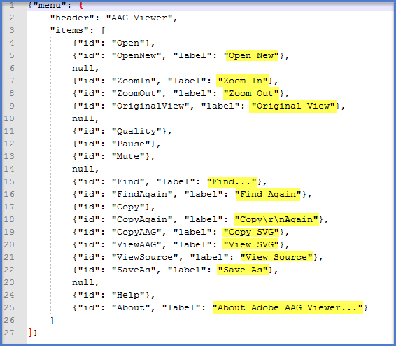

```{r echo = F}
options(scipen = 999)
```

## Language Topics Discussed

- Network science applied to cognitive science
- Example: Verbal fluency
- Example: NASA Metadata

## Cognitive Science

- One goal of cognitive scientists is to model semantic memory
  - Previously, we've discussed traditional approaches to this task with the hierarchical network and "bubble" models before
  - You can also approach this question using neural network models
- Network science provides a set of tools to help define and explore this structure 

## Network terminology

- Nodes: conceptual entities of interest (usually words in our case)
- Edges: relationship between nodes (similarity)
- How do we meaningfully represent these values?
  - Usually we can find data that helps us represent the network we want to build
  - For example, in a semantic network, we can use words as nodes and edges can be represented by shared features, free associations, etc. 

## Example Network

```{r pic_2, echo = F}
knitr::include_graphics("fa_network.png")
```

## Network Statistics

- Microscopic Network Measures are often used to denote the importance of a node - or how "central" the node is in the network.
- Degree (k): the number of edges connected to a node, as nodes with more edges are more connected in a network, sometimes called their neighborhood.
- Shortest path distances (L): the shortest distance between two nodes, or how many "hops" you have to take to get between two nodes. 

## Network Statistics

- Local clustering coefficient (C): denotes how much the node's neighbors are also neighbors or the interconnectedness between nodes.  

```{r pic_3, echo = F}
knitr::include_graphics("local_cluster.png")
```

## Network Statistics

- Macroscopic Network Measures are often used to talk about the overall organization of a network.
- Small world structure (S): will have high local clustering coefficients and short path lengths when compared to a random network
  - This idea is sometimes related to efficiency - as things are very closely related, you don't have to go very far to relay/transmit information. 
- Assortivity (A): correlation between pairs of node degrees, where zero indicates uncorrelated networks, and higher values indicate more clustering of sections

## Let's Try Examples

```{r}
#r chunk
#install.packages(c("memnet", "jsonlite", "dplyr", "tidytext", "widyr", "ggplot2", "igraph", "ggraph", "tidyr"))
library(memnet)
library(jsonlite)
library(dplyr)
library(tidytext)
library(widyr)
library(ggplot2)
library(igraph)
library(ggraph)
library(tidyr)
```

## Verbal Fluency

- Verbal fluency is the ability to successfully retrieve information from memory
- In a verbal fluency task, you are often ask to name all the things you can think of in a category
  - For example, name all the animals you can think of in a minute
  - This information can be interpreted as the semantic network (and potentially the winding path that spreading activation takes)

## Example Data

```{r}
##r chunk
data("animal_fluency")
head(animal_fluency)
```

## Example Data

- We will pull the ages from the list names and can compare between ages to view network differences 

```{r}
##r chunk
#get the ages which are the list names
age <- as.numeric(names(animal_fluency))
```

## Network Types in memnet

- A community graph adds edges for words that occur within X words of each other (can be set in the code, default is 1 with other co-occurrence rules)
- A threshold graph adds edges for words that are adjacent
- A random walk graph adds edges for words that are within a window size of one to each other 

## Older Networks 

- Note: the age split here is somewhat arbitrary to produce a nice split in the data

```{r}
##r chunk
# infer networks for age > 70
net_comunity <- community_graph(animal_fluency[age > 70])
net_threshold <- threshold_graph(animal_fluency[age > 70])
net_rw <- rw_graph(animal_fluency[age > 70])
```

## Younger Networks

```{r}
##r chunk
net_comunity2 <- community_graph(animal_fluency[age <= 60])
net_threshold2 <- threshold_graph(animal_fluency[age <= 60])
net_rw2 <- rw_graph(animal_fluency[age <= 60])
```

## Plots - Community

```{r}
##r chunk - cex controls size of text
network_plot(edg_to_adj(net_comunity), nod_cex = 2, lab_cex = 1)
network_plot(edg_to_adj(net_comunity2), nod_cex = 2, lab_cex = 1)
```

## Plots - Threshold

```{r}
##r chunk - cex controls size of text
network_plot(edg_to_adj(net_threshold), nod_cex = 2, lab_cex = 1)
network_plot(edg_to_adj(net_threshold2), nod_cex = 2, lab_cex = 1)
```

## Plots - Random Walk 

```{r}
##r chunk - cex controls size of text
network_plot(edg_to_adj(net_rw), nod_cex = 2, lab_cex = .5, lab_lwd = 1, lab_grid_size = 70)
network_plot(edg_to_adj(net_rw2), nod_cex = 2, lab_cex = .5, lab_lwd = 1, lab_grid_size = 70)
```

## Network Statistics

V = number of nodes
E = number of edges
K = degree
C = Clustering coefficient
L = shortest path
S = Small world
A = assortivity

```{r}
##r chunk - can do other networks in the same way to compare
network_stats(edg_to_adj(net_comunity))
network_stats(edg_to_adj(net_comunity2))
```

## Something else fun

```{r}
##r chunk
#k is the number of hops
neighborhood_plot(edg_to_adj(net_comunity), k = 3, node = 'cat', nod_cex = 2, lab_cex = 1)
neighborhood_plot(edg_to_adj(net_comunity2), k = 3, node = 'cat', nod_cex = 2, lab_cex = 1)
```

## Example: NASA's metadata

- Metadata is information about what is in a dataset: how it was collected, authors, variable names, variable descriptions, keywords, etc. 
- We can use the metadata to simply understand a dataset we want to work with OR treat it as text data itself!
- We will explore NASA's metadata to see if we can understand its inter-workings.

## What is JSON?

- JSON: JavaScript Object Notation
- A structured file that allows you to store hierarchical information 

```{r pic, echo = F}

```

## NASA JSON

```{r}
##r chunk
metadata <- fromJSON("nasa_data.JSON")
names(metadata$dataset)
```

## What data to use?

- We could start with keywords to help us figure out what they think is the most important part of the document. 

```{r}
##r chunk
head(metadata$dataset$keyword) #it's a list!
```

## What data to use?

- Since this class is all about modeling language, let's use the titles and descriptions.

```{r}
##r chunk
head(metadata$dataset$title)
head(metadata$dataset$description)
```

## Cleaning up the data

```{r}
##r chunk
nasa_title <- tibble(id = metadata$dataset$identifier,
                         title = metadata$dataset$title)
head(nasa_title)
```

## Cleaning up the data

```{r}
##r chunk
nasa_desc <- tibble(id = metadata$dataset$identifier,
                        desc = metadata$dataset$description)
head(nasa_desc)
```

## Cleaning up the data

```{r}
##r chunk
nasa_keyword <- tibble(id = metadata$dataset$identifier,
                           keyword = metadata$dataset$keyword) %>% 
  unnest(keyword)

head(nasa_keyword)
```

## Why separate?

- You could easily merge these together, but that would create lots of duplicates as each dataset has multiple keywords, which we `unnest`ed earlier. 
- We will also be breaking each of these down by word, so a bit easier to keep them separate. 

```{r}
##r chunk
nrow(nasa_title)
nrow(nasa_desc)
nrow(nasa_keyword)
```

## Stop Words and Bag of Words

- We are going to remove all stop words and treat this analysis like a bag of words (each word separately, like the vector space models)

```{r}
##r chunk
nasa_title <- nasa_title %>% 
  unnest_tokens(word, title) %>% 
  anti_join(stop_words)

nasa_desc <- nasa_desc %>% 
  unnest_tokens(word, desc) %>% 
  anti_join(stop_words)

head(nasa_title)
head(nasa_desc)
```

## Number of Words

- So, how many words are we working with here? 

```{r}
##r chunk
nrow(nasa_title)
nrow(nasa_desc)
nrow(nasa_keyword)
```

## Simple statistics

- What are the most popular words? 

```{r}
##r chunk
nasa_title %>% 
  count(word, sort = TRUE)
```

## Simple statistics

```{r}
##r chunk
nasa_desc %>% 
  count(word, sort = TRUE)
```

## Simple statistics

```{r}
##r chunk
nasa_keyword %>% 
  group_by(keyword) %>% 
  count(sort = TRUE)
```

## What have we learned?

- NASA seems to report a lot of data because they use open science principles
- They tend to use versioning, which we might consider deleting 
- Most everything is in lower case, but you might consider converting case first to ensure all of the same words are matched together

## Exclude numbers

```{r}
##r chunk
nasa_title <-  nasa_title[-grep("[0-9]", nasa_title$word), ] 
nasa_title %>% 
  count(word, sort = TRUE)

nasa_desc <-  nasa_desc[-grep("[0-9]", nasa_desc$word), ] 
nasa_desc %>% 
  count(word, sort = TRUE)
```

## Collocates!

- What are the common word pairs? 

```{r}
##r chunk
title_word_pairs <- nasa_title %>% 
  pairwise_count(word, id, sort = TRUE, upper = FALSE)

head(title_word_pairs)
```

## Collocates!

```{r}
##r chunk
desc_word_pairs <- nasa_desc %>% 
  pairwise_count(word, id, sort = TRUE, upper = FALSE)

head(desc_word_pairs)
```

## Collocates!

```{r}
##r chunk
keyword_pairs <- nasa_keyword %>% 
  pairwise_count(keyword, id, sort = TRUE, upper = FALSE)

head(keyword_pairs)
```

## Make a network plot

```{r}
##r chunk
set.seed(52550)
title_word_pairs %>%
  filter(n >= 250) %>%
  graph_from_data_frame() %>%
  ggraph(layout = "fr") + #use ?ggraph to see all the options
  geom_edge_link(aes(edge_alpha = n, edge_width = n), edge_colour = "purple") +
  geom_node_point(size = 5) +
  geom_node_text(aes(label = name), repel = TRUE, 
                 point.padding = unit(0.2, "lines")) +
  theme_void()
```

## Make a network plot

```{r}
##r chunk
desc_word_pairs %>%
  filter(n >= 2500) %>%
  graph_from_data_frame() %>%
  ggraph(layout = "fr") + #use ?ggraph to see all the options
  geom_edge_link(aes(edge_alpha = n, edge_width = n), edge_colour = "purple") +
  geom_node_point(size = 5) +
  geom_node_text(aes(label = name), repel = TRUE, 
                 point.padding = unit(0.2, "lines")) +
  theme_void()
```

## Make a network plot

```{r}
##r chunk
keyword_pairs %>%
  filter(n >= 1000) %>%
  graph_from_data_frame() %>%
  ggraph(layout = "fr") + #use ?ggraph to see all the options
  geom_edge_link(aes(edge_alpha = n, edge_width = n), edge_colour = "purple") +
  geom_node_point(size = 5) +
  geom_node_text(aes(label = name), repel = TRUE, 
                 point.padding = unit(0.2, "lines")) +
  theme_void()
```

## Strongest pairs

- What are the strongest word pairs (i.e., they always occur together)?

```{r}
##r chunk
keyword_cors <- nasa_keyword %>% 
  group_by(keyword) %>%
  filter(n() >= 50) %>%
  pairwise_cor(keyword, id, sort = TRUE, upper = FALSE)

head(keyword_cors)
```

## Visualize correlated pairs

```{r}
##r chunk
keyword_cors %>%
  filter(correlation > .6) %>%
  graph_from_data_frame() %>%
  ggraph(layout = "fr") +
  geom_edge_link(aes(edge_alpha = correlation, edge_width = correlation), edge_colour = "purple") +
  geom_node_point(size = 5) +
  geom_node_text(aes(label = name), repel = TRUE,
                 point.padding = unit(0.2, "lines")) +
  theme_void()
```

## What have you learned?

- How to use tidyverse to create bag of words models 
- More traditional approaches of network science and statistics
- How to create word networks to visualize related words and their strengths
- Can be combined with work like semantic vector space models to help "show" the data 