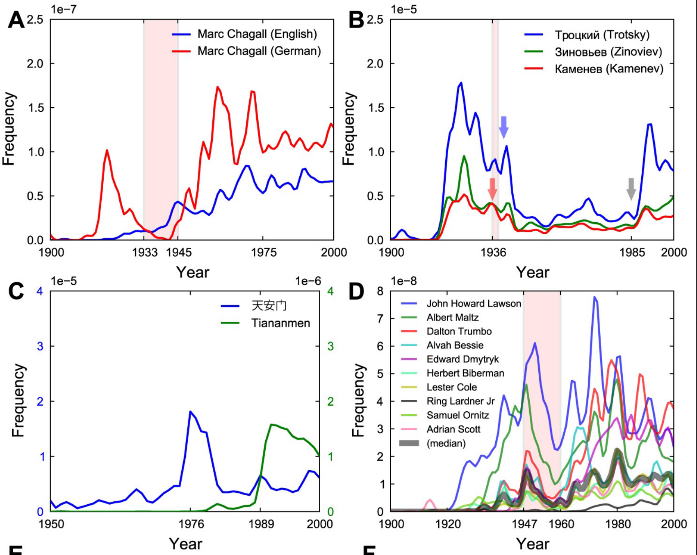

## Language Topics Discussed

- Collocations: words that occur together more frequently than expected due to chance (peanut-butter)
- *n*-grams: n words that occur together, so a bigram is two words occurring together
- https://books.google.com/ngrams
- https://xkcd.com/ngram-charts/
- https://www.ted.com/talks/what_we_learned_from_5_million_books?language=en

## Culturomics

- A term coined by the folks who used the Google Dataset to glean interesting information about humans based on the language that they used
- Looked at 4% of all printed books, digitized by Google
- Corpus of over 500 billion words across seven or more languages 

## Culturomics

- Estimated that English is around 1 million different words that are at least one per billion
- Showed that the dictionary only covers a small portion of these words
- Showed another proof for Zipf's law

## Culturomics

- Examined the competition of irregular and regular verbs (burnt, burned; found, finded; dwelt, dwelled)
- Looked at the frequency of naming for famous people - showed their rapid "fame rise", then the peak, followed by a half-life (decline in their listings)
  - The rise to fame was affected by job choice though - actors show the earliest peaks, followed by writers and politicians 

## Culturomics

- Censorship and Suppression: we can see when cultures (or those in charge) are suppressing certain instances of words across time
- You see across lots of countries:
  - Russia: Trotsky
  - Germany: Marc Chagall
  - China: Tiananmen Square
  - US: The Hollywood Ten

## Culturomics

```{r pic1, echo=FALSE, out.height="500px", out.width="500px", fig.align="center"}

```

## Some Considerations

- Optical Character Recognition (OCR) isn't perfect (s versus f)
- The meta-data is not perfect, so dates may be incorrect
- Synonymy: multiple meanings over the years can be difficult to interpret (tweet)

## Distance versus Association

- Distance metrics are used to show how related two or more items are
- Association metrics are used to show the relationship or connection between items 
  - The main difference is their scaling and interpretation 

## Characteristics of Distance Metrics

- Distance must be non-negative
- If x and y are the same, the distance is zero 
- The x to y relationship is the same as the y to x relationship (measures are symmetric)
- Triangle inequality: distance of x to y + distance of y to z is less than or equal to the distance of x to z 

## Distance Measures

- String distance measures tell you the match between strings
  - For example, believe and beleive (spelling error) or cat to hat (phoneme change)
- Types:
  - The Hamming distance (method='hamming') counts the number of character substitutions that turns b into a. 
  - The Levenshtein distance (method='lv') counts the number of deletions, insertions and substitutions necessary to turn b into a. 
  - The Optimal String Alignment distance (method='osa') is like the Levenshtein distance but also allows transposition of adjacent characters where each substring can only be edited once.
  
## Distance Measures

```{r}
##r chunk
library(stringdist)

words1 <- c("believe", "cat")
words2 <- c("beleive", "hat")

stringdist(words1, words2, method = "hamming")
stringdist(words1, words2, method = "lv")
stringdist(words1, words2, method = "osa")
```

## Distance Measures

- Cosine is often defined as the number of shared features - we've used this function in our discussion of vector space models.
  - When defined this way, 0 indicates no shared features, while 1 indicates perfect match in features.
  - As a distance metric, however, 0 indicates exactly the same (no distance between them), and 1 indicates totally different (all the distance between them).

```{r}
##r chunk
stringdist(words1, words2, method = "cosine")
```

## Association Measures

- Association measures were developed to show that not all "distance" is symmetric.
  - Example: Family Feud 
  - Cheese --> Cheddar is approximately 21 people
  - Cheddar --> Cheese is approximately 100 people 
- Conditional probabilities help with this conceptualization

## Association Measures

```{r pic2, echo=FALSE, fig.align="center"}
knitr::include_graphics("associationtable.png")
```

- We can take any two variables we are interested in and calculate the relation between them using a basic contingency table.
  - A: Co-occurrence of X and Y
  - B: Number of occurrences of X without Y
  - C: Number of occurrences of Y without X
  - D: Number of occurrences that are not X or Y

## Association Measures

- Unidirectional/asymmetric: Association measures that change based on if you switch rows/columns in our frequency table
  - Conditional probabilities: P(X|Y) is not always equal to P(Y|X)
- Bidirectional/symmetric: Association measures that do not change based on the layout of the table

## Conditional Probability

```{r cellardoor, echo = T}
##r chunk
#collocate table for cellar (Y) and door (X)
#common to put collexeme on X, lexeme on Y
a = 228
b = 210170 - a
c = 4026 - a   
d = 560000000-a-b-c
#P(XY|X) probability of combination given door
a/(b+a) * 100
#P(XY|Y) probability of combination given cellar
a/(c+a) * 100
```

## Conditional Probability

- Attraction: conditional probability of construction given lexeme 1
- Reliance/Faith: conditional probability of construction given lexeme 2
- As noted, these are not necessarily going to be the same

## Another consideration

- Contingency based measures: measures of associative strength that account for the other possible co-occurrences
- For example, category learning shows a distinct hierarchy of features that are important for categories (i.e., wings to bird versus eyes to bird)

## Example: We Can Do It!

```{r cando, include = T}
##r chunk
he = c(33582, 1229276, 4104220, (560000000 - 33582 - 1229276 - 4104220)) 
she = c(14180, 1229276, 2153862, (560000000 - 14180 - 1229276 - 2153862))
he_she = as.data.frame(rbind(he,she))
colnames(he_she) = c("a", "b", "c", "d")
he_she
```

## Attraction

- Attraction: probability of XY given Y
- Lexeme-can, Y is he or she

```{r attraction, include=T}
##r chunk
attraction = he_she$a/(he_she$a+he_she$c)*100
attraction
rownames(he_she)
```

## Reliance

- Reliance: probability of XY given X
- Lexeme-can, X is can 

```{r reliance, include=T}
##r chunk
reliance = he_she$a/(he_she$a+he_she$b)*100
reliance
rownames(he_she)
```

## Delta-P

```{r deltaP, include = T}
##r chunk
#similar to attraction
dp_YX = he_she$a / (he_she$a + he_she$c) - he_she$b / (he_she$b + he_she$d)
dp_YX

#similar to reliance
dp_XY = he_she$a / (he_she$a + he_she$b) - he_she$c / (he_she$c + he_she$d)
dp_XY
```

## Probability based on Fisher's Test

- Fisher's Exact is a form of chi-square analysis that determines if there are associations in categorical variables
- You can take these *p*-values and log transform them 
- Interpretation is:
  - Positive numbers = mutual attraction 
  - Negative numbers = no attraction, "repelling"
  - Close to zero = no relation
- Good for low frequency variables

## LogP.Fisher

```{r fisher, include=T}
##r chunk
library(Rling)
#expected frequency
aExp = (he_she$a + he_she$b)*(he_she$a + he_she$c)/
  (he_she$a + he_she$b + he_she$c + he_she$d)
#p values
pvF = pv.Fisher.collostr(he_she$a, he_she$b, he_she$c, he_she$d)
#log based on expected frequency
logpvF = ifelse(he_she$a < aExp, log10(pvF), -log10(pvF))
logpvF
```

## Log Likelihood

- Ratio of probabilities of the likelihood of your lexeme-collexeme combination to not
- Positive indicates attraction type value
- Negative indicates repelling 

```{r LL, include=T}
##r chunk
LL = LL.collostr(he_she$a, he_she$b, he_she$c, he_she$d)
LL1 = ifelse(he_she$a < aExp, -LL, LL)
LL1
```

## Pointwise Mutual Information

- Ratio of the probability of XY given X divided by the probability of XY

```{r pmi, include = T}
##r chunk
PMI = log(he_she$a / aExp)^2
PMI
```

## Log Odds Ratio

- Ratio of the likelihood of XY and not XY to X and Y individually 

```{r OR, include = T}
##r chunk
logOR = log(he_she$a*he_she$d/(he_she$b*he_she$c))
logOR
```

## Which one?

- If these all give me the same basic answer, which one should I use?
  - What is typical in your field?
  - Small sample sizes: Fisher's Test, Log Likelihood
  - Larger sample sizes: PMI, others
  - Compare across datasets: Odds Ratios

## A Python Application

- Use a text similarity measure to determine which movie you should watch if you like X movie. 
- We can use cosine to match the descriptions of movies together!
- Also, can implement the BM25 ranking function, which is an extension of the bag of words models we've been discussing

```{r}
##r chunk
library(reticulate)
```

## Import the Movies

```{python}
##python chunk
import pandas as pd

#import data
df = pd.read_csv('tmdb_5000_movies.csv.gz', compression='gzip')

#cleanup for this specific example
df = df[['title', 'tagline', 'overview', 'genres', 'popularity']]
df.tagline.fillna('', inplace=True)
df['description'] = df['tagline'].map(str) + ' ' + df['overview']
df.dropna(inplace=True)
df.info()

#show you one of the rows (row 2!)
df.iloc[[1]]
```

## Clean up the text

```{python}
##python chunk
import nltk
import re
import numpy as np

stop_words = nltk.corpus.stopwords.words('english')

def normalize_document(doc):
    # lower case and remove special characters\whitespaces
    doc = re.sub(r'[^a-zA-Z0-9\s]', '', doc, re.I|re.A)
    doc = doc.lower()
    doc = doc.strip()
    # tokenize document
    tokens = nltk.word_tokenize(doc)
    # filter stopwords out of document
    filtered_tokens = [token for token in tokens if token not in stop_words]
    # re-create document from filtered tokens
    doc = ' '.join(filtered_tokens)
    return doc

normalize_corpus = np.vectorize(normalize_document)

norm_corpus = normalize_corpus(list(df['description']))
len(norm_corpus)
```

## Create a Bag of Words Model

- Note here we are not doing any type of reduction, just a simple term by document feature with some weighting

```{python}
##python chunk
from sklearn.feature_extraction.text import TfidfVectorizer

tf = TfidfVectorizer(ngram_range=(1, 2), min_df=2)
tfidf_matrix = tf.fit_transform(norm_corpus)
tfidf_matrix.shape
```

## Run cosine similarity on the summaries  

- Calculate pairwise cosine values for all movies 

```{python}
##python chunk
from sklearn.metrics.pairwise import cosine_similarity

doc_sim = cosine_similarity(tfidf_matrix)
doc_sim_df = pd.DataFrame(doc_sim)
doc_sim_df.head()
```

## Create a matching function

- This function sorts through all the similarity values
- Finds the top 5 matches
- Then prints out their names 

```{python}
##python chunk
def movie_recommender(movie_title, movies, doc_sims):
    # find movie id
    movie_idx = np.where(movies == movie_title)[0][0]
    # get movie similarities
    movie_similarities = doc_sims.iloc[movie_idx].values
    # get top 5 similar movie IDs
    similar_movie_idxs = np.argsort(-movie_similarities)[1:6]
    # get top 5 movies
    similar_movies = movies[similar_movie_idxs]
    # return the top 5 movies
    return similar_movies

movie_recommender("Shanghai Calling", #name of film must be in dataset
                  df["title"].values, #all film names
                  doc_sim_df #pd dataframe of similarity values
                  )
```

## Use the BM25 measure

- Instead of cosine, let's try the BM25 similarity measure
- ...on part of the dataset, because it's slow!

```{python}
##Python chunk
from gensim.summarization.bm25 import get_bm25_weights

doc_sim = get_bm25_weights(norm_corpus[0:100].tolist(), n_jobs = 1)
doc_sim_df = pd.DataFrame(doc_sim)
doc_sim_df.head()

movie_recommender("Spectre",
                  df["title"].values[0:100],
                  doc_sim_df)
```

## Summary

- You learned about Culturomics and how we can use text to measure trends in culture
- You learned about similarity measures that are distance and association
- You learned how to apply similarity with models you've seen before
