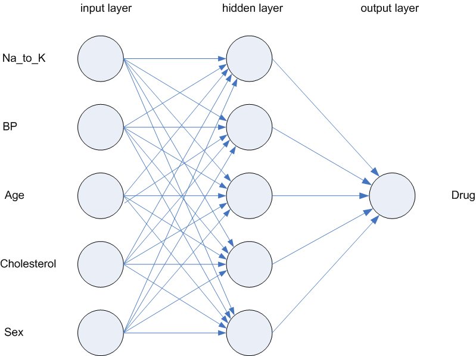
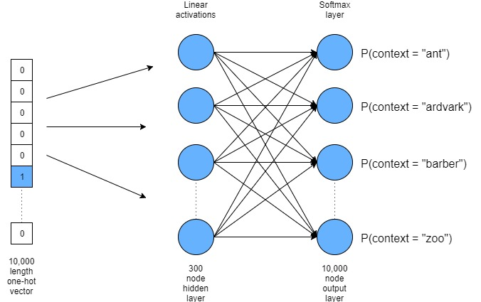
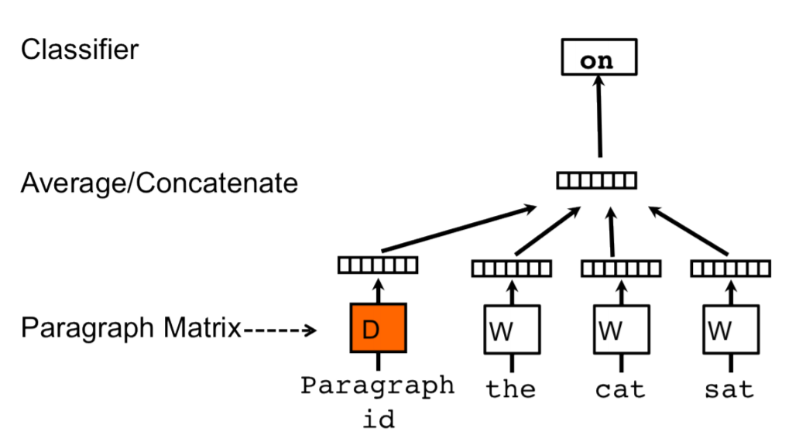
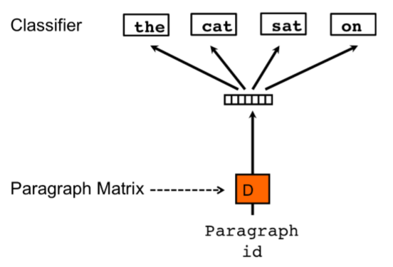

## Extending our learning

- Different types of representation of words than a simple model
- Extension of similarity by examining the "company" a word keeps
- Integration of neural models into vector space models

## Word Embeddings

- What we've been doing with words by documents matrices is somewhat word embeddings, where words are mapped into numeric vectors
- Word embeddings can also be used in neural networks
- Model examples include word2vec and Glove

## Usefulness of Word Embeddings

- Figure out similarities between concepts
- Semantic classification (categories, similarities)
- Text classification (keywords, similar documents)
- And on!

## word2vec is a Neural Net

- word2vec extends our semantic vector space models into a neural net models
- Neural net models try to represent the way that neurons work in the brain
- They are organized by layers which show the interconnected processes occurring in cognition
  - Also, they show that we don't really know all the things the brain is doing!
- The nodes are connected via weights, which are adjusted with training

## Example visualization

```{r pic1, echo=FALSE, fig.align="center"}

```

## Neural Net Models

- There are lots of ins and outs for the definitions of neural networks (perceptron, feed forward, back propagation, etc.)
- A simple distinction is "shallow" versus "deep" learning
- Shallow learning models only include one hidden layer, while deep learning models include multiple hidden layers
- word2vec is a shallow model with only one hidden layer between input and output

## Better than vector space?

- These models are better at capturing context than vector space models
- The bag of words approaches we have used for other models ignore the order and link between words (i.e. are they next to each other? Or simply in the same document?)
- Before this wasn't a big deal because we would relate the occurrence of words globally - if all the same words appeared in documents, then they were probably related
- Now, we can add features to this representation, such as the context of the words around it thus, grabbing word *embedding* 

## word2vec Embedding Types

- There are several ways to accomplish embeddings:
- CBOW: continuous bag of words
- Skip Gram

## CBOW

- CBOW tries to understand a word by simple context, often thought of as a "moving window" - a process that might be akin to reading
- If I had the sentence: "I have been running this lasso regression all morning", understanding the word "lasso" would be `running this regression all`

## Skip gram 

- Skip gram models interpret context by linking words in the moving window directly together and picking a random word for context
- In the previous example, we would see that `running` or `regression` might be used 

## Visual comparison 

```{r pic2, echo=FALSE, fig.align="center"}
knitr::include_graphics("cbo_vs_skipgram.png")
```

## Which one is better?

- CBOW models are faster, often better with more frequent contexts
- Skip gram models are better at rare combinations, can work with smaller training data 

```{r}
##r chunk
library(reticulate)
```

## A simple example

- Use the `abc` corpus from `nltk` - Australian Broadcasting Commission 2006 - a plain text corpus with lots of words and sentences
- Any set of a lot of words and sentences should work 

```{python}
##python chunk
import nltk
import gensim
from nltk.corpus import abc
```

## A simple example

- Use the `gensim` package to build a word2vec model - notice how you are inputting tokenized documents into the model (.sents() is a list of lists of words)
- Use the model to pull out vocabulary (i.e., the words it used as input)
- Find a similar word based on context
- The numbers presented are cosine similarity 

```{python}
##python chunk
model = gensim.models.Word2Vec(abc.sents())
X = list(model.wv.vocab)
model.wv.most_similar('science')
```

## Activation

- Activation is the idea of what inputs are required to produce a specific output
- In the brain, this idea is what neurons need to "fire" to create a thought/action/etc
- For example, to interpret a picture, we need a pattern of activation - color, lines, curves, etc. that are all represented in different parts of the brain 

## Activation

- In word2vec, softmax method is used
- The function will predict which words have the highest probability of being in the context of the input word
- The denominator of the softmax function has to evaluate all the possible context words in the vocabulary

## Activation

```{r pic3, echo=FALSE, fig.align="center"}

```

## Options in word2vec

word2vec(

- list of tokenized sentences, 
- min_count = number of times a word has to appear to stay in the vocab,
- size = dimension of the number of vectors, 300 is often used,
- workers = number of threads to train model,
- window = maximum distance between current and predicted word
- sg = 0 for CBOW, 1 for Skip Gram
- ...few more we aren't going to use much 
)

## Example

- From the `janeaustenr` package, we can import all the works of Jane Austen.
- This data is somewhat processed by line, instead of sentence, but we can use that as our sentences to tokenize.

```{r}
##r chunk
library(janeaustenr)
text_data <- austen_books()
text_data <- subset(text_data,
                    nchar(text) >= 50 & book == "Sense & Sensibility")
text_data <- as.data.frame(text_data)
```

## Data Cleanup

```{python}
##python chunk
text_data = r.text_data
list_data = text_data['text'].tolist()
 
token_data = []

for sent in list_data:
  temp = gensim.utils.simple_preprocess(sent)
  token_data.append(temp)
  
token_data[0:2]
```

## Build the Model

```{python}
##python chunk
model = gensim.models.Word2Vec(
        token_data,
        size=100, #smaller size for smaller data
        window=6,
        min_count=2,
        workers=4)
```

## Let's see what happened!

```{python}
##python chunk
model.wv.most_similar("elinor")
model.wv.most_similar("duty")
```

## Let's try Skip Gram

```{python}
##python chunk
model2 = gensim.models.Word2Vec(
        token_data,
        size=100, #smaller size for smaller data
        window=6,
        min_count=2,
        workers=4,
        sg = 1)
```

```{python}
##python chunk
model2.wv.most_similar("elinor")
model2.wv.most_similar("duty")
```

## Want to learn more?

- https://medium.com/@zafaralibagh6/a-simple-word2vec-tutorial-61e64e38a6a1 (for the top, not the JAVA).
- http://jalammar.github.io/illustrated-word2vec/

## Classification with word2vec

- A tutorial from: https://towardsdatascience.com/multi-class-text-classification-model-comparison-and-selection-5eb066197568
- We have learned how to build a word2vec model, let's now focus on how to use that model to classify documents
- The question is: how do we turn a neural net model into features we can apply algorithms to? 

## Necessary packages and data

- We are going to use data from Stack Overflow
- Each document represents a question asked on Stack Overflow for Python, C++, and PhP categories

```{python}
##python chunk
import pandas as pd
import numpy as np
from bs4 import BeautifulSoup
import re
from nltk.corpus import stopwords
import nltk
from sklearn.metrics import classification_report
from sklearn.metrics import accuracy_score
SOdata = pd.read_csv("stack_overflow.csv")
SOdata.head()
```

## Clean up the data

- We've covered a few simple ways to clean up the data including `gensim.simple_preprocess`
- In this function, we are taking out symbols, stopwords, lower casing the text, and removing html codes
- Because this data is from the internet, we should clean out only necessary parts (i.e., spelling would not work on this data)

## Clean up the data

```{python}
##python chunk
REPLACE_BY_SPACE_RE = re.compile('[/(){}\[\]\|@,;]') #remove symbols with space
BAD_SYMBOLS_RE = re.compile('[^0-9a-z #+_]') #take out symbols altogether
STOPWORDS = set(stopwords.words('english')) #stopwords

def clean_text(text):
    text = BeautifulSoup(text, "lxml").text # HTML decoding
    text = text.lower() # lowercase text
    text = REPLACE_BY_SPACE_RE.sub(' ', text) # replace REPLACE_BY_SPACE_RE symbols by space in text
    text = BAD_SYMBOLS_RE.sub('', text) # delete symbols which are in BAD_SYMBOLS_RE from text
    text = ' '.join(word for word in text.split() if word not in STOPWORDS) # delete stopwors from text
    return text
```

## Apply clean_text

- Apply our clean_text function to the pandas column and view what the output is. 

```{python}
##python chunk
SOdata['post'] = SOdata['post'].apply(clean_text)
SOdata.head()
```

## Build two models

- We are going to treat this now like a machine learning problem.
- First, split the data into a training dataset (to build the model with) and a testing dataset (to see if the model is any good)

```{python}
##python chunk
X = SOdata['post']
y = SOdata['tags']

from sklearn.model_selection import train_test_split
X_train, X_test, y_train, y_test = train_test_split(X, y, test_size=0.20, random_state = 42)
```

## Tokenize the words

- For some of our functions, we need a tokenized list of our words, rather than individual "documents"
- We can tokenize them and save them as lists to use again

```{python}
##python chunk
tokenized_train = [nltk.tokenize.word_tokenize(text)
                   for text in X_train.to_list()]
tokenized_test = [nltk.tokenize.word_tokenize(text)
                   for text in X_test.to_list()]
```

## Build the word2vec model

```{python}
##python chunk
# build word2vec model
w2v_model = gensim.models.Word2Vec(tokenized_train, 
                                   size=100, window=6,
                                   min_count=2, iter=5, workers=4)
```

## How to get features?

- Nearly all predictive models have some sort of feature set they use to predict the outcome or category
- How do we convert a neural net model into a predictive model? 
- We can convert the word vectors created by the model into an vocabulary by features matrix
- By converting back, we can treat these as our predictors in any machine learning algorithm (much like we might with LSA or Topics)

## How to get features?

```{python}
##python chunk
def document_vectorizer(corpus, model, num_features):
    vocabulary = set(model.wv.index2word)
    
    def average_word_vectors(words, model, vocabulary, num_features):
        feature_vector = np.zeros((num_features,), dtype="float64")
        nwords = 0.
        
        for word in words:
            if word in vocabulary: 
                nwords = nwords + 1.
                feature_vector = np.add(feature_vector, model.wv[word])
        if nwords:
            feature_vector = np.divide(feature_vector, nwords)

        return feature_vector

    features = [average_word_vectors(tokenized_sentence, model, vocabulary, num_features)
                    for tokenized_sentence in corpus]
    return np.array(features)
```

## Apply our conversion function 

```{python}
##python chunk
# generate averaged word vector features from word2vec model
avg_wv_train_features = document_vectorizer(corpus=tokenized_train,
                                                    model=w2v_model,
                                                     num_features=100)
avg_wv_test_features = document_vectorizer(corpus=tokenized_test, 
                                                    model=w2v_model,
                                                    num_features=100)
```

## Use those features

- I do assume you know a little bit about logistic regression here!
- Essentially, we use logistic regression to predict categories based on our features
- We train a model with our training data, then examine how well it predicts the new testing data
- Models that fit well have:
  - High accuracy scores: how much you got right
  - High precision scores: number of times correct for class given false positives
  - High recall scores: number of times correct for class given false negatives
  - High F1 scores: the harmonic mean of precision and recall 
  
## Confusion Matrices

```{r echo = FALSE, out.height="100%",fig.align='center'}
knitr::include_graphics("confusion.png")
```

## Build a logistic model

```{python}
##python chunk
#define your outcomes
my_tags = ["python", "php", "c++"]

#build a log model
from sklearn.linear_model import LogisticRegression
logreg = LogisticRegression(solver='lbfgs', multi_class='ovr', max_iter=10000)

#fit the data to the log model
logreg = logreg.fit(avg_wv_train_features, y_train)
```

## Examine the output

```{python}
##python chunk
#predict new data
y_pred = logreg.predict(avg_wv_test_features)

#print out results
print('accuracy %s' % accuracy_score(y_pred, y_test))
print(classification_report(y_test, y_pred,target_names=my_tags))
```

## FastText

- FastText is Facebook's version of word2vec
- Should better represent rare/idiosyncratic words and events 
- https://fasttext.cc/

## Implementing FastText

```{python}
##python chunk
from gensim.models.fasttext import FastText

#build a fast test model
ft_model = FastText(tokenized_train, size=100, window=6, 
                    min_count=2, iter=5, workers=4)
```

## Extract the features

- Because this model is very similar to word2vec, we can perform the same extraction of features on this model 

```{python}
##python chunk
avg_ft_train_features = document_vectorizer(corpus=tokenized_train, model=ft_model,
                                                     num_features=100)
avg_ft_test_features = document_vectorizer(corpus=tokenized_test, model=ft_model,
                                                    num_features=100)           
```

## Can it predict?

- Use the same logistic regression set up as before
- Is this model better than word2vec?

```{python}
##python chunk
logreg = LogisticRegression(solver='lbfgs', multi_class='ovr', max_iter=10000)
logreg = logreg.fit(avg_ft_train_features, y_train)
y_pred = logreg.predict(avg_ft_test_features)
print('accuracy %s' % accuracy_score(y_pred, y_test))
print(classification_report(y_test, y_pred,target_names=my_tags))
```

## doc2vec

- Paragraph vector (doc2vec) is built on the concepts of word2vec 
- Word2vec examines words in a dimensional space
- Doc2vec examines documents in a dimensional space
  - Additionally, there are extensions of CBOW and Skip-Gram 

## Encoding types

- PV-DM: distributed memory of paragraph vectors
- A take on CBOW that randomly samples consecutive words in a document and try to predict a new word based on context and paragraph

```{r pic1doc, echo=FALSE, fig.height=4, fig.align="center"}

```

## Encoding types

- DBOW: distributed bag of words
- Works much like a Skip Gram model 

```{r pic2doc, echo=FALSE, fig.height=4, fig.align="center"}

```

## How to build a model

Doc2Vec(

- dm: 0 for distributed bag of words, 1 for distributed memory
- vector_size: number of dimensional feature vectors
- min_count: number of times a word has to appear to be included
- negative: number of noise words
- hs: negative sampling will be used
- sample: the threshold for how high-frequency words will be randomly sampled
- workers: number of cores 

)

## Let's build!

- We have to create a special type of python object called a `TaggedDocument`
- This function allows us to tag each document with a paragraph label
- Do not confuse this with the classification label 

```{python}
##python chunk
from gensim.models import Doc2Vec
from gensim.models.doc2vec import TaggedDocument
from sklearn import utils

def label_sentences(corpus, label_type):
    labeled = []
    for i, v in enumerate(corpus):
        label = label_type + '_' + str(i)
        labeled.append(TaggedDocument(v.split(), [label]))
    return labeled
```

## Build the model

```{python}
##python chunk
#apply our labeling function
X_train_tagged = label_sentences(X_train, 'Train')
X_test_tagged = label_sentences(X_test, 'Test')

#build a blank distributed memory model
model_dbow = Doc2Vec(dm=0, vector_size=100, 
                    negative=5, hs=0, alpha = .065,
                    min_count=2, sample = 0, workers=4)
                    
#build the vocabulary for the model
#why do we build on all data?
all_data = X_train_tagged + X_test_tagged
model_dbow.build_vocab([x for x in all_data])
```

## Train the model

- In these models, because they are somewhat randomly sampled, you will run training several times to help create the appropriate weights

```{python}
##python chunk
for epoch in range(30):
    model_dbow.train(utils.shuffle([x for x in X_train_tagged]), total_examples=len(X_train_tagged), epochs=1)
    model_dbow.alpha -= 0.002
    model_dbow.min_alpha = model_dbow.alpha
```

## How to get features?

- We can simply return the finalized vectors of weights from this model for each document to use in our classification algorithm

```{python}
##python chunk
def get_vectors(model, corpus_size, vectors_size, vectors_type):
    vectors = np.zeros((corpus_size, vectors_size))
    for i in range(0, corpus_size):
        prefix = vectors_type + '_' + str(i)
        vectors[i] = model.docvecs[prefix]
    return vectors
    
train_vectors_dbow = get_vectors(model_dbow, len(X_train_tagged), 100, 'Train')
test_vectors_dbow = get_vectors(model_dbow, len(X_test_tagged), 100, 'Test')
```

## Let's try that log again 

```{python}
##python chunk
logreg = LogisticRegression(solver='lbfgs', multi_class='ovr', max_iter=10000)
logreg = logreg.fit(train_vectors_dbow, y_train)
y_pred = logreg.predict(test_vectors_dbow)
print('accuracy %s' % accuracy_score(y_pred, y_test))
print(classification_report(y_test, y_pred,target_names=my_tags))
```

## Summary

- We have begun to learn a bit about language model representation using a neural network that may, more accurately, represent how the brain processes language
- We ended showing how you can use those models to predict and classify data, extending to FastText and doc2vec
- There are many pretrained models but for specific lexicons, you will want to build your own 