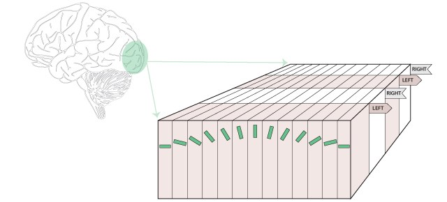
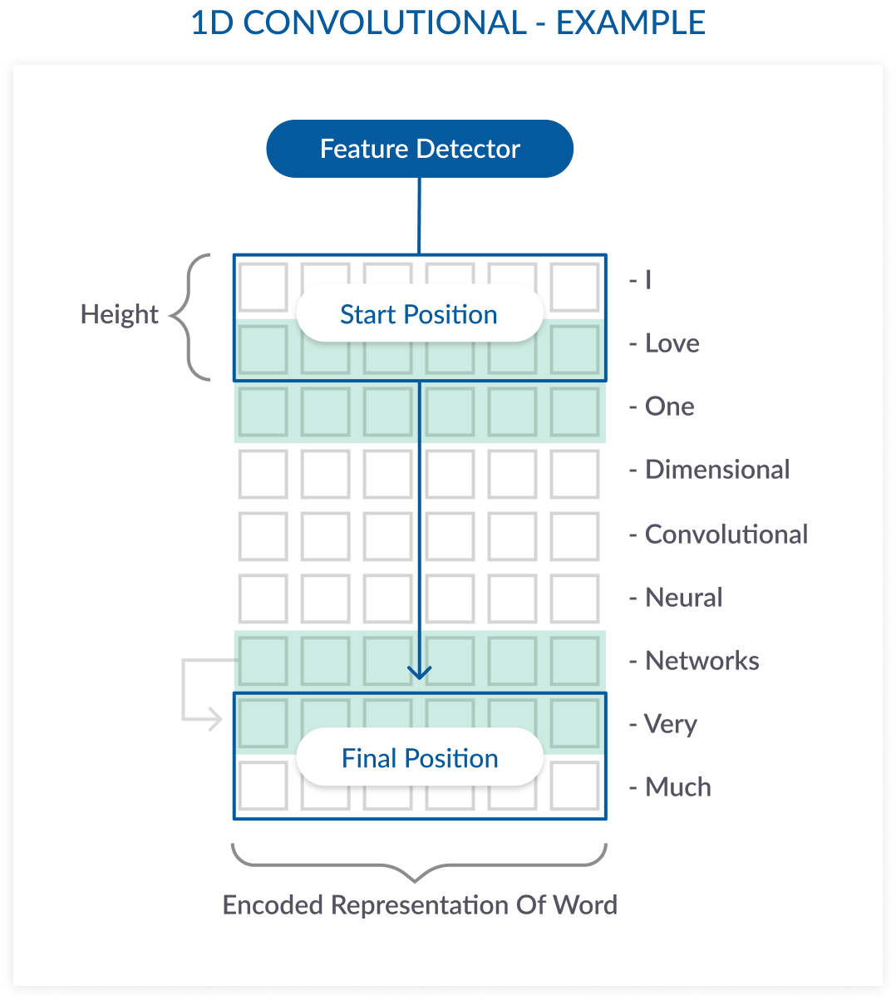

## One Step Further

- Previously, we covered word2vec, creating shallow neural networks of texts
- We then used those encodings to help us predict new information (classification tasks)
- What can we gain by using deep learning - expanding shallow neural networks into multiple hidden layers?

## Types of networks CNNS

- Convolutional neural networks
  - Inspired by the visual cortex, wherein areas of the brain respond to certain visual stimuli
  
```{r echo=FALSE, fig.width=4, fig.align="center"}

library(reticulate)
```

## Types of networks CNNS

- All layers are fully connected, meaning all nodes are connected to all other nodes

```{r echo=FALSE, fig.width=4, fig.align="center"}
knitr::include_graphics("convolutional.png")
```

## Types of networks CNNS

- Uses back propagation to learn: as the model learns, it checks against a known answer, and then adjusts the weights of the model to better capture that answer
  - What we see is a shaping process to getting the right connections in place
  - Loss is the amount of change that occurs in each round of training 
- A very good tutorial: https://adeshpande3.github.io/A-Beginner%27s-Guide-To-Understanding-Convolutional-Neural-Networks/

## Types of networks RNNs

- Recurrent neural networks
  - Many neural models ignore the sequence of information, but RNNs include this information
  - Sequences are easy to think about in language but can be converted for many tasks
  - Left side is a "vanilla" network like a CNN, right sides are more complex sequences with RNNs
  
```{r echo=FALSE, fig.width=4, fig.align="center"}
knitr::include_graphics("recurrent.jpeg")
```

## Types of networks RNNs

- Long short term memory is a popular type of RNN
- Often use a back propagation through time method to train the model (gradient descent) or global optimization 
- A great tutorial: http://karpathy.github.io/2015/05/21/rnn-effectiveness/

## Uses of deep learning

- Speech recognition
- General language modeling 
- Image recognition and classification
- Text generation

## Uses of deep learning

- Machine translation: Google's Neural Machine Translation System 
  - Starting in 2016, Google switched to a deep learning model for machine translation 
  - This model uses context and a recurrent neural network to help with translation
  - Uses zero-shot translations: no need to translate between languages they have trained, but rather direct translation between any two languages
  - Because this system works, shows implicit and transfer learning (which is hard for humans!)
- Learn more: https://ai.googleblog.com/2016/11/zero-shot-translation-with-googles.html
- Learn more: https://ai.googleblog.com/2016/09/a-neural-network-for-machine.html

## Set up

- Install keras `py_install("keras")` if you have conda + reticulate
- Install tensorflow `py_install("tensorflow")` for conda + reticulate
- You may have to install with administrative capabilities
- This code will not run on the server due to space/capabilities
- This code also does not currently run on M1 Macs (12/2021) as there's a numpy/tensforflow bug 

## A Keras Example

- We are going to use an example from keras to predict sentiment
- Sequential is a type of model that runs in order
- Dense is for layering connected neurons
- LSTM is the type of model we will be using 

## A Keras Example

```{python}
##python chunk
from keras.preprocessing import sequence
from keras.models import Sequential
from keras.layers import Dense, Embedding
from keras.layers import LSTM
from keras.datasets import imdb

max_features = 1000 #you can edit this parameter, top X number of words
maxlen = 15  # size of sequences
batch_size = 32 #size of training batches
```

## Load the data

- Remember, this is a specific example of data that's loaded from keras.
- You can determine how you want to clean the data you were interested in running yourself.
- You could use train_test_split from sklearn to help you break apart a loaded dataset 

```{python}
##python chunk
#ignore warning
import numpy as np
(x_train, y_train), (x_test, y_test) = imdb.load_data(num_words=max_features)

#randomly sample for this example only to run in class time
index = np.random.choice(x_train.shape[0], 1000, replace=False)  
x_train = x_train[index]
y_train = y_train[index]

index = np.random.choice(x_test.shape[0], 1000, replace=False)  
x_test = x_test[index]
y_test = y_test[index]

print(len(x_train), 'train sequences')
print(len(x_test), 'test sequences')
```

## Pad sequences

- Pad sequences is so that each of the inputs have the same length

```{python}
##python chunk
x_train = sequence.pad_sequences(x_train, maxlen=maxlen)
x_test = sequence.pad_sequences(x_test, maxlen=maxlen)
print('x_train shape:', x_train.shape)
print('x_test shape:', x_test.shape)
```

## Build the model

- First, we set up a sequential neural network model
- Then we add our layers to build the model
  - The embeddings layer of our features, which we could use word2vec for or other vector spaces
  - The LSTM layer to help the model "remember"
    - Why 128? It's a good default!
  - Last, the dense layer, which connects to the LSTM layer with sigmoid activation 
    - Remember that activation controls how input and outputs are handled

## Build the model 

```{python}
##python chunk
model = Sequential()
model.add(Embedding(max_features, 128))

# this is the section that doesn't play nice on certain combinations of tensorflow + keras
model.add(LSTM(128, dropout=0.2, recurrent_dropout=0.2)) 
model.add(Dense(1, activation='sigmoid'))
```

## Compile the model

- We need to compile the model we just built 
- All networks need loss and optimizer functions

```{python}
##python chunk
model.compile(loss='binary_crossentropy',
              optimizer='adam',
              metrics=['accuracy'])
```

## Train the model

- The reason I cut down the data is because the larger the data, the longer this takes to run
- We put in the training and validation (test) data, along with batch size and number of runs (epochs)

```{python}
##python chunk
model.fit(x_train, y_train,
          batch_size=batch_size,
          epochs=15,
          validation_data=(x_test, y_test))
```

## Evaluate the model

- Now we can see how well the model did, using score (an evaluation of the loss in the model)
- Accuracy is the accuracy of the model (how well it predicts)
   - We are not doing that great but I also did not put in a lot of data 

```{python}
##python chunk
score, acc = model.evaluate(x_test, y_test,
                            batch_size=batch_size)
print('Test score:', score)
print('Test accuracy:', acc)
```

## Convolutional Neural Network

- Let's try a second example of a CNN
- Here are all the packages you would need (many are already loaded, but to help you keep track of what is necessary)
- Notice the new packages 

```{python}
##python chunk
from keras.preprocessing import sequence
from keras.models import Sequential
from keras.layers import Dense, Dropout, Activation
from keras.layers import Embedding
from keras.layers import LSTM
from keras.layers import Conv1D, MaxPooling1D
from keras.datasets import imdb
```

## Define Parameters

- Here we define the parameters of the CNN + LSTM model

```{python}
##python chunk

# Convolution
kernel_size = 5
filters = 64
pool_size = 4

# Embedding
max_features = 1000
maxlen = 15
embedding_size = 128

# LSTM
lstm_output_size = 70

# Training
batch_size = 30
epochs = 2
```

## Build the model

- Notice how many of the layers are the same
- We have added Dropout, Conv1D, MaxPooling1D
- This model includes seven layers (number of `.add`)
  - Dropout helps with overfitting
  - Conv1D creates a one-dimensional structure to the data
  - MaxPooling is similar to what we did with word2vec to flatten the data

## One Dimension Example

```{r echo=FALSE, fig.width=4, fig.align="center"}

```

## Build the model

```{python}
##python chunk
model = Sequential()
model.add(Embedding(max_features, embedding_size, input_length=maxlen))
model.add(Dropout(0.25))
model.add(Conv1D(filters,
                 kernel_size,
                 padding='valid',
                 activation='relu',
                 strides=1))
model.add(MaxPooling1D(pool_size=pool_size))
model.add(LSTM(lstm_output_size))
model.add(Dense(1))
model.add(Activation('sigmoid'))
```

## Compile the model

- We use the same arguments here for loss and optimization

```{python}
##python chunk
model.compile(loss='binary_crossentropy',
              optimizer='adam',
              metrics=['accuracy'])
```

## Train the model

```{python}
##python chunk
model.fit(x_train, y_train,
          batch_size=batch_size,
          epochs=epochs,
          validation_data=(x_test, y_test))
```

## Examine the accuracy

```{python}
##python chunk
score, acc = model.evaluate(x_test, y_test, batch_size=batch_size)
print('Test score:', score)
print('Test accuracy:', acc)
```

## Further work

- Tensorflow is a popular package for this type of work as well
- Recommend checking out: https://github.com/Apress/text-analytics-w-python-2e/tree/master/Ch10%20-%20The%20Promise%20of%20Deep%20Learning
  - (just wouldn't run in a reasonable time or way for class)
  
## Text Generation

- An example from: https://machinelearningmastery.com/text-generation-lstm-recurrent-neural-networks-python-keras/
- Let's create a big text file of a negative movie reviews. 

```{r}
##r chunk
temp = read.csv("processed_reviews.csv")
bad = subset(temp, sentiment == 0)
bad_text = tolower(paste(bad$review[1:250], collapse = " "))
```

## Libraries for Python

```{python}
##python
import numpy
from keras.models import Sequential
from keras.layers import Dense
from keras.layers import Dropout
from keras.layers import LSTM
from keras.callbacks import ModelCheckpoint
from keras.utils import np_utils
```

## Character Generation

- For this example, we will use characters as our input strings.
- We could use words, but we'd want a lot more reviews to get more accurate word sequences

```{python}
##python chunk
bad_text = r.bad_text
# create mapping of unique chars to integers
bad_chars = sorted(list(set(bad_text)))
bad_char_to_int = dict((c, i) for i, c in enumerate(bad_chars))

n_chars = len(bad_text)
n_vocab = len(bad_chars)

print(n_chars)
print(n_vocab)
```

## Character Sequences

- We are creating our prepared sequence of characters
- Before, we used the pad_sequence option, but this allows us to control the length of characters 

```{python}
##python chunk
# prepare the dataset of input to output pairs encoded as integers
seq_length = 100
dataX = []
dataY = []
for i in range(0, n_chars - seq_length, 1):
	seq_in = bad_text[i:i + seq_length]
	seq_out = bad_text[i + seq_length]
	dataX.append([bad_char_to_int[char] for char in seq_in])
	dataY.append(bad_char_to_int[seq_out])
n_patterns = len(dataX)
print("Total Patterns: ", n_patterns)
```

## One Hot Encoding

- We've already showed that we can use text as our input for a neural net
- We now can also try one hot encoding, which transforms each of our inputs into a binary sequence
- This mirrors our dummy coding we used earlier in the semester

```{python}
##python chunk
# reshape X to be [samples, time steps, features]
X = numpy.reshape(dataX, (n_patterns, seq_length, 1))
# normalize
X = X / float(n_vocab)
# one hot encode the output variable
y = np_utils.to_categorical(dataY)
```

## Build the model

```{python}
##python chunk
# define the LSTM model
model = Sequential()
model.add(LSTM(128, input_shape=(X.shape[1], X.shape[2])))
model.add(Dropout(0.2))
model.add(Dense(y.shape[1], activation='softmax'))
model.compile(loss='categorical_crossentropy', optimizer='adam')
```

## Save the model

- We know these things can take a long time to run
- Here, you can save the output from models you are going to run for a while
- Then load them back later

```{python}
##python chunk
# define the checkpoint
filepath="weights-improvement-{epoch:02d}-{loss:.4f}.hdf5"
checkpoint = ModelCheckpoint(filepath, monitor='loss', verbose=1, save_best_only=True, mode='min')
callbacks_list = [checkpoint]
```

## Train the model

- This took a while to run ... 

```{python eval = F}
##python chunk
model.fit(X, y, epochs=5, batch_size=32, callbacks=callbacks_list)
```

## Use the model

- Import and compile our previously trained model

```{python}
##python chunk
filename = "weights-improvement-05-2.5970.hdf5"
model.load_weights(filename)
model.compile(loss='categorical_crossentropy', optimizer='adam')
```

## Generate some output

- Let's see what the model gives us!

```{python}
##python chunk

#from one hot back to character
int_to_char = dict((i, c) for i, c in enumerate(bad_chars))

# pick a random seed
start = numpy.random.randint(0, len(dataX)-1)
pattern = dataX[start]
print("Seed:")
print("\"", ''.join([int_to_char[value] for value in pattern]), "\"")
# generate characters
newpattern = []
for i in range(100):
	x = numpy.reshape(pattern, (1, len(pattern), 1))
	x = x / float(n_vocab)
	prediction = model.predict(x, verbose=0)
	index = numpy.argmax(prediction)
	result = int_to_char[index]
	newpattern.append(result)
	
	#move the pattern forward
	seq_in = [int_to_char[value] for value in pattern]
	pattern.append(index)
	pattern = pattern[1:len(pattern)]

''.join(newpattern)
```

## Summary

- You learned how to start building deep learning models
- We did examples with simple data to show sequential and convolutional models
- We expanded that information to text generation models
- Great job! You've learned all the things!
