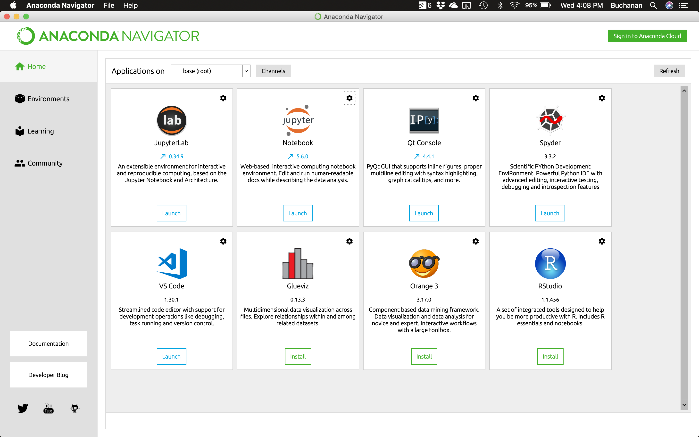
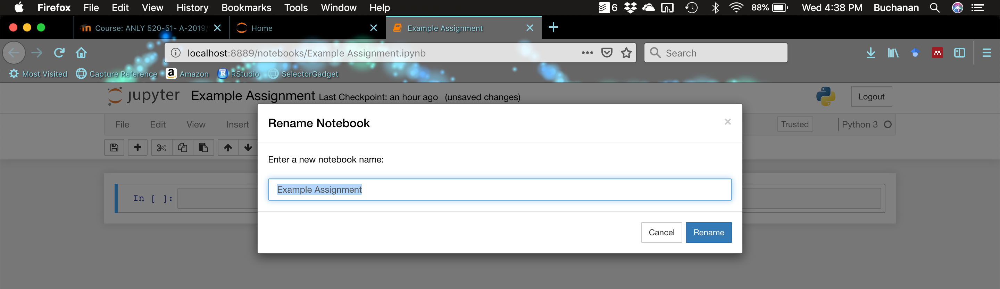
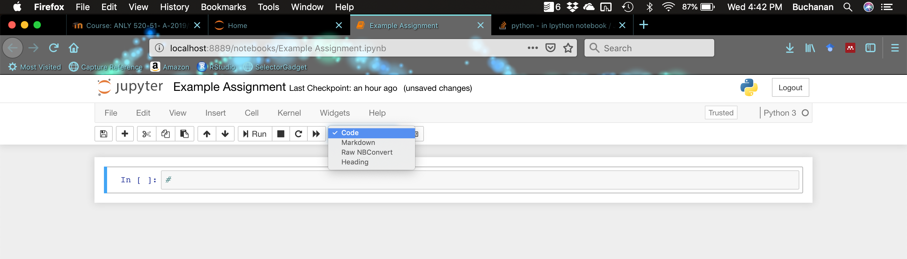
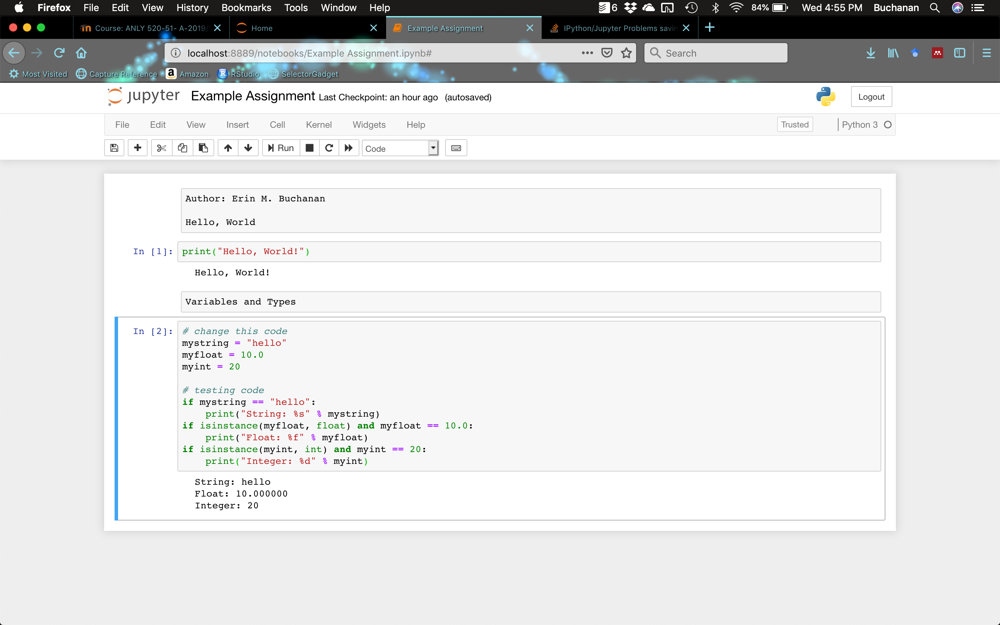

## Install the Anaconda Distribution

- Go to: [https://www.anaconda.com/download/](https://www.anaconda.com/download/). 

- Download the Python 3.7+ distribution from the Anaconda website for your operating system. 

- Install after it finishes downloading.

## Open Anaconda-Navigator

Once you have installed Anaconda, you should see under Applications (Mac) or Programs (Windows) a program called Anaconda Navigator. It should look like this:

```{r echo=FALSE, out.width = "100%"}

```

## Create your report

- Note: this instruction guide will help you learn how to navigate Jupyter notebooks. For this assignment, one has already been built for you - you can open it to get started, but here's how to create your own which you will do for the next set of assignments. 

- Create a document/report with the code and output merged together. If you are familiar with Markdown, you can use Markdown to knit together a document (that's how this file was written). 

- Otherwise, you can use Jupyter notebooks to help put together a coherent, share-able document of your script and what it does. 

- Open Jupyter notebooks from within the Anaconda Navigator. Once you get to the main Jupyter window (this will open in an internet browser), you should click on New -> Notebook -> Python 3. 

- In this window, you will add your code and comments to that code. 

- Give your assignment a name, by clicking on Untitled at the top and saving the file with whatever file name you would like.

```{r echo=FALSE, out.width="100%"}

```

- Each section is called a "cell". You can have several types of cells, and you will generally use `code` for running your python script (which will also give you the output) and `markdown` for typing text. 

- Change the first cell to a `markdown` cell by clicking on `code` and changing to `markdown`. 

```{r echo=FALSE, out.width="100%"}

```

- Put your name at the top of this cell. 

- Create a new cell by clicking the plus (+) icon located under File. The default cell type is a code block. You can enter your first round of code here. To run a code block, click Run or hit Shift+Enter. 

- Continue adding markdown sections and code blocks until you've completed the assignment. Be sure to run each Python cell. 

```{r echo=FALSE, out.width="100%"}

```

## Learn some Python 

- Open the example notebook - when you first open Jupyter, you can see the files on your computer. Download the `Assignment 1 - How To Python.ipynb` file from Moodle. Then, go back to the webpage with Jupyter on it. You can find the file like you would find it on your computer, and open it through the webpage navigator. 

- This file contains a set of tutorials from DataCamp. You will read through the tutorials and run the Python code as you go to see how Python works. 

- At the end of each tutorial section, you will find a section labeled Exercise. You will edit the code in the Exercise section to answer the question. You can use `Assignment 1 - How To Python Answers.ipynb` online to check to make sure you are getting it right. 


## Submit Your Assignment

- Click on File -> Download As.

- If you have `LaTex` installed, you can save this file as a .pdf file. 

- Otherwise, save the file as .html. 

- Submit the report and the script on Moodle. I will comment on the report, which should contain answers, descriptions, etc. as required, but will use the script to help you troubleshoot when you are having problems getting your code to run. Future assignments will contain a Jupyter notebook or markdown to get you started. 

