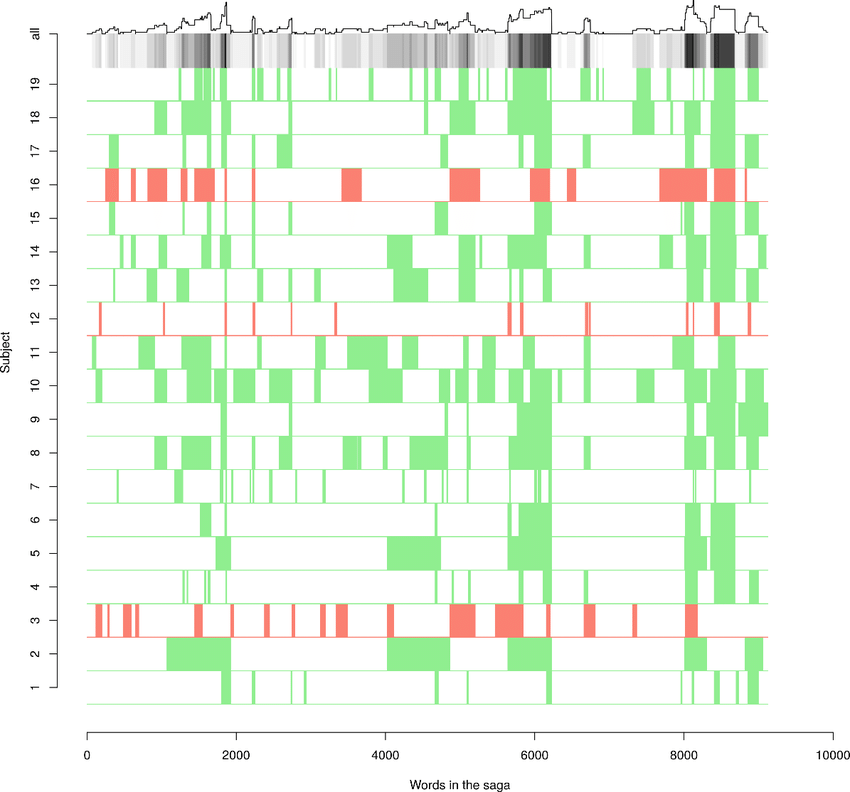
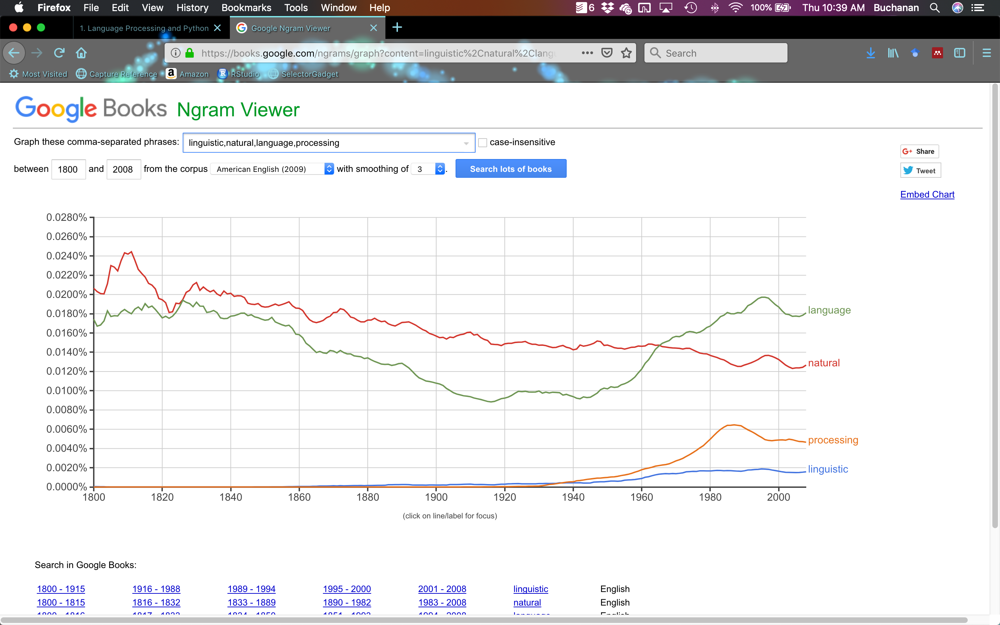

## What is this course about?

- Natural Language Processing (and the Python Toolkit)
- Computational Linguistics
- Dealing with language (which is messy)

## What will you learn?

- How simple programs can help you manipulate and analyze language data, and how to
write these programs
- How key concepts from text mining and linguistics are used to describe and analyze language
- How data structures and algorithms are used in text mining and NLP
- How language data is stored in standard formats, and how data can be used to evaluate the performance of NLP techniques

## Syllabus

- You should read the syllabus for course policies and other important information. 
- You will use Moodle for all course related activities. 
- Let's check those things out now.

## Writing

- You will be expected to write reports with code and text embedded. 
- You will want to embed or otherwise cite your sources for material you are referencing.
- Please use APA style on how to citations (search Purdue OWL for tips).

## What is NLP?

- Natural language processing
- Roots in computer science, artificial intelligence, and linguistics
- Focuses on human language and how to analyze language data
- What is language? How do we deal with such a messy construct?

## Origins of NLP

- Turing Test - Intelligence (1950)
    - Chinese Room Thought Experiment by Searle (1980)
- Georgetown Experiment - Machine Translation (1954)
- NLP Systems (1960s)
    - SHRDLU 
    - ELIZA
- Explosion in research given computational power increases, corpus linguistics, and machine learning

## Why Study NLP?

- 80% of "big data" is unstructured data
    - Images
    - Videos
    - Human language (text, recordings)
- Text Mining (text analytics, sentiment analysis, etc.)
    - Linguistic, statistical, and machine learning techniques used to derive high-quality information from text
    
## Traditional Approaches to Text Analytics

- Semantics
    - Readability 
    - Student interest indices
    - Vocabulary 
- Frequency, frequency, frequency
    - Factor/cluster analysis
    - Word clouds
    - Pages, chapters, etc. 

## Terms to Know

- Corpus: a body of linguistic data
    - [Corpus of Contemporary American English](https://corpus.byu.edu/coca/)

```{r echo=FALSE, out.width="100%"}
knitr::include_graphics("lesson1-coca.png")
```

## Terms to Know

- Token: total number of words in a text
- Types: number of distinct words 
- Frequency distribution: a list of all the unique tokens (types) and count of how many times they appear

```{r echo=FALSE, out.height="400px", fig.align="center"}
knitr::include_graphics("lesson1-freqdist.png")
```

## Terms to Know

- Dispersion plot: a graphical representation of the location of tokens in a text

```{r echo=FALSE, out.height="400px", fig.align="center"}

```

## Terms to Know

- Collocation: a sequence of words that occur together often
- n-Gram: n words that occur together 

```{r echo=FALSE, out.width="100%"}

```

## How to Compute Language

- Basic Statistics
    - Frequency: Counts of characters, words, sentences
    - Lexical Diversity: percentage of unique word tokens
    - Lexical Dispersion: position of word tokens in the text 

## How to Compute Language    

- Word Sense Disambiguation
    - Determine which word was intended in a given context
        - serve: help with food or drink; hold an office; put ball into play
        - dish: plate; course of a meal; communications device
    - Contextual clues:
        - The lost children were found by the searchers (agentive)
        - The lost children were found by the mountain (locative)
        - The lost children were found by the afternoon (temporal)

## How to Compute Language 	  

- Pronoun Resolution
    - Pronouns refers to a noun - like I/you/this
    - The noun it refers to is called the antecedent
- Examples
    - The thieves stole the paintings. They were subsequently sold.
    - The thieves stole the paintings. They were subsequently caught.
    - The thieves stole the paintings. They were subsequently found.

## How to Compute Language 

- Generating Language Output
    - Question Answering
        - For example, who sold the paintings?
    - Machine Translation
        - Being able to translate from one language to another
        - Search for google translate fails
    - Spoken Dialog Systems
        - Siri, Ok Google, etc. 
        
## How to Compute Language

```{r echo=FALSE, out.width="100%"}
knitr::include_graphics("lesson1-translation.png")
```

## How to Compute Language 

- Textual Entailment: determining if a statement is true from a set of text input
    - Text: David Golinkin is the editor or author of eighteen books, and over 150 responsa, articles, sermons and books
    - Hypothesis: Golinkin has written eighteen books

## Break

- Learn some Python!
- Do the first assignment together with others
- As you read the first chapter of the book, there's more Python tutorial

## Getting Started with the NLTK

- Let's hop over to the Jupyter Notebook for Python
- Class will generally consist of: 
    - Lecture notes - explaining key concepts
    - Notebooks/scripts - active use of key concepts

