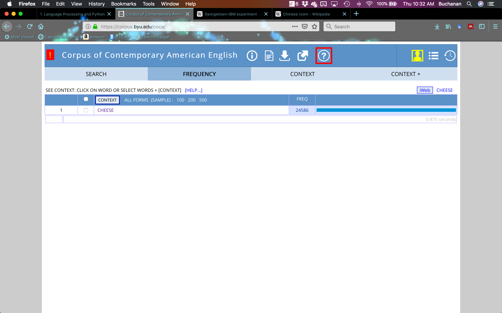
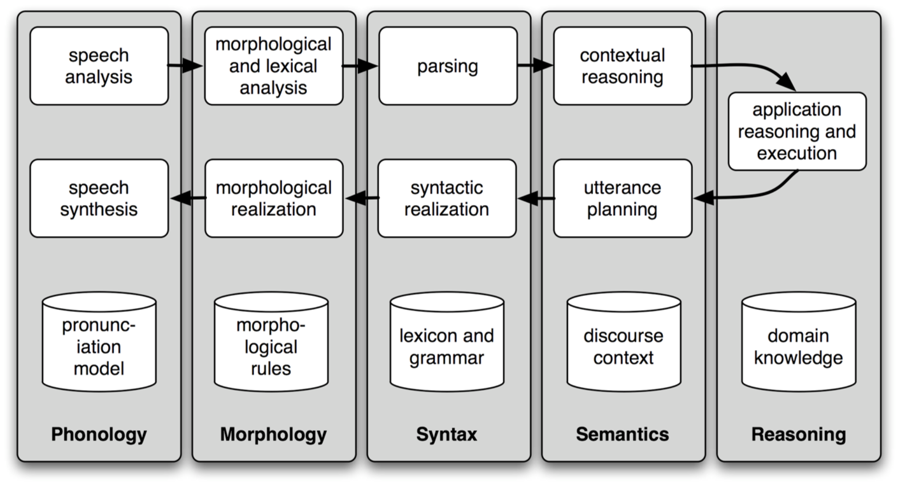

```{r setup, include=FALSE}
knitr::opts_chunk$set(echo = TRUE)
```

## What is this course about?

- Natural language processing - not only sentiment analytics 
- Learning how to perform statistics on text and language (which is messy)

## What will you learn?

- Students will be able to *define* **Natural Language Processing**.
- Students will be able to **identify key concepts** *of computing with language*.
- Students will be able to **explain the relevance** *of Natural Language Processing to* **current technological needs**.
- Students will be able to **install and experiment with Natural Language Processing tools**.

## Syllabus

- You should read the syllabus for course policies and other important information. 
- You will use Canvas for all course related activities. 
- Let's check those things out now.

## Writing

- You will be expected to write reports with code and text embedded. 
- APA Style citations are the preferred format for crediting your sources.
- Both in-text citations and reference pages are required.
- Refer to [link](http://www.apastyle.org) if you need a review of the proper format.
- Examples: 

     - Relational database systems do not lend themselves well to clustered computing; even though some RDBMS offerings have a clustered component, such as Oracle Real Application Cluster (RAC), they still rely on big hardware and a shared storage array. (Sadalage & Fowler, 2013)  
     - Sadalage, P. J., & Fowler, M. (2013). NoSQL Distilled: A Brief Guide to the Emerging World of Polyglot 	Persistence. Upper Saddle River, NJ: Pearson 	Education, Inc.

## What is NLP?

- Natural language processing
- Roots in computer science, artificial intelligence, and linguistics
- Focuses on human language and how to analyze language data
- What is language? How do we deal with such a messy construct?

## Origins of NLP

- Turing Test - Intelligence (1950)
    - Chinese Room Thought Experiment by Searle (1980)
- Georgetown Experiment - Machine Translation (1954)
- NLP Systems (1960s)
    - SHRDLU 
    - ELIZA
- Explosion in research given computational power increases, corpus linguistics, and machine learning

## Roots in Artificial Intelligence

- The term "artificial intelligence" was coined by John McCarthy in 1956. 
- The subject has been studied for decades and one of the most elusive in Computer Science. 
- AI ranges from machines that are search algorithms to the goal - capable of thinking.
- [link](https://courses.cs.washington.edu/courses/csep590/06au/projects/history-ai.pdf)


## The Turing Test

- No one can refute a computer's ability to process logic. 
- However, the question needs to be answered if the computer thinks or not. 
- This gets down to the precise definition of "think".
- It is important because their are strong oppositions as to whether or not this notion is even possible. 
- The Turing test is a central, long term goal for AI research:
- Will we ever be able to build a computer that can sufficiently imitate a human to the point where a suspicious judge cannot tell the difference between human and machine?
- [link](https://en.wikipedia.org/wiki/Turing_test) 

## Early 1960s ~ Baseball

- Baseball is a computer program, built in two parts, that answers questions phrased in ordinary English about stored data. 
  - The program reads the question from punched cards. 
  - After the words and idioms are looked up in a dictionary, the phrase structure and other syntactic facts are determined for a content analysis, which lists attribute-value pairs specifying the information given and the information requested. 
  - This information was then matched to a database to find the answers. 
- The program's context was baseball games; it answers
such questions as *"Where did each team play on July 7?"*

## Early 1960s ~ Eliza

- ELIZA is an early natural language processing computer program created from 1964 to 1966 at the MIT AI Lab by Joseph Weizenbaum.
  - Created to demonstrate the superficiality of communication between humans and machines.
  - It simulated conversation by using a pattern matching and substitution methodology.
  - Had no built in framework for contextualizing events.
  - Surprising number of individuals who attributed human-like feelings to the computer program, including Weizenbaum's secretary.

## Early 1960s ~ SHRDLU 

- SHRDLU is a program for understanding natural language, written by Terry Winograd at the MIT Artificial Intelligence Laboratory in 1968-70.
  - Carried on a simple dialog with a user about specific objects shown on the screen.
    
## Why Study NLP?

- 80% of "big data" is unstructured data
    - Images
    - Videos
    - Human language (text, recordings)
- Text Mining (text analytics, sentiment analysis, etc.)
    - Linguistic, statistical, and machine learning techniques used to derive high-quality information from text
    
## Traditional Approaches to Text Analytics

- Semantics
    - Readability 
    - Student interest indices
    - Vocabulary 
- Frequency, frequency, frequency
    - Factor/cluster analysis
    - Word clouds
    - Pages, chapters, etc. 
    
## What are we going to do?

- Learn how to process raw text
- Learn how to tag for parts of speech
- Learn how to parse sentences and perform entity recognition
- Learn how to use dependency parsing
- Learn classification skills
- Learn sentiment analysis 

## Text analytics 

- NLP: use of a computer to process natural (human) language
- Computational linguistics: examining language through a computational focus 
- Machine learning: using an algorithm for a machine to learn a specific task - usually how to classify or process text
- Information retrieval: looking up information based on a query, which requires text processing

## Terms to Know

- Corpus: a body of linguistic data
    - [Corpus of Contemporary American English](https://corpus.byu.edu/coca/)

```{r echo=FALSE, out.width="100%"}

```

## Corpora

- What can we do with a corpus?
  - Lots of stuff!
  - Commonly: part of speech tagging, stemming, lemmatization, creating and testing grammars, understanding roles and types of words
- Popular corpora:
  - Brown corpus: most overused corpus! first corpus published in a book, text in a few categories
  - LOB corpus: the British answer to the Brown corpus
  - CHILDES/TalkBank: children speeches/text, audio, video
  - WordNet: a hierarchically structured lexical database
  - Treebank: corpus for lemmatization, part of speech tagging
  - Reuters: a corpus of news articles that is often used for machine learning
  - ANC and BNC: American and British National Corpus; COCA: Corpus of Contemporary American English and Google N-gram - all the words!
  - Web/chat/email/tweets: many new corpora fall into these categories and are often hosted on kaggle 

## Terms to Know

- Token: total number of words in a text
- Types: number of distinct words 
- Frequency distribution: a list of all the unique tokens (types) and count of how many times they appear

```{r}
##r chunk
#install.packages("https://osf.io/ak7gq/download", repos = NULL, method = "libcurl", type = "source")
library(Rling)
data(ELP)
ELP <- ELP[order(ELP$SUBTLWF, decreasing = T) , ]
ELP <- ELP[1:100 , ]
barplot(ELP$SUBTLWF, names.arg = ELP$Word,
        xlab = "Top 100 Words", ylab = "Frequency")
```

```{r python_setup, echo = F, message = F}
##r chunk
#library
library(reticulate)

py_config()
```

## Terms to Know

- Dispersion plot: a graphical representation of the location of tokens in a text

```{python}
##python chunk
import nltk
from nltk.book import text4
text4.dispersion_plot(["citizens", "democracy", "freedom", "duties", "America"])
```

## Terms to Know

- Collocation: a sequence of words that occur together often
- n-Gram: n words that occur together 

```{r echo=FALSE, out.width="100%"}
knitr::include_graphics("ngram.png")
```

## How to Compute Language

- Basic Statistics
    - Frequency: Counts of characters, words, sentences
    - Lexical Diversity: percentage of unique word tokens
    - Lexical Dispersion: position of word tokens in the text 

## How to Compute Language    

- Word Sense Disambiguation
    - Determine which word was intended in a given context
        - serve: help with food or drink; hold an office; put ball into play
        - dish: plate; course of a meal; communications device
    - Contextual clues:
        - The lost children were found by the searchers (agentive)
        - The lost children were found by the mountain (locative)
        - The lost children were found by the afternoon (temporal)

## How to Compute Language 	  

- Pronoun Resolution
    - Pronouns refers to a noun - like I/you/this
    - The noun it refers to is called the antecedent
- Examples
    - The thieves stole the paintings. They were subsequently sold.
    - The thieves stole the paintings. They were subsequently caught.
    - The thieves stole the paintings. They were subsequently found.

## How to Compute Language 

- Generating Language Output
    - Question Answering
        - For example, who sold the paintings?
    - Machine Translation
        - Being able to translate from one language to another
        - Search for google translate fails
    - Spoken Dialog Systems
        - Siri, Ok Google, etc. 
        
## How to Compute Language

```{r echo=FALSE, out.width="100%"}

```

## How to Compute Language 

- Textual Entailment: determining if a statement is true from a set of text input
    - Text: David Golinkin is the editor or author of eighteen books, and over 150 responsa, articles, sermons and books
    - Hypothesis: Golinkin has written eighteen books

## Final Thoughts

- In this lecture, we covered some of the basic concepts in NLP 
- Additionally, how those basic concepts might be applied to future directions
- Next step: get your computer set up for the semester!

