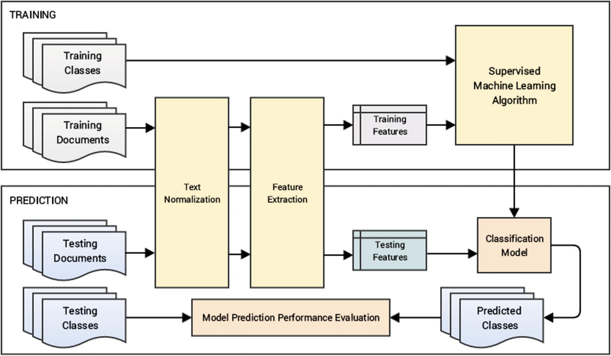
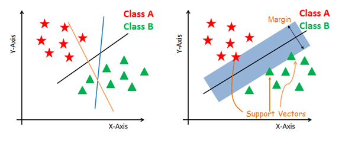

```{r setup, include=FALSE}
knitr::opts_chunk$set(echo = TRUE)
```

## Classification

- Text or document classification is an important area of text analytics
- Used to classify, cluster, categorize, or otherwise group documents based on the attributes of that document
- This work is especially useful when you have lots of documents and don't have the time or energy to read them all!
- This work is not only for documents, but can be applied to music, images, video, etc.

## Classification

- We have called our different functions/programs things like:
  - Taggers: part of speech
  - NER: named entity recognition
  - Parsers: sentence parsing and chunking
- All of these are basically specialized forms of classification
- Now, we will explore how to build a classifier and talk specifically about feature extraction as our focus

## Classification

- The main goal is to take data (documents) that we have and figure out how to classify it 
  - The classification labels can be whatever you'd like them to be 
  - You can perform this classification based on a prelabeled data (supervised learning) or unlabeled data (unsupervised learning)
- All documents will still need to be "cleaned" or normalized before using classification techniques 

## Terminology

- What can I classify? 
  - Individual words (often used for sentiment, categories)
  - Phrases/sentences
  - Tweets
  - Documents - often the term document is used to mean any of these, text of varying size 
  
## Terminology

- Often you have a set of predefined "classes" you want to classify documents as
  - Like positive, neutral, negative
  - Sports, fiction, news, academic, etc.
  - Any type of keywords you would like
- Then, in other analyses you are using the documents to help reveal what keywords might be used for classification 

## Terminology

```{r echo = FALSE, fig.align='center'}
knitr::include_graphics("TextClassificationExample.png")
```

## Types of Techniques

- Unsupervised machine learning: 
  - Does not require prelabeled data
  - Focus is on pattern finding, finding latent structures in the data
  - Use feature engineering to find the meaningful patterns
  - Clustering, topic models, factor analysis 

## Types of Techniques

- Supervised machine learning:
  - Requires prelabeled data with categories already defined 
  - Features are extracted to predict those categories 
  - Regression is technically a form of supervised learning - you are trying to predict a continuous outcome
  - Classification is when you are trying to predict a categorical (label) outcome

## Supervised Learning

- First, you will define the feature extraction by determining what might be predictive of your categories
- Next, you will pick an algorithm to use to see if you can map features to category labels
- Once you pick this algorithm, you will use part of the labeled data as *training* data to give your model *learning*
- At this stage, you are improving by tweaking the parameters of the model (hyperparameters)

## Supervised Learning

- After training, you would seek to explore if the model is any good by examining metrics, such as accuracy
- At this stage, you may have a development *testing* set that you can use to improve your model
- After you have completed developing your model, you would measure performance by applying the model to a new *testing* set and examine metrics

## Outcomes

- Binary: two classes or categories, and you assign each document one of their labels
- Multi-class classification: three or more categories, and you assign each document to only one category
- Multi-label classification: you assign documents into one or more labels (like a set of keywords)

## The Process

```{r echo = FALSE, fig.align='center'}

```

## Working the Process

- Here's everything we are going to use!

```{r}
##r chunk
library(reticulate)
```

```{python}
##python chunk
from sklearn.datasets import fetch_20newsgroups
import numpy as np
import matplotlib.pyplot as plt
import pandas as pd
from bs4 import BeautifulSoup 
from nltk.stem import PorterStemmer
ps = PorterStemmer()
import nltk
stopwords = nltk.corpus.stopwords.words('english')
import unicodedata
from contractions import contractions_dict
```

## 20 Newsgroups

- Difficult classification task if you use all 20 categories 
- We need to clean out the formatting (headers, footers, etc.), take out empty posts, and do other text processing that we discussed earlier in the semester 

## 20 Newsgroups

```{python}
##python chunk
data = fetch_20newsgroups(subset='all', shuffle=True,
                          remove=('headers', 'footers', 'quotes'))
data_labels_map = dict(enumerate(data.target_names))
```

## 20 Newsgroups

- Break apart the data into data, label number, label name
- Make the data into a pandas dataframe
- Look at what we've got 

```{python}
##python chunk
corpus, target_labels, target_names = (data.data, data.target, 
                                       [data_labels_map[label] for label in data.target])
data_df = pd.DataFrame({'Article': corpus, 'Target Label': target_labels, 'Target Name': target_names})
print(data_df.shape)
data_df.head(10)
```

## Text Normalization

```{python}
##python chunk
total_nulls = data_df[data_df.Article.str.strip() == ''].shape[0]
print("Empty documents:", total_nulls)

data_df = data_df[~(data_df.Article.str.strip() == '')]
data_df.shape
```

## Text Normalization

```{python eval = F}
##python chunk 
# normalize our corpus

#remove html
data_df['Article'] = [BeautifulSoup(str(text)).get_text() for text in data_df['Article'].tolist()]

#lower case
data_df['Article'] = data_df['Article'].str.lower()

#contractions
#data_df['Article'] = [contractions.fix(text) for text in data_df['Article'].tolist()]
for contraction, expansion in contractions_dict.items():
  data_df['Article'] = data_df['Article'].str.replace(contraction, expansion)

#unicode
data_df['Article'] = [unicodedata.normalize('NFKD', str(text)).encode('ascii', 'ignore').decode('utf-8', 'ignore') for text in data_df['Article'].tolist()]

#take out special characters
data_df['Article'] = data_df['Article'].str.replace('[^a-zA-Z0-9\s]|\[|\]', '')

#stemming
data_df['Article'] = [' '.join([ps.stem(word) for word in text.split()]) for text in data_df['Article'].tolist()]

#stop words
data_df['Article'] = [' '.join([word for word in text.split() if word not in stopwords]) for text in data_df['Article'].tolist()]

#drop the null values after this process
data_df = data_df.dropna().reset_index(drop=True)

#save it
data_df.to_csv('clean_newsgroups.csv', index=False)
```

## Text Normalization

- Let's look at what our normalization did

```{python}
##python chunk
data_df = pd.read_csv('clean_newsgroups.csv')
data_df.head()
```

## Build Testing and Training Data

- Let's split our data into testing and training data with an 80-20% split 

```{python}
##python chunk
from sklearn.model_selection import train_test_split

train_corpus, test_corpus, train_label_nums, test_label_nums, train_label_names, test_label_names = train_test_split(np.array(data_df['Article'].apply(lambda x:np.str_(x))), np.array(data_df['Target Label']), np.array(data_df['Target Name']), test_size=0.20, random_state=42)

train_corpus.shape, test_corpus.shape
```

## Build Testing and Training Data

- We need to make sure that we don't have any empty or very small categories
- We can use the counter options to create a frequency table of the splits

```{python}
##python chunk
from collections import Counter

trd = dict(Counter(train_label_names))
tsd = dict(Counter(test_label_names))

(pd.DataFrame([[key, trd[key], tsd[key]] for key in trd], 
             columns=['Target Label', 'Train Count', 'Test Count']).sort_values(by=['Train Count', 'Test Count'], ascending=False))
```

## Feature Extraction

- What are features?
  - They are measurable (meaning you can put a number to them)
  - Generally, they can be counted or coded as binary (present or not)
  - We have to figure out how to transform text data into features

## Feature Extraction Methods

- Bag of Words method: 
  - Create a vector for each document 
  - Create a vocabulary of present words
  - Add the frequency, binary encoding, or otherwise denote which words are present in each document 
  
## Feature Extraction Methods

- Bag of N-Grams method:
  - Extend the bag of words but instead of using single words, use phrases or n-grams
  - Careful here because these create more features and smaller frequencies
- TF-IDF method:
  - Term Frequency-Inverse Document Frequency
  - Creates a metric that denotes the importance of a word to a document, given all other documents
  - Weighting scheme that can be applied to Bag of Words type methods

## Advanced Feature Extraction

- There are other methods of vectorizing the data including:
- Word2Vec: 
  - Developed by Google
  - This model encodes the data in a neural network model 
  - The important component to Word2Vec over simpler feature extraction is that it includes context by using continuous bag of words (CBOW) or Skip Gram encoding
- GloVe and FastText are similar approaches with tweaks on the implementation of Word2Vec options

## Popular Classification Algorithms

- Multinomial Naive Bayes
- Logistic regression
-  Support vector machines
- Random forest
- Gradient boosting machine
- ... and more! Learn how each of these words by checking out: https://towardsdatascience.com/top-10-machine-learning-algorithms-for-data-science-cdb0400a25f9 and https://becominghuman.ai/top-machine-learning-algorithms-you-should-know-to-become-a-data-scientist-17b16bc85077

## Evaluation

- How do we know we have a good model?
  - Accuracy
  - Precision
  - Recall
  - F1 Score

## A Brief Example

- We will come back to our newsgroups example for the algorithms and methods mentioned above in a bit. 
- Let's use a Breast Cancer dataset to portray how evaluation of models works
- Dataset has already been coded for features, as well as if they have breast cancer (1) or not (0)
- Therefore, we are doing binary classification and logistic regression is a very popular and easy algorithm for this task

## A Brief Example

```{python}
##python chunk
from sklearn.datasets import load_breast_cancer

# load data
data = load_breast_cancer()
X = data.data
y = data.target
print(X.shape, data.feature_names)
```

## Build the data

- Split the data into testing and training data

```{python}
##python chunk
X_train, X_test, y_train, y_test = train_test_split(X, y, test_size=0.20, random_state=42)
print(X_train.shape, X_test.shape)
```

## Train the model

- Apply logistic regression to the features and data

```{python}
##python chunk
from sklearn import linear_model

#create a blank model with your algorithm
logistic = linear_model.LogisticRegression(solver = 'lbfgs', max_iter = 10000)

#fit it to the training data
logistic.fit(X_train,y_train)
```

## Confusion Matrices

- Confusion matrices are a great way to see how your model predicted categories 
- Denotes the predicted label versus the actual label
- Great way to see where the model is getting it right and wrong

## Confusion Matrices

```{r eval = T}
##r chunk
source_python("model_evaluation_utils.py")
```

```{python}
##python chunk
#predict the testing dataset 
y_pred = logistic.predict(X_test)

#compare that to the real labels
#remember this function is in the extra file 
display_confusion_matrix(true_labels=y_test, predicted_labels=y_pred, classes=[0, 1])
```

## Confusion Matrices

```{r echo = FALSE, fig.align='center'}
knitr::include_graphics("confusion.png")
```

## Confusion Matrices

- True positive: instances breast cancer was indicated and it's actually breast cancer 
- False positive: instances breast cancer was indicated and it's NOT breast cancer
- True negative: instances that breast cancer was NOT indicated and it's NOT breast cancer
- False negative: instances that breast cancer was NOT indicated and it's breast cancer

```{python}
##python chunk
display_confusion_matrix(true_labels=y_test, predicted_labels=y_pred, classes=[0, 1])
```

## Model Performance

- From these true/false positives and negatives, we can calculate model performance
- Accuracy: Overall proportion of correct predictions in the model

$$ \frac{TP + TN}{TP + FP + TN + FN} $$

## Accuracy 

```{python}
##python chunk
positive_class = 1
TP = 70
FP = 4
TN = 39
FN = 1

fw_acc = round(metrics.accuracy_score(y_true=y_test, y_pred=y_pred), 5)
mc_acc = round((TP + TN) / (TP + TN + FP + FN), 5)
print('Framework Accuracy:', fw_acc)
print('Manually Computed Accuracy:', mc_acc)
```

## Model Performance

- Precision: 
  - Also called positive predictive value
  - Number of times you were right for the positive (1) class
  
$$ \frac{TP}{TP + FP} $$ 

## Precision

```{python}
##python chunk
fw_prec = round(metrics.precision_score(y_true=y_test, y_pred=y_pred), 5)
mc_prec = round((TP) / (TP + FP), 5)
print('Framework Precision:', fw_prec)
print('Manually Computed Precision:', mc_prec)
```

## Model Performance

- Recall: 
  - Also called sensitivity
  - Identifies the percent of true positives actually captured 

$$ \frac{TP}{TP + FN} $$ 

## Recall

```{python}
##python chunk
fw_rec = round(metrics.recall_score(y_true=y_test, y_pred=y_pred), 5)
mc_rec = round((TP) / (TP + FN), 5)
print('Framework Recall:', fw_rec)
print('Manually Computed Recall:', mc_rec)
```

## Model Performance

- F1 Score: harmonic mean of the precision and recall scores 

$$ \frac{2 \times Precision \times Recall}{Precision + Recall} $$ 

## F1 Score

```{python}
##python chunk
fw_f1 = round(metrics.f1_score(y_true=y_test, y_pred=y_pred), 5)
mc_f1 = round((2*mc_prec*mc_rec) / (mc_prec+mc_rec), 5)
print('Framework F1-Score:', fw_f1)
print('Manually Computed F1-Score:', mc_f1)
```

## Visualization ROC Curve

- ROC: Receiver Operating Characteristic Curve
- Presents the relationship between True Positives and False Positives
- Want curves that are close to true positives!

```{python}
##python chunk
plot_model_roc_curve(clf=logistic, features=X_test, true_labels=y_test)
```

## Example BOW Method

- Let's first try using the bag of words method to create features for analysis in our classification scheme. 
- The `CountVectorizer` function helps us take our processed text and transform it into numerical data. 

```{python}
##python chunk
#packages we need
from sklearn.feature_extraction.text import CountVectorizer
from sklearn.model_selection import cross_val_score

# set up the count vectorizer function
cv = CountVectorizer(binary=False, #not true false, actual counts
                    min_df=0.0, #min proportion words have to occur to be included
                    max_df=1.0, #max proportion 
                    decode_error='replace') #take out bad bytes
```

## Example BOW Method

```{python}
##python chunk
# apply that function to our dataset 
# see notes above, make sure this is np.str_
cv_train_features = cv.fit_transform(train_corpus)

# transform test articles into features
cv_test_features = cv.transform(test_corpus)

cv_train_features

print('BOW model:> Train features shape:', cv_train_features.shape, ' Test features shape:', cv_test_features.shape)
```

## Features - Now What?

```{r echo = FALSE, fig.align='center'}

```

## Logistic Regression

- Logistic regression is a popular technique for machine learning and classification tasks
- Binary logistic regression helps classify between two outcomes
- Multinomial logistic regression helps classify between multiple outcomes
- Transforms linear regression to the logit
- Each category will be classified by looking at their predicted probability of being in that category (the odds)

```{r echo = FALSE, fig.align='center'}
knitr::include_graphics("logistic_regression.png")
```

## General Processing Pipeline

- First, import the packages for your chosen algorithm
- Create a blank model
- Fit the data to the model using the training data
- Predict the categories for the testing data
- Calculate your model performance on the the testing data prediction

## LR in Python

```{python}
##python chunk
from sklearn.linear_model import LogisticRegression
from sklearn.metrics import classification_report
from sklearn.metrics import accuracy_score

#blank model
lr = LogisticRegression(penalty='l2', solver='lbfgs', multi_class='ovr',
                        max_iter=1000, C=1, random_state=42)

#fit the model                        
lr.fit(cv_train_features, train_label_names)

#predict new cases
y_pred = lr.predict(cv_test_features)

#print out results
print('accuracy %s' % accuracy_score(test_label_names, y_pred))
print(classification_report(test_label_names, y_pred))
```

## Naive Bayes

- First, calculates the prior probability of each category
- Feature contribution is then added to each category prediction
- Then sums the likelihood of each category for each instance, highest one wins

```{r echo = FALSE, fig.align='center'}
knitr::include_graphics("naive_bayes_bargraph.png")
```

## Multinomial Naive Bayes in Python

```{python}
##python chunk
from sklearn.naive_bayes import MultinomialNB

mnb = MultinomialNB(alpha=1)
```

## MNB in Python

```{python}
#fit the model                        
mnb.fit(cv_train_features, train_label_names)

#predict new cases
y_pred = mnb.predict(cv_test_features)

#print out results
print('accuracy %s' % accuracy_score(test_label_names, y_pred))
print(classification_report(test_label_names, y_pred))
```

## Linear Support Vector Machine (SVM)

- An algorithm to separate categories by the largest amount on a hyperplane
- Support vectors are the data points closest to the hyperplane
- Hyperplane is the decision plane that separates the set of categories

```{r echo = FALSE, fig.align='center'}

```

## SVM in Python

```{python}
##python chunk
from sklearn.svm import LinearSVC

svm = LinearSVC(penalty='l2', C=1, random_state=42)
svm.fit(cv_train_features, train_label_names)
y_pred = svm.predict(cv_test_features)

#print out results
print('accuracy %s' % accuracy_score(test_label_names, y_pred))
print(classification_report(test_label_names, y_pred))
```

## The Results

- All three give us approximately the same results
- Accuracy is about 70%, which is pretty good considering the number of categories
- Can we improve by selecting a better set of features?

## TF-IDF

- Remember the TF-IDF is a weighting scheme that lessens the importance of very frequent and very infrequent words

```{python}
##python chunk
from sklearn.feature_extraction.text import TfidfVectorizer

# build BOW with TFIDF features on train articles
tv = TfidfVectorizer(use_idf=True, min_df=0.0, max_df=1.0)

# apply to train and test
tv_train_features = tv.fit_transform(train_corpus)
tv_test_features = tv.transform(test_corpus)

# look at feature shape
print('TFIDF model:> Train features shape:', tv_train_features.shape, ' Test features shape:', tv_test_features.shape)
```

## Retest LR

```{python}
##python chunk
lr = LogisticRegression(penalty='l2', solver='lbfgs', multi_class='ovr',
                        max_iter=1000, C=1, random_state=42)
lr.fit(tv_train_features, train_label_names)
y_pred = lr.predict(tv_test_features)
print('accuracy %s' % accuracy_score(test_label_names, y_pred))
print(classification_report(test_label_names, y_pred))
```

## Retest MNB

```{python}
##python chunk
mnb.fit(tv_train_features, train_label_names)
y_pred = mnb.predict(tv_test_features)
print('accuracy %s' % accuracy_score(test_label_names, y_pred))
print(classification_report(test_label_names, y_pred))
```

## Retest SVM

```{python}
##python chunk
svm = LinearSVC(penalty='l2', C=1, random_state=42)
svm.fit(tv_train_features, train_label_names)
y_pred = svm.predict(tv_test_features)
print('accuracy %s' % accuracy_score(test_label_names, y_pred))
print(classification_report(test_label_names, y_pred))
```

## Where are we incorrect?

```{python}
##python chunk
#note I had to upgrade sklearn to .22 for this
metrics.confusion_matrix(test_label_names, y_pred)
metrics.plot_confusion_matrix(svm, #model classifier
                              X = tv_test_features, #features
                              y_true = test_label_names, #answers
                              xticks_rotation = "vertical")
plt.show()
```

## word2vec is a Neural Net

- word2vec extends our bag of words models into a neural net models
- Neural net models try to represent the way that neurons work in the brain
- They are organized by layers which show the interconnected processes occurring in cognition
- The nodes are connected via weights, which are adjusted with training

## Example visualization

```{r pic1, echo=FALSE, fig.align="center"}
knitr::include_graphics("nn.gif")
```

## Features in word2vec

```{r pic2, echo=FALSE, fig.align="center"}
knitr::include_graphics("cbo_vs_skipgram.png")
```

## Implementing word2vec

- First, take your corpus and tokenize the words, so you have a list of lists

```{python}
##python chunk
tokenized_train = [nltk.tokenize.word_tokenize(text)
                   for text in train_corpus]
tokenized_test = [nltk.tokenize.word_tokenize(text)
                   for text in test_corpus]
```

## Build a word2vec

```{python}
##python chunk
import gensim
# build word2vec model
w2v_num_features = 300
w2v_model = gensim.models.Word2Vec(tokenized_train, #corpus
            size=w2v_num_features, #number of features
            window=10, #size of moving window
            min_count=2, #minimum number of times to run
            sg = 0, #cbow model
            iter=5, workers=5) #iterations and cores
```

## Convert to features

```{python}
##python chunk
#create flattening function
def document_vectorizer(corpus, model, num_features):
    vocabulary = set(model.wv.index2word)
    
    def average_word_vectors(words, model, vocabulary, num_features):
        feature_vector = np.zeros((num_features,), dtype="float64")
        nwords = 0.
        
        for word in words:
            if word in vocabulary: 
                nwords = nwords + 1.
                feature_vector = np.add(feature_vector, model.wv[word])
        if nwords:
            feature_vector = np.divide(feature_vector, nwords)

        return feature_vector

    features = [average_word_vectors(tokenized_sentence, model, vocabulary, num_features)
                    for tokenized_sentence in corpus]
    return np.array(features)
    
# generate averaged word vector features from word2vec model
avg_wv_train_features = document_vectorizer(corpus=tokenized_train, model=w2v_model,
                                                     num_features=w2v_num_features)
avg_wv_test_features = document_vectorizer(corpus=tokenized_test, model=w2v_model,
                                                    num_features=w2v_num_features)
```

## Test with your algorithms

```{python}
##python chunk
lr = LogisticRegression(penalty='l2', solver='lbfgs', multi_class='ovr',
                        max_iter=1000, C=1, random_state=42)
lr.fit(avg_wv_train_features, train_label_names)
y_pred = lr.predict(avg_wv_test_features)
print('accuracy %s' % accuracy_score(test_label_names, y_pred))
print(classification_report(test_label_names, y_pred))
```

## Test with Bayes

```{python}
##python chunk
#specifically Bayes does not allow negative numbers

#find the minimum values
avg_wv_train_features.min()
avg_wv_test_features.min()

#add a constant to both
avg_wv_train_features = avg_wv_train_features + 4
avg_wv_test_features = avg_wv_test_features + 4

#then run bayes
mnb = MultinomialNB(alpha=1)
mnb.fit(avg_wv_train_features, train_label_names)
y_pred = mnb.predict(avg_wv_test_features)
print('accuracy %s' % accuracy_score(test_label_names, y_pred))
print(classification_report(test_label_names, y_pred))
```

## Test with SVM

```{python}
svm = LinearSVC(penalty='l2', C=1, random_state=42)
svm.fit(avg_wv_train_features, train_label_names)
y_pred = svm.predict(avg_wv_test_features)

#print out results
print('accuracy %s' % accuracy_score(test_label_names, y_pred))
print(classification_report(test_label_names, y_pred))
```

## Summary

- We have examined the different options for classification
  - Focusing on feature representation for words
  - Focusing on algorithm
- We find that features do have an impact on the outcome, as well as the algorithm

