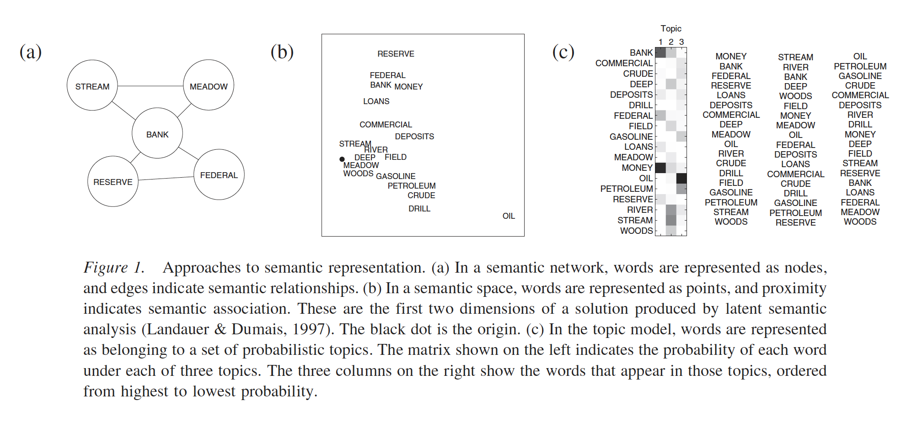

```{r setup, include=FALSE}
knitr::opts_chunk$set(echo = TRUE)
```

## Overview

- Sentiment analysis is one of the most widely used applications of machine learning and classification techniques
- Sometimes called opinion mining
- We have lots of instances with subjective texts:
  - Reviews, reviews, reviews
  - Social media data
  - Business feedback
  - and on! People like to give their opinions

## Classification Schemes

- We can label sentiment continuously using polarity scales with the following structure: 
  - Negative: polarity < 0
  - Neutral: polarity = 0
  - Positive: polarity > 0
- We can also use categorical labels, and we are not limited to positive and negative, as emotions are often used as labels (angry, happy, etc.)

## Techniques

- Unsupervised lexicon based models
- Traditional machine learning models
- Newer deep learning models

## Example

- We will work with the famous IMDB sentiment dataset
- 50,000 reviews that have been coded for positive or negative sentiment as the class labels
- Consider the important aspects of this type of data - depending on the technique used, you might consider cleaning the text differently 

```{r}
##r chunk
library(reticulate)
py_config()
```

```{python echo = F}
import platform
if platform.system() == "Windows":
    import os
    os.environ[ 'MPLCONFIGDIR' ] = '/tmp/'
    os.environ['SCIKIT_LEARN_DATA'] = "C:/Users/EBuchanan.HU/py_stuff"
```

## Loading and clean up libraries

```{python}
##python chunk
import pandas as pd
import numpy as np
import nltk
import textblob
from bs4 import BeautifulSoup
import unicodedata
import contractions
#if you want to stem
from nltk import PorterStemmer
ps = PorterStemmer()
```

## Load the data

```{python}
##python chunk
dataset = pd.read_csv('movie_reviews.csv.bz2', compression='bz2')
dataset.shape
dataset.head()
```

## A function for data cleaning

- This function doesn't do spelling because many of the words will be considered "incorrect" like the movie names, abbreviations, etc. 
- You would also expect opinions to have lots of slang
- A good halfway solution would likely be to find the most common mistakes and fix those only 

```{python}
##python chunk
STOPWORDS = set(nltk.corpus.stopwords.words('english')) #stopwords
STOPWORDS.remove('no')
STOPWORDS.remove('but')
STOPWORDS.remove('not')

def clean_text(text):
    text = BeautifulSoup(text).get_text() #html
    text = text.lower() #lower case
    text = contractions.fix(text) #contractions
    text = unicodedata.normalize('NFKD', text).encode('ascii', 'ignore').decode('utf-8', 'ignore') #symbols
    #text = ' '.join([ps.stem(word) for word in text.split()]) #stem
    text = ' '.join(word for word in text.split() if word not in STOPWORDS) # stopwords
    return text
```

## Apply our function 

- Now we apply our `clean_text` function to clean up the data

```{python}
##python chunk 
dataset['review'] = dataset['review'].apply(clean_text)
dataset.head()
```

## Unsupervised lexicon models

- Unsupervised methods include applying an algorithm to data that does not have the labels
  - For example, a popular method to categorize data is cluster or topics analysis
- Generally these use some known characteristics about the data to help us group them into positive and negative sentiment
  - A lexicon is a dictionary of known vocabulary words with a specific sentiment
  - These lexicons often have other information like part of speech, modality, mood, strength, etc. as well
  
## Popular lexicons

- Bing Liu's lexicon
  - Contains 6,800 words which are divided into positive and negative word files.
- MPQA subjectivity lexicon
  - Multi-perspective question answering lexicon that includes opinion corpora, subjectivity, opinion finders and more 
  - For example, the word zest is considered a strong subjective word with a positive polarity
- Pattern lexicon
  - Lexicon developed to mark words (in WordNet!) for their polarity, subjectivity, intensity, and confidence on a continuous scale
  - TextBlob uses this lexicon for it's coding 

## Example using TextBlob

- First, we will separate out our data into test and train
- You do not really do training for the lexicon based models because:
  - They are simply "looking up" the words they find in your text
  - And then calculating a score based on the number of words found and their polarity
- However, we use can this example throughout to show how each approach varies in their accuracy

```{python}
##python chunk
reviews = np.array(dataset['review'])
sentiments = np.array(dataset['sentiment'])

from sklearn.model_selection import train_test_split

train_reviews, test_reviews, train_sentiments, test_sentiments = train_test_split(reviews, sentiments, test_size=0.20, random_state = 42)
train_reviews.shape
test_reviews.shape
```

## Example using TextBlob

- Let's print out a few reviews and their predicted polarity score to help understand what is going on

```{python}
##python chunk
sample_review_ids = [7626, 3533, 1010]

for review, sentiment in zip(test_reviews[sample_review_ids], test_sentiments[sample_review_ids]):
    print('REVIEW:', review)
    print('Actual Sentiment:', sentiment)
    print('Predicted Sentiment polarity:', textblob.TextBlob(review).sentiment.polarity)
    print('-'*60)
```

## Example using TextBlob

- Now, calculate the score for all the sentiments in the test data
- Then we convert those to categorical labels to see our accuracy
- In general, continuous data is more informative, but we need the class labels to see the accuracy of this approach 

```{python}
##python chunk 

example_test_reviews = test_reviews[0:1001]
example_test_sentiments = test_sentiments[0:1001]

#calculate sentiment for smaller example set
sentiment_polarity = [textblob.TextBlob(review).sentiment.polarity for review in example_test_reviews]

#convert to categorical labels
predicted_sentiments = ['positive' if score >= 0.1 else 'negative' for score in sentiment_polarity]
```

## Example using TextBlob

- How well did we do? 

```{python}
##python chunk
from sklearn.metrics import classification_report
print(classification_report(y_true=example_test_sentiments,
                      y_pred=predicted_sentiments, 
                      labels=['positive', 'negative']))
```

## Popular lexicons

- AFINN lexicon 
  - A popular lexicon because of it's simplicity
  - Does consider emoticons and !!, so best not to clean those out of the text first
  - Words are scored from -5 to 5 and the final output is a score based on the summation of the words

## Example using AFINN

```{python}
##python chunk 
from afinn import Afinn
#load the model 
afn = Afinn(emoticons=True)

#look at some examples
for review, sentiment in zip(test_reviews[sample_review_ids], test_sentiments[sample_review_ids]):
    print('REVIEW:', review)
    print('Actual Sentiment:', sentiment)
    print('Predicted Sentiment polarity:', afn.score(review))
    print('-'*60)
```

## Example using AFINN

- Since we have a potentially very large range of scores (i.e. they are not bounded -1 to 1), we can decide for ourselves what the criterion should be

```{python}
##python chunk
#predict the polarity
sentiment_polarity = [afn.score(review) for review in example_test_reviews]

#decide how to categorize
predicted_sentiments = ['positive' if score >= 1.0 else 'negative' for score in sentiment_polarity]
```

## Example using AFINN

```{python}
##python chunk
print(classification_report(y_true=example_test_sentiments,
                      y_pred=predicted_sentiments, 
                      labels=['positive', 'negative']))
```

## Popular lexicons

- SentiWordNet
  - Based on the synsets from WordNet
  - Each synset is coded with positive word score, negative word score, and an objectivity score

```{python}
##python chunk
from nltk.corpus import sentiwordnet as swn
#nltk.download('sentiwordnet')
awesome = list(swn.senti_synsets('awesome', 'a'))[0]
print('Positive Polarity Score:', awesome.pos_score())
print('Negative Polarity Score:', awesome.neg_score())
print('Objective Score:', awesome.obj_score())
```

## Example using SentiWordNet

- Unfortunately, it does not have built in options for predicting scores
- We can use a function to first find all the POS tags (necessary for synsets)
- Then grab the SentiWordNet Scores
- Then subtract positive minus negative scores to final polarity
- And print out those final scores 

```{python}
##python chunk
import spacy
nlp = spacy.load("en_core_web_sm")

def analyze_sentiment_sentiwordnet_lexicon(review,
                                           verbose=False):

    # tokenize and POS tag text tokens
    tagged_text = [(token.text, token.tag_) for token in nlp(review)]
    pos_score = neg_score = token_count = obj_score = 0
    # get wordnet synsets based on POS tags
    # get sentiment scores if synsets are found
    for word, tag in tagged_text:
        ss_set = None
        if 'NN' in tag and list(swn.senti_synsets(word, 'n')):
            ss_set = list(swn.senti_synsets(word, 'n'))[0]
        elif 'VB' in tag and list(swn.senti_synsets(word, 'v')):
            ss_set = list(swn.senti_synsets(word, 'v'))[0]
        elif 'JJ' in tag and list(swn.senti_synsets(word, 'a')):
            ss_set = list(swn.senti_synsets(word, 'a'))[0]
        elif 'RB' in tag and list(swn.senti_synsets(word, 'r')):
            ss_set = list(swn.senti_synsets(word, 'r'))[0]
        # if senti-synset is found        
        if ss_set:
            # add scores for all found synsets
            pos_score += ss_set.pos_score()
            neg_score += ss_set.neg_score()
            obj_score += ss_set.obj_score()
            token_count += 1
    
    # aggregate final scores
    final_score = pos_score - neg_score
    norm_final_score = round(float(final_score) / token_count, 2)
    final_sentiment = 'positive' if norm_final_score >= 0 else 'negative'
    if verbose:
        norm_obj_score = round(float(obj_score) / token_count, 2)
        norm_pos_score = round(float(pos_score) / token_count, 2)
        norm_neg_score = round(float(neg_score) / token_count, 2)
        # to display results in a nice table
        sentiment_frame = pd.DataFrame([[final_sentiment, norm_obj_score, norm_pos_score, 
                                         norm_neg_score, norm_final_score]],
                                       columns=pd.MultiIndex(levels=[['SENTIMENT STATS:'], 
                                                             ['Predicted Sentiment', 'Objectivity',
                                                              'Positive', 'Negative', 'Overall']], 
                                                             codes=[[0,0,0,0,0],[0,1,2,3,4]]))
        print(sentiment_frame)
        
    return final_sentiment
```

## Example using SentiWordNet

```{python}
##python chunk
for review, sentiment in zip(test_reviews[sample_review_ids], test_sentiments[sample_review_ids]):
    print('REVIEW:', review)
    print('Actual Sentiment:', sentiment)
    pred = analyze_sentiment_sentiwordnet_lexicon(review, verbose=True)    
    print('-'*60)
```

## Example using SentiWordNet

```{python}
##python chunk
predicted_sentiments = [analyze_sentiment_sentiwordnet_lexicon(review, verbose=False) for review in example_test_reviews]

print(classification_report(y_true=example_test_sentiments,
                      y_pred=predicted_sentiments, 
                      labels=['positive', 'negative']))
```

## Popular lexicons

- VADER
  - Valance Aware Dictionary and Sentiment Reasoner
  - Includes words, emoticons, slang (wtf, lol)
  - Coded -4 to 4 
  - Words were hand coded by raters

## Example using VADER

- Again, we take a similar approach and create a function to run the analysis

```{python}
##python chunk
from nltk.sentiment.vader import SentimentIntensityAnalyzer
#nltk.download('vader_lexicon')

def analyze_sentiment_vader_lexicon(review, 
                                    threshold=0.1,
                                    verbose=False):
    
    # analyze the sentiment for review
    analyzer = SentimentIntensityAnalyzer()
    scores = analyzer.polarity_scores(review)
    # get aggregate scores and final sentiment
    agg_score = scores['compound']
    final_sentiment = 'positive' if agg_score >= threshold\
                                   else 'negative'
    if verbose:
        # display detailed sentiment statistics
        positive = str(round(scores['pos'], 2)*100)+'%'
        final = round(agg_score, 2)
        negative = str(round(scores['neg'], 2)*100)+'%'
        neutral = str(round(scores['neu'], 2)*100)+'%'
        sentiment_frame = pd.DataFrame([[final_sentiment, final, positive,
                                        negative, neutral]],
                                        columns=pd.MultiIndex(levels=[['SENTIMENT STATS:'], 
                                                                      ['Predicted Sentiment', 'Polarity Score',
                                                                       'Positive', 'Negative', 'Neutral']], 
                                                              codes=[[0,0,0,0,0],[0,1,2,3,4]]))
        print(sentiment_frame)
    
    return final_sentiment
```

## Example using VADER

```{python}
##python chunk
for review, sentiment in zip(test_reviews[sample_review_ids], test_sentiments[sample_review_ids]):
    print('REVIEW:', review)
    print('Actual Sentiment:', sentiment)
    pred = analyze_sentiment_vader_lexicon(review, threshold=0.4, verbose=True)    
    print('-'*60)
```

## Example using VADER

```{python}
##python chunk
predicted_sentiments = [analyze_sentiment_vader_lexicon(review, threshold=0.4, verbose=False) for review in example_test_reviews]

print(classification_report(y_true=example_test_sentiments,
                      y_pred=predicted_sentiments, 
                      labels=['positive', 'negative']))
```

## Supervised Learning Approach

- Surely, we can do better than 70%!
- Lexicon based models are great when you are approaching a new task and want a quick answer
- Training your own model could allow you to create a better classifier 

## Feature Extraction

- We are going to use many of the techniques covered in the classification section to train and classify sentiment ourselves 
- Let's use the Bag of Words and the TF-IDF approaches to start

```{python}
##python chunk 
from sklearn.feature_extraction.text import CountVectorizer, TfidfVectorizer

# build BOW features on train reviews
cv = CountVectorizer(binary=False, min_df=0.0, max_df=1.0, ngram_range=(1,2))
cv_train_features = cv.fit_transform(train_reviews)
cv_test_features = cv.transform(test_reviews)

```

## Feature Extraction

```{python}
##python chunk

# build TFIDF features on train reviews
tv = TfidfVectorizer(use_idf=True, min_df=0.0, max_df=1.0, ngram_range=(1,2),
                     sublinear_tf=True)
tv_train_features = tv.fit_transform(train_reviews)
tv_test_features = tv.transform(test_reviews)
```

## Model Training

- In the classification section, we consider logistic regression, naive Bayes, and support vector machines
- You can apply any of those here to the extracted bag of words and TF-IDF features

```{python}
##python chunk
from sklearn.linear_model import LogisticRegression

#blank model
lr = LogisticRegression(penalty='l2', max_iter=1000, C=1)
```

## Logistic Regression Bag of Words

```{python}
##python chunk
# fit the model
lr_bow_model = lr.fit(cv_train_features, train_sentiments)

# grab the predictions
lr_bow_predictions = lr_bow_model.predict(cv_test_features)

#model performance
print(classification_report(y_true=test_sentiments, 
                      y_pred=lr_bow_predictions,
                      labels=['positive', 'negative']))
```

## Logistic Regression TF-IDF

```{python}
##python chunk
# fit the model
lr_tfidf_model = lr.fit(tv_train_features, train_sentiments)

# grab the predictions
lr_tfidf_predictions = lr_tfidf_model.predict(tv_test_features)

#model performance
print(classification_report(y_true=test_sentiments,
                      y_pred=lr_tfidf_predictions,
                      labels=['positive', 'negative']))
```

## Learn More

- Do even more with word2vec!
- Apply this idea to deep learning models
- Example code provided at: https://github.com/Apress/text-analytics-w-python-2e/blob/master/Ch09%20-%20Sentiment%20Analysis/Ch09b%20-%20Sentiment%20Analysis%20-%20Supervised.ipynb
- And https://github.com/Apress/text-analytics-w-python-2e/blob/master/Ch09%20-%20Sentiment%20Analysis/Ch09c%20-%20Sentiment%20Analysis%20-%20Advanced%20Deep%20Learning.ipynb

## Analyzing Sentiment Causation

- Now that we've tested both supervised and unsupervised methods, we know we can predict sentiment
- But what is causing that prediction?
  - We can use a confusion matrix to examine where we are getting the wrong answers
  - But that doesn't tell us exactly what the issue is with the model or the prediction
- Model visualization and interpretation is helpful for those who want to understand WHAT the machine learning is doing 

## Simply Predict!

```{python}
##python chunk
#new text to predict
new_corpus = ['The Lord of the Rings is an Excellent movie!', 
              'I didn\'t like the recent movie on TV. It was NOT good and a waste of time!']

#clean that text up
norm_new_corpus = [clean_text(text) for text in new_corpus]

#transform into the right format
cv_new_corpus = cv.transform(norm_new_corpus)

#predict
lr_bow_model.predict(cv_new_corpus)

#predict probabilities
lr_bow_model.predict_proba(cv_new_corpus)
```

## Topics Background

- What does it take to understand a sentence?
  - Retrieving concepts from memory
  - Dynamic process based on incoming information
  - Use the semantic context to create a "gist" representation

## Topics Background

- Pulling the right information from memory can be improved by predicting what concepts are going to be relevant (expectancy generation)
  - For example, *bank* might pull up *federal* and *reserve*
  - However, multiple senses can sometimes make this difficult
  - Gist representation allows us to create an overarching topic to disambiguate sense

## Topics Background

```{r topicspic2, echo=FALSE, out.height="500px", out.width="800px", fig.align="center"}

```

## Topics Background

```{r topicspic, echo=FALSE, out.height="500px", out.width="700px", fig.align="center"}
knitr::include_graphics("lsacompare.png")
```

## Topics Modeling

- We will use topics modeling to help us understand what is happening in our text
- Good visualization and generation technique to know *what* is in the text, rather than just the prediction 
- Can also be used as an unsupervised classification technique

## Get Started

```{python}
##python chunk 
import pyLDAvis
import pyLDAvis.gensim  # don't skip this
import matplotlib.pyplot as plt
import gensim
import gensim.corpora as corpora
```

## Separate Reviews

- We want to separate reviews into positive and negative to help us visualize what is important in each one separately
- It's tempting to just do them all and pick 2 topics (one for positive and one for negative), but there are MANY things going on each in review

## Separate Reviews

```{python}
##python
dataset.head()

positive = dataset[dataset['sentiment']=="positive"][0:1001]
positive_reviews = positive['review'].apply(nltk.word_tokenize)

negative = dataset[dataset['sentiment']=="negative"][0:1001]
negative_reviews = negative['review'].apply(nltk.word_tokenize)
```

## Create a dictionary and Doc-Term Matrix

```{python}
##python chunk
#create a dictionary of the words
dictionary_positive = corpora.Dictionary(positive_reviews)
dictionary_negative = corpora.Dictionary(negative_reviews)

#create a doc term matrix
pos_doc_term_matrix = [dictionary_positive.doc2bow(doc) for doc in positive_reviews]
neg_doc_term_matrix = [dictionary_negative.doc2bow(doc) for doc in negative_reviews]
```

## Build the LDA Topic Model

```{python}
##python chunk
lda_model_pos = gensim.models.ldamodel.LdaModel(
  corpus = pos_doc_term_matrix, #TDM
  id2word = dictionary_positive, #Dictionary
  num_topics = 10, 
  random_state = 100,
  update_every = 1,
  chunksize = 100,
  passes = 10,
  alpha = 'auto',
  per_word_topics = True)
```

## Build the LDA Topic Model

```{python}
##python chunk
lda_model_neg = gensim.models.ldamodel.LdaModel(
  corpus = neg_doc_term_matrix, #TDM
  id2word = dictionary_negative, #Dictionary
  num_topics = 10, 
  random_state = 100,
  update_every = 1,
  chunksize = 100,
  passes = 10,
  alpha = 'auto',
  per_word_topics = True)
```

## View the Topics

```{python}
##python chunk
print(lda_model_pos.print_topics())
```

## View the Topics

```{python}
##python chunk
print(lda_model_neg.print_topics())
```

## Interactive Graphics

```{python eval = F}
##python chunk
vis = pyLDAvis.gensim.prepare(lda_model_pos, pos_doc_term_matrix, dictionary_positive, n_jobs = 1)
pyLDAvis.save_html(vis, 'LDA_Visualization_Positive.html') ##saves the file

vis = pyLDAvis.gensim.prepare(lda_model_neg, neg_doc_term_matrix, dictionary_negative, n_jobs = 1)
pyLDAvis.save_html(vis, 'LDA_Visualization_Negative.html') ##saves the file
```

## Summary

- In this section, you learned how to use pre-built lexicons to predict polarity of a text
- Then, we used supervised learning tasks to create our own models of sentiment classification
  - Remember, you can extend this to any type of feature input and machine learning algorithm
- Next, we extended into how to visualize what might be the important results from your classifier using topic modeling 
