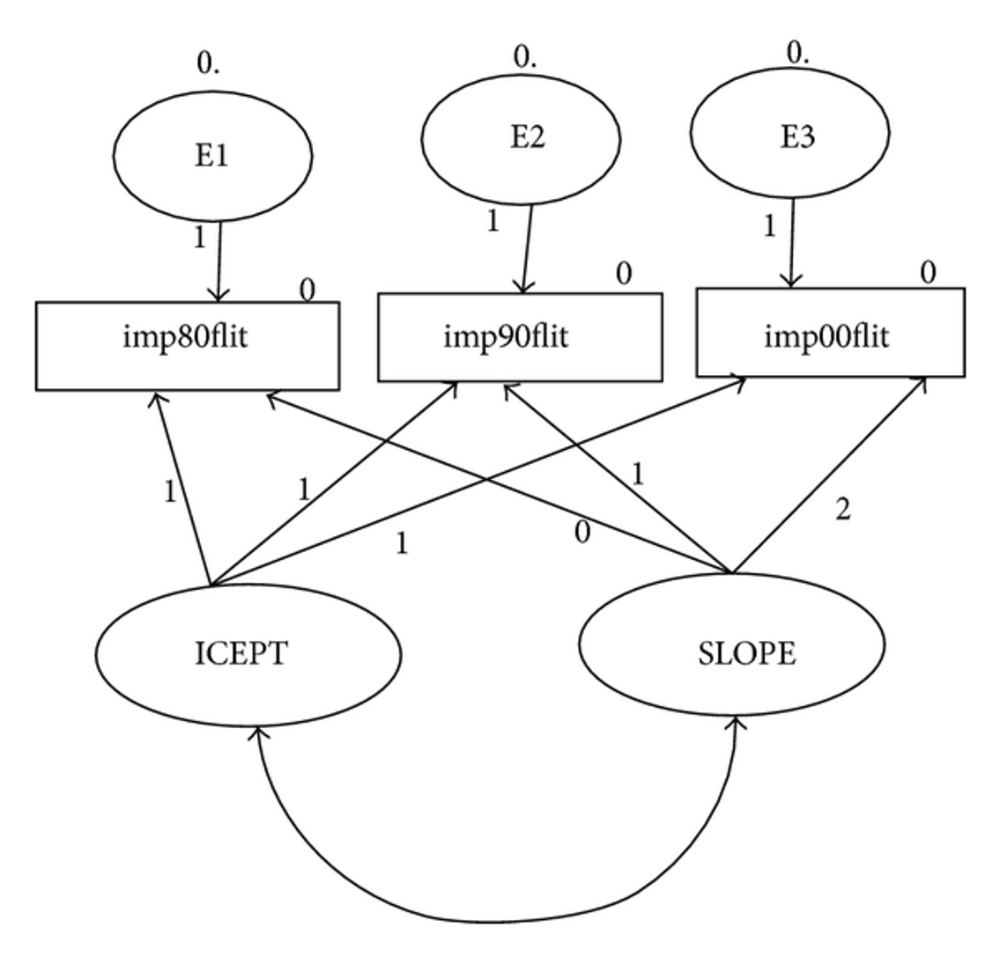
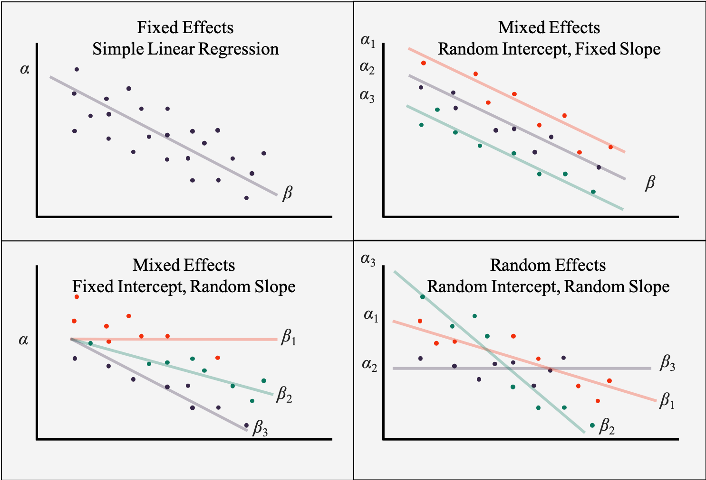

```{r echo = F, message = F, warning = F}
knitr::opts_chunk$set(echo = TRUE)
library(lavaan)
library(semPlot)
```

## Latent Growth Modeling

- Measuring change over repeated time measurements
- Gives you more information than a traditional repeated measures ANOVA or regression line by itself.
- Advantages:
  - Estimate means and covariances separately 
  - Estimating observed values and unobserved values separately 

## Assumptions

- Continuous measurement of the DVs
- This assumption is true for many structural models though!
- Time spacing is the same across people
- NOT across measurements, but people need to be spaced the same
- At least three time points per person (otherwise, you are doing a dependent *t*-test)
- Large samples! 

## Before you start

- You have to know the expected type of change before you start
- Generally it's linear, however, you can do curvilinear or power functions 

## Example model

- We will set the regression loading values to specific numbers to be able to estimate intercept and slope.

```{r echo=FALSE, out.width = "75%", fig.align="center"}

```

## Understand the idea

- Intercept
  - You set these values to 1 indicating that you do NOT want to estimate them
- Basically, that gives you a starting value for the first time point, which is the average point where people start (y-intercept)

## Understand the idea

- Slope – represents the change over time
  - You can set these values to anything you want
  - Usually the first time is indicated by a 0
  - There's no slope for time 1, just an intercept
  - Then the paths are set based on the time differences between them 

## Understand the idea

- Setting the parameters this way:
  - Helps with identification
  - Is theoretical to match the concept of slope and intercept estimation
  - Allows you to not have to set the variances, so you can look at them

## Questions

- What is the average change for each person?
- Where do they start?
- How does it change over time?
- What is the form of the change?

## Questions 

- Is the average slope and intercept a good fit for all participants?
- Or should we include a variance term to account for the differences between people?
- Models are called random effects if you add the random variances (similar to multilevel models) 
- If we have a random effects model – is there another variable that explains those random effects?

## Understanding the Output

- Intercept mean: the average starting point for time 1
- Slope mean: the average increment across time points

```{r echo=FALSE, out.width = "75%", fig.align="center"}

```

## Understanding the Output

- Intercept variance: the spread around the average start point
  - Large scores indicate a lot of spread – meaning people start in a lot of different places
  - Small scores indicate a small spread – everyone starts about the same place
  
```{r echo=FALSE, out.width = "75%", fig.align="center"}

```

## Understanding the Output

- Slope variance – the range of increments across time points
  - Small variances mean that everyone is going up/down about the same amount
  - Large variances mean that people scores are going up/down differently (almost like an interaction)

```{r echo=FALSE, out.width = "75%", fig.align="center"}

```

## Understanding the Output

- Factor covariance – examines the relationship between intercept and slope
- Positive covariance - positive slope
  - People who start with higher intercepts have higher positive slopes
- Positive covariance - negative slope
  - People who start higher go down faster (larger negative slopes)
- Negative covariance - positive slope
  - People who start with higher intercepts go up slower (smaller slopes)
- Negative covariance - negative slope
  - People who start with higher intercepts go down slower

## Example: Crime Data across time

```{r}
##load the data
crime.cov <- lav_matrix_lower2full(c(.63, 
                                    .50, .60, 
                                    .48, .48, .58, 
                                    .47, .48, .51, .67))

crime.mean <- c(5.17, 5.32, 5.40, 5.52)

names(crime.mean) <- 
  rownames(crime.cov) <- 
  colnames(crime.cov) <- c("Time1", "Time2", "Time3", "Time4")
```

## New Functions

- `growth()`: This function helps with the set up for a LGM, fixes the parameters correctly for you. 
- We will use the data as covariances and means, but you can import the data just like `cfa()`

## How to Test

- This procedure is very similar to multigroup model testing, only in reverse.
- We are going to start with the most constrained model and slowly let parameters free to see which is the best. 
- We would prefer the unconstrained model be the best:
  - The slope and intercept are useful 
  - But the variances to be low indicating everyone has the same pattern of slope and intercept

## Intercept Only Model

- Use only the intercept (mean of the data) to estimate 
- You want this model to be bad, otherwise you are saying that one average score is the best for all the time points
- Intercept variance is constrained to 0, so you only get a mean. 
- Residuals are forced to be the same for each time point, so the variance is the same across all time points

```{r}
crime.model1 <- '
# intercept
i =~ 1*Time1 + 1*Time2 + 1*Time3 + 1*Time4
i~~0*i
# residual variances
Time1~~r*Time1
Time2~~r*Time2
Time3~~r*Time3
Time4~~r*Time4
'
```

## Intercept Only Model

```{r}
crime.fit1 <- growth(crime.model1,
                    sample.cov=crime.cov, 
                    sample.mean=crime.mean, 
                    sample.nobs=952)
summary(crime.fit1,
        standardized = TRUE,
        fit.measures = TRUE,
        rsquare = TRUE)
```

## Intercept Only Model

```{r}
semPaths(crime.fit1,
         whatLabels = "par",
         edge.label.cex = 1,
         layout = "tree")
```

## Comparison Table Fit Indices

```{r}
library(knitr)
fit.table <- matrix(NA, nrow = 5, ncol = 6)
colnames(fit.table) <- c("Model", "X2", "df", "RMSEA", "SRMR", "CFI")
fit.table[1, ] <- c("Intercept Only", round(fitmeasures(crime.fit1, c("chisq", "df", "rmsea", "srmr", "cfi")),3))
kable(fit.table)
```

## Comparison Table Parameters

```{r}
#save the parameter estimates
crime.fit1.par <- parameterestimates(crime.fit1)

#make table
par.table <- matrix(NA, nrow = 5, ncol = 7)
colnames(par.table) <- c("Model", "Intercept Mean", "Intercept Variance", "Residual Variance", "Slope Mean", "Slope Variance", "Covariance")

#put data in table
par.table[1, ] <- c("Intercept Only", 
                    round(crime.fit1.par$est[crime.fit1.par$lhs == "i" & crime.fit1.par$op == "~1"], 3),
                    "X", 
                    round(crime.fit1.par$est[crime.fit1.par$lhs == "Time1" & crime.fit1.par$op == "~~"], 3),
                    "X", 
                    "X", 
                    "X")
kable(par.table)
```

## Random Intercept Only Model

- We allow the intercept variance to be > 0
- People can start at different places 
- Residual variances are still the same
- Still no slope

```{r}
crime.model2 <- '
# intercept
i =~ 1*Time1 + 1*Time2 + 1*Time3 + 1*Time4
# residual variances
Time1~~r*Time1
Time2~~r*Time2
Time3~~r*Time3
Time4~~r*Time4
'
```

## Random Intercept Only Model

```{r}
crime.fit2 <- growth(crime.model2,
                    sample.cov=crime.cov, 
                    sample.mean=crime.mean, 
                    sample.nobs=952)
summary(crime.fit2,
        standardized = TRUE,
        fit.measures = TRUE,
        rsquare = TRUE)
```

## Comparison Table Fit Indices

- This model is much better than model 1
- Implies that people all start in different places 

```{r}
fit.table[2, ] <- c("Random Intercept", round(fitmeasures(crime.fit2, c("chisq", "df", "rmsea", "srmr", "cfi")),3))
kable(fit.table)
```

## Comparison Table Parameters

```{r}
#save the parameter estimates
crime.fit2.par <- parameterestimates(crime.fit2)

#put data in table
par.table[2, ] <- c("Random Intercept", 
                    round(crime.fit2.par$est[crime.fit2.par$lhs == "i" & crime.fit2.par$op == "~1"], 3),
                    round(crime.fit2.par$est[crime.fit2.par$lhs == "i" & crime.fit2.par$op == "~~"], 3), 
                    round(crime.fit2.par$est[crime.fit2.par$lhs == "Time1" & crime.fit2.par$op == "~~"], 3),
                    "X", 
                    "X", 
                    "X")
kable(par.table)
```

## Random Slope + Intercepts

- Add in the random slope
  - `s~0*1` (makes the average slope 0)
  - `s~~0*i` (uncorrelated slope/intercept)
- Leave the intercept and its variance in the model
- Keep the residuals constrained to be the same

```{r}
crime.model3 <- '
# intercept
i =~ 1*Time1 + 1*Time2 + 1*Time3 + 1*Time4
# slope
s =~ 0*Time1 + 1*Time2 + 2*Time3 + 3*Time4
s~0*1
s~~0*i
# residual variances
Time1~~r*Time1
Time2~~r*Time2
Time3~~r*Time3
Time4~~r*Time4
'
```

## Random Slope + Intercepts

```{r}
crime.fit3 <- growth(crime.model3,
                    sample.cov=crime.cov, 
                    sample.mean=crime.mean, 
                    sample.nobs=952)
summary(crime.fit3,
        standardized = TRUE,
        fit.measures = TRUE,
        rsquare = TRUE)
```

## Comparison Table Fit Indices

- This model is much better than model 2
- Implies that having at least a random slope is better than no slope

```{r}
fit.table[3, ] <- c("Random Slope", round(fitmeasures(crime.fit3, c("chisq", "df", "rmsea", "srmr", "cfi")),3))
kable(fit.table)
```

## Comparison Table Parameters

```{r}
#save the parameter estimates
crime.fit3.par <- parameterestimates(crime.fit3)

#put data in table
par.table[3, ] <- c("Random Slope", 
                    round(crime.fit3.par$est[crime.fit3.par$lhs == "i" & crime.fit3.par$op == "~1"], 3),
                    round(crime.fit3.par$est[crime.fit3.par$lhs == "i" & crime.fit3.par$op == "~~" & crime.fit3.par$rhs == "i"], 3), 
                    round(crime.fit3.par$est[crime.fit3.par$lhs == "Time1" & crime.fit3.par$op == "~~"], 3),
                    "X", 
                    round(crime.fit3.par$est[crime.fit3.par$lhs == "s" & crime.fit3.par$op == "~~"], 3), 
                    "X")
kable(par.table)
```

## Full Slopes + Intercept

- Allow the slope and intercept to vary
- Constrain the residual variances

```{r}
crime.model4 <- '
# intercept
i =~ 1*Time1 + 1*Time2 + 1*Time3 + 1*Time4
# slope
s =~ 0*Time1 + 1*Time2 + 2*Time3 + 3*Time4
# residual variances
Time1~~r*Time1
Time2~~r*Time2
Time3~~r*Time3
Time4~~r*Time4
'
```

## Full Slopes + Intercept

- Significant covariance – negative covariance with positive slope 
  - People who start high go up slower than people who start lower. 

```{r}
crime.fit4 <- growth(crime.model4,
                    sample.cov=crime.cov, 
                    sample.mean=crime.mean, 
                    sample.nobs=952)
summary(crime.fit4,
        standardized = TRUE,
        fit.measures = TRUE,
        rsquare = TRUE)
```

## Comparison Table Fit Indices

- This model is much better than model 3
- Implies that having a single slope is better than just random slopes

```{r}
fit.table[4, ] <- c("Full Slope", round(fitmeasures(crime.fit4, c("chisq", "df", "rmsea", "srmr", "cfi")),3))
kable(fit.table)
```

## Comparison Table Parameters

```{r}
#save the parameter estimates
crime.fit4.par <- parameterestimates(crime.fit4)

#put data in table
par.table[4, ] <- c("Full Slope", 
                    round(crime.fit4.par$est[crime.fit4.par$lhs == "i" & crime.fit4.par$op == "~1"], 3),
                    round(crime.fit4.par$est[crime.fit4.par$lhs == "i" & crime.fit4.par$op == "~~" & crime.fit4.par$rhs == "i"], 3), 
                    round(crime.fit4.par$est[crime.fit4.par$lhs == "Time1" & crime.fit4.par$op == "~~"], 3),
                    round(crime.fit4.par$est[crime.fit4.par$lhs == "s" & crime.fit4.par$op == "~1"], 3), 
                    round(crime.fit4.par$est[crime.fit4.par$lhs == "s" & crime.fit4.par$op == "~~"], 3), 
                    round(crime.fit4.par$est[crime.fit4.par$lhs == "i" & crime.fit4.par$op == "~~" & crime.fit4.par$rhs == "s"], 3))
kable(par.table)
```

## Totally Unconstrained Model

- Now the residuals are free to vary
- You want the residuals to be small and roughly equal, so this model shouldn't be any different than the previous model

```{r}
crime.model5 <- '
# intercept
i =~ 1*Time1 + 1*Time2 + 1*Time3 + 1*Time4
# slope
s =~ 0*Time1 + 1*Time2 + 2*Time3 + 3*Time4
'
```

## Totally Unconstrained Model

```{r}
crime.fit5 <- growth(crime.model5,
                    sample.cov=crime.cov, 
                    sample.mean=crime.mean, 
                    sample.nobs=952)
summary(crime.fit5,
        standardized = TRUE,
        fit.measures = TRUE,
        rsquare = TRUE)
```

## Comparison Table Fit Indices

- This model is equal to model 4
- This result implies that your residual variances are all approximately equal

```{r}
fit.table[5, ] <- c("Unconstrained", round(fitmeasures(crime.fit5, c("chisq", "df", "rmsea", "srmr", "cfi")),3))
kable(fit.table)
```

## Comparison Table Parameters

```{r}
#save the parameter estimates
crime.fit5.par <- parameterestimates(crime.fit5)

residual_numbers <- paste(round(crime.fit5.par$est[crime.fit5.par$lhs == "Time1" & crime.fit5.par$op == "~~"], 3), 
                          round(crime.fit5.par$est[crime.fit5.par$lhs == "Time2" & crime.fit5.par$op == "~~"], 3),
                          round(crime.fit5.par$est[crime.fit5.par$lhs == "Time3" & crime.fit5.par$op == "~~"], 3),
                          round(crime.fit5.par$est[crime.fit5.par$lhs == "Time4" & crime.fit5.par$op == "~~"], 3))

#put data in table
par.table[5, ] <- c("Unconstrained", 
                    round(crime.fit5.par$est[crime.fit5.par$lhs == "i" & crime.fit5.par$op == "~1"], 3),
                    round(crime.fit5.par$est[crime.fit5.par$lhs == "i" & crime.fit5.par$op == "~~" & crime.fit5.par$rhs == "i"], 3), 
                    residual_numbers,
                    round(crime.fit5.par$est[crime.fit5.par$lhs == "s" & crime.fit5.par$op == "~1"], 3), 
                    round(crime.fit5.par$est[crime.fit5.par$lhs == "s" & crime.fit5.par$op == "~~"], 3), 
                    round(crime.fit5.par$est[crime.fit5.par$lhs == "i" & crime.fit5.par$op == "~~" & crime.fit5.par$rhs == "s"], 3))
kable(par.table)
```

## Summary

- In this lecture you've learned:
  
  - Latent growth modeling
  - The idea of random intercepts and slopes to account for participant variability
  - How to test most to least restrictive models
  - How to compare parameters and models 