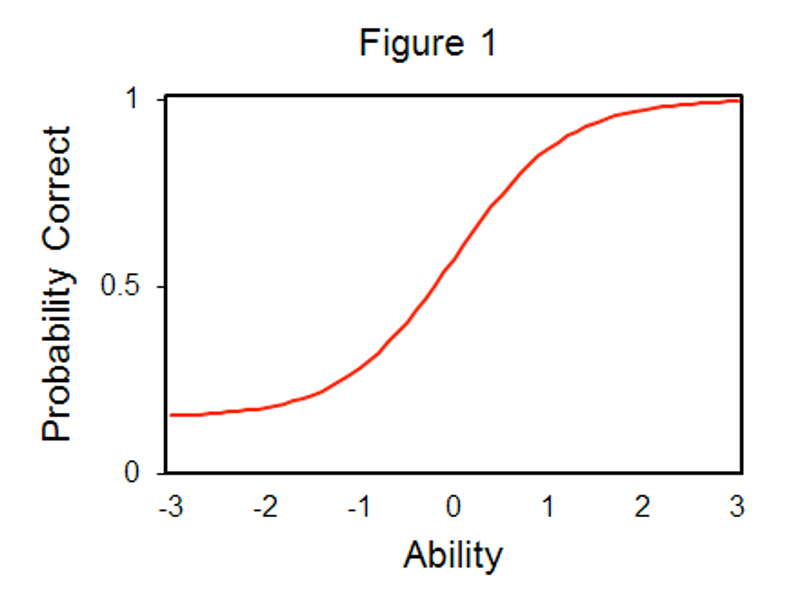
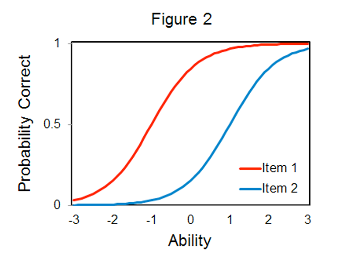
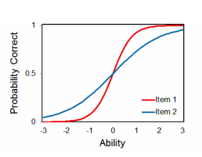

```{r echo = F, message = F, warning = F}
knitr::opts_chunk$set(echo = TRUE)
library(lavaan)
library(semPlot)
```

## Item Response Theory

- What do you do if you have dichotomous (or categorical) manifest variables?
  - Many agree that more than four response options can be treated as continuous without a loss in power or interpretation.  
  - Do you treat these values as categorical?
- Do you assume the underlying latent variable is continuous?

## Categorical Options

- There are two approaches that allow us to analyze data with categorical predictors:
  - Item Factor Analysis
    - More traditional factor analysis approach using ordered responses
    - You can talk about item loading, eliminate bad questions, etc.
    - In the `lavaan` framework, you update your `cfa()` to include the `ordered` argument 
  - Item Response Theory

## Item Response Theory

- Classical test theory is considered "true score theory"
  - Any differences in responses are differences in ability or underlying trait
  - CTT focuses on reliability and item correlation type analysis
  - Cannot separate the test and person characteristics 
- IRT is considered more modern test theory focusing on the latent trait
  - Focuses on the item for *where* it measures a latent trait, discrimination, and guessing 
  - Additionally, with more than two outcomes, we can examine ordering, response choice options, and more 
  
## Issues

- Unidimensionality: assumption is that there is one underlying trait or dimension you are measuring
  - You can run separate models for each dimension
  - There are multitrait options for IRT
- Local Independence
  - After you control for the latent variable, the items are uncorrelated 

## Item Response Theory

- A simple example of test versus person
  - 3 item questionnaire
  - Yes/no scaling
  - 8 response patterns
  - Four total scores (0, 1, 2, 3)

## Item Response Theory

- Item characteristic curves (ICCs)
  - The log probability curve of theta and the probability of a correct response

```{r echo=FALSE, out.width = "75%", fig.align="center"}

```

## Item Response Theory

- Theta – ability or the underlying latent variable score
- b – Item location – where the probability of getting an item correct is 50/50
  - Also considered where the item performs best
  - Can be thought of as item difficulty

```{r echo=FALSE, out.width = "75%", fig.align="center"}

```

## Item Response Theory

- a – item discrimination 
  - Tells you how well an item measures the latent variable
  - Larger a values indicate better items 
  
```{r echo=FALSE, out.width = "75%", fig.align="center"}

```

## Item Response Theory

- c – guessing parameter
  - The lower level likelihood of getting the item correct

```{r echo=FALSE, out.width = "75%", fig.align="center"}

```

## Item Response Theory

- 1 Parameter Logistic (1PL)
  - Also known as the Rasch Model
  - Only uses b
- 2 Parameter Logistic (2PL)
  - Uses b and a
- 3 Parameter Logistic (3PL)
  - Uses b, a, and c

## Polytomous IRT

- A large portion of IRT focuses on dichotomous data (yes/no, correct/incorrect)
- Scoring is easier because you have "right" and "wrong" answers
- Separately, polytomous IRT focuses on data with multiple answers, with no "right" answer 
  - Focus on ordering, meaning that low scores represent lower abilities, while high scores are higher abilities 
  - Likert type scales 

## Polytomous IRT

- Couple of types of models:
  - Graded Response Model
  - Generalized Partial Credit Model
  - Partial Credit Model

## Polytomous IRT

- A graded response model is simplest but can be hard to fit.
- Takes the number of categories – 1 and creates mini 2PLs for each of those boundary points (1-rest, 2-rest, 3-rest, etc.).
- You get probabilities of scoring at this level OR higher

## Polytomous IRT

- The generalized partial credit and partial credit models account for the fact that you may not have each category used equally
- Therefore, you get the mini 2PLs for adjacent categories (1-2, 2-3, 3-4)
- If your categories are ordered (which you often want), these two estimations can be very similar. 
- Another concern with the partial credit models is making sure that all categories have a point at which they are the most likely answer (thresholds)

## Polytomous IRT

- Install the `mirt()` library to use the multidimensional IRT package. 
- We are not covering multiple dimensional or multigroup IRT, but this package can do those models or polytomous estimation. 

## IRT Examples

- Let's start with DIRT: Dichotomous IRT
- Dataset is the LSAT, which is scored as right or wrong

```{r}
library(ltm)
library(mirt)
data(LSAT)
head(LSAT)
```

## Two Parameter Logistic

```{r}
# Data frame name ~ z1 for one latent variable
#irt.param to give it to you standardized
LSAT.model <- ltm(LSAT ~ z1,
                  IRT.param = TRUE)
```

## 2PL Output

- Difficulty = b = theta = ability
- Discrimination = a = how good the question is at figuring a person out.

```{r}
coef(LSAT.model)
```

## 2PL Plots

```{r}
plot(LSAT.model, type = "ICC") ## all items at once
```

## 2PL Plots

```{r}
plot(LSAT.model, type = "IIC", items = 0) ## Test Information Function
```

## 2PL Other Options

```{r}
factor.scores(LSAT.model)
```

## Three Parameter Logistic

```{r}
LSAT.model2 <- tpm(LSAT, #dataset
                   type = "latent.trait",
                   IRT.param = TRUE)
```

## 3PL Output

- Difficulty = b = theta = ability
- Discrimination = a = how good the question is at figuring a person out.
- Guessing = c = how easy the item is to guess 

```{r}
coef(LSAT.model2)
```

## 3PL Plots

```{r}
plot(LSAT.model2, type = "ICC") ## all items at once
```

## 3PL Plots

```{r}
plot(LSAT.model2, type = "IIC", items = 0) ## Test Information Function
```

## 3PL Other Options

```{r}
factor.scores(LSAT.model2)
```

## Compare Models

```{r}
anova(LSAT.model, LSAT.model2)
```

## Polytomous IRT

- Dataset includes the Meaning in Life Questionnaire 

```{r}
library(rio)
poly.data <- import("lecture_irt.csv")
poly.data <- na.omit(poly.data)

#reverse code
poly.data$Q99_9 = 8 - poly.data$Q99_9

#separate factors
poly.data1 = poly.data[ , c(1, 4, 5, 6, 9)]
poly.data2 = poly.data[ , c(2, 3, 7, 8, 10)]
```

## Graded Partial Credit Model

```{r}
gpcm.model1 <- mirt(data = poly.data1, #data
                    model = 1, #number of factors
                    itemtype = "gpcm") #poly model type
```

## GPCM Output

- Can also get factor loadings here, with standardized coefficients to help us determine if they relate to their latent trait

```{r}
summary(gpcm.model1) ##standardized coefficients 
```

## GPCM Output

```{r}
coef(gpcm.model1, IRTpars = T) ##coefficients

head(fscores(gpcm.model1)) ##factor scores
```

## GPCM Plots

```{r}
plot(gpcm.model1, type = "trace") ##curves for all items at once
itemplot(gpcm.model1, 5, type = "trace")
```

## GPCM Plots

```{r}
itemplot(gpcm.model1, 4, type = "info") ##IIC for each item
plot(gpcm.model1, type = "info") ##test information curve
```

## GPCM Plots

```{r}
plot(gpcm.model1) ##expected score curve
```

## Summary

- In this lecture you've learned:
  
  - Item response theory compared to classical test theory
  - How to run a dichotomous or traditional IRT with 2PL and 3PL
  - How to run a polytomous IRT using graded partial credit model
  - How to compare models and interpret their output 
