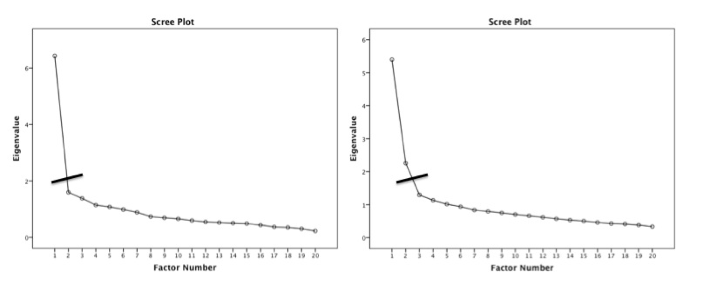
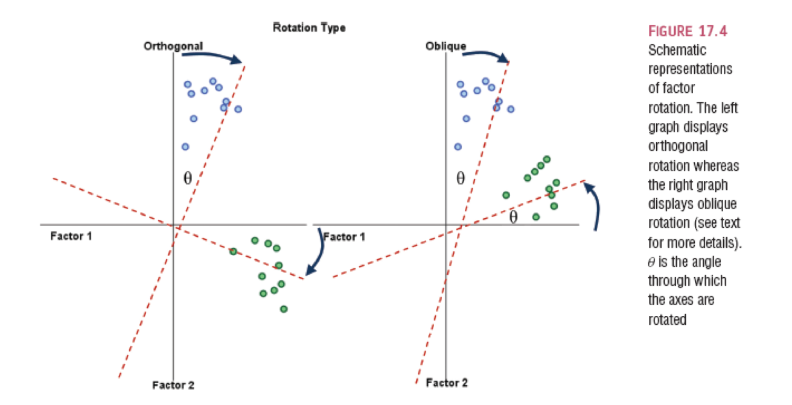

```{r echo = F}
options(scipen = 999)
knitr::opts_chunk$set(echo = TRUE)
```

## Terminology

- Measured variables – the real scores from the experiment
  - Squares on a diagram
- Latent variables – the construct the measured variables are supposed to represent
  - Not measured directly
  - Circles on a diagram

## Terminology 

```{r echo = F, warning = F, message = F}
library(lavaan)
library(semPlot)
HS.model <- ' visual  =~ x1 + x2 + x3
              textual =~ x4 + x5 + x6
              speed   =~ x7 + x8 + x9 '

fit <- cfa(HS.model, data = HolzingerSwineford1939)
semPaths(fit,
         whatLabels = "std",
         edge.label.cex = 1)
```

## What is EFA?

- Factor analysis attempts to achieve parsimony (data reduction) by:
  - Explaining the *maximum amount of common variance* in a correlation matrix 
  - Using the *smallest* number of explanatory constructs (factors)
- Common variance is the overlapping variance between items 
- Unique variance is the variance only related to that item (error variance)

## Directionality 

- Factors are thought to *cause* the measured variables
- Therefore, we are saying that the measured variable *is predicted by* the factor

```{r echo = F, warning = F, message = F}
library(lavaan)
library(semPlot)
HS.model <- ' visual  =~ x1 + x2 + x3
              textual =~ x4 + x5 + x6
              speed   =~ x7 + x8 + x9 '

fit <- cfa(HS.model, data = HolzingerSwineford1939)
semPaths(fit,
         whatLabels = "std",
         edge.label.cex = 1)
```

## Why use EFA?

- Understand structure of set of variables
- Construct a scale to measure the latent variable
- Reduce data set to smaller size that still measures original information

## The Example Data

- We are going to build a scale that measures the anxiety that statistics provokes in students 
- Dataset is from the Field textbook

1.	Statistics makes me cry
2.	My friends will think I'm stupid for not being able to cope with R
3.	Standard deviations excite me
4.	I dream that Pearson is attacking me with correlation coefficients
5.	I don't understand statistics
6.	I have little experience of computers
7.	All computers hate me
8.	I have never been good at mathematics
9.	My friends are better at statistics than me
10.	Computers are useful only for playing games
11.	I did badly at mathematics at school
12.	People try to tell you that R makes statistics easier to understand but it doesn't
13.	I worry that I will cause irreparable damage because of my incompetence with computers
14.	Computers have minds of their own and deliberately go wrong whenever I use them
15.	Computers are out to get me
16.	I weep openly at the mention of central tendency
17.	I slip into a coma whenever I see an equation
18.	R always crashes when I try to use it
19.	Everybody looks at me when I use R
20.	I can't sleep for thoughts of eigenvectors
21.	I wake up under my duvet thinking that I am trapped under a normal distribution
22.	My friends are better at R than I am
23.	If I'm good at statistics my friends will think I'm a nerd

## The Example Data

```{r message = F}
library(rio)
library(psych)
master <- import("lecture_efa.csv")
head(master)
```

## Steps to Analysis

- Data screening (not shown, use last week's notes!)
  - Additionally, you need at least interval measurement for the analyses shown here
  - Enough items to group into factors (recommended 3-4 per potential factor)
- How many factors should you use?
- Simple structure
- Adequate solutions

## How many factors do I use?

- Theory
- Kaiser criterion
- Scree plots
- Parallel analysis

## Kaiser criterion

- Old rule: extract the number of eigenvalues over 1
- New rule: extract the number of eigenvalues over .7
- What the heck is an eigenvalue? 
  - A mathematical representation of the variance accounted for by that grouping of items

## Scree plots

```{r scree, echo=FALSE, out.height="500px", out.width="800px", fig.align="center"}

```

## Parallel analysis

- A statistical test to tell you how many eigenvalues are greater than chance
  - Calculates the eigenvalues for your data
  - Randomizes your data and recalculates the eigenvalues
  - Then compares them to determine if they are equal

## Finding factors/components

```{r}
number_items <- fa.parallel(master, #data frame
                            fm="ml", #math
                            fa="fa") #only efa
```

## Eigenvalues

```{r}
 
sum(number_items$fa.values > 1)
sum(number_items$fa.values > .7)
```

## Simple structure

- Simple structure covers two pieces:
  - The math used to achieve the solution: maximum likelihood
  - Rotation to increase communality between items and aid in interpretation
  
## Rotation

```{r rotation, echo=FALSE, out.height="500px", out.width="800px", fig.align="center"}

```

## Rotation
  
- Orthogonal assume uncorrelated factors: varimax, quartermax, equamax
- Oblique allows factors to be correlated: oblimin, promax
- Why would we even use orthogonal?

## Simple structure/solution

- Looking at the loadings: the relationship between the item and the factor/component
  - Want these to be related at least .3 
  - Remember that r = .3 is a medium effect size that is ~10% variance
  - Can eliminate items that load poorly 
  - Difference here in scale development versus exploratory clustering

## Run an EFA

```{r}
EFA_fit <- fa(master, #data
              nfactors = 2, #number of factors
              rotate = "oblimin", #rotation
              fm = "ml") #math
```

## Look at the results

```{r}
EFA_fit
```

## Item 23 

```{r}
EFA_fit2 <- fa(master[ , -23], #data
              nfactors = 2, #number of factors
              rotate = "oblimin", #rotation
              fm = "ml") #math

EFA_fit2
```

## Plots of the results

- The built in plot functions from `psych` are fantastic!

```{r}
 fa.plot(EFA_fit2, 
     labels = colnames(master[ , -23]))
```

## Plots of the results

```{r}
fa.diagram(EFA_fit2)
```

## Adequate solution

- Fit indices: a measure of how well the model matches the data 
  - Goodness of fit statistics: measure the overlap between the reproduced correlation matrix and the original, want high numbers close to 1
  - Badness of fit statistics (residual): measure the mismatch, want low numbers close to zero 
- Theory/interpretability 
- Reliability

## Fit statistics

```{r}
EFA_fit2$rms #Root mean square of the residuals
EFA_fit2$RMSEA #root mean squared error of approximation
EFA_fit2$TLI #tucker lewis index
1 - ((EFA_fit2$STATISTIC-EFA_fit2$dof)/
       (EFA_fit2$null.chisq-EFA_fit2$null.dof)) #CFI 
```

## Reliability

```{r}
factor1 = c(1:7, 9:10, 12:16, 18:22)
factor2 = c(8, 11, 17)
##we use the psych::alpha to make sure that R knows we want the alpha function from the psych package.
##ggplot2 has an alpha function and if we have them both open at the same time
##you will sometimes get a color error without this :: information. 
psych::alpha(master[, factor1], check.keys = T)
psych::alpha(master[, factor2], check.keys = T)
```

## Interpretation 

Factor 1: 

1.	Statistics makes me cry
2.	My friends will think I'm stupid for not being able to cope with R
3.	Standard deviations excite me
4.	I dream that Pearson is attacking me with correlation coefficients
5.	I don't understand statistics
6.	I have little experience of computers
7.	All computers hate me
9.	My friends are better at statistics than me
10.	Computers are useful only for playing games
12.	People try to tell you that R makes statistics easier to understand but it doesn't
13.	I worry that I will cause irreparable damage because of my incompetence with computers
14.	Computers have minds of their own and deliberately go wrong whenever I use them
15.	Computers are out to get me
16.	I weep openly at the mention of central tendency
18.	R always crashes when I try to use it
19.	Everybody looks at me when I use R
20.	I can't sleep for thoughts of eigenvectors
21.	I wake up under my duvet thinking that I am trapped under a normal distribution
22.	My friends are better at R than I am

Factor 2:

8.	I have never been good at mathematics
11.	I did badly at mathematics at school
17.	I slip into a coma whenever I see an equation

Bad: 

23.	If I'm good at statistics my friends will think I'm a nerd

## Wrapping Up

- You've learned about exploratory factor analysis, which we will revisit when we cover confirmatory factor analysis 
- You learned how to examine for the number of possible latent variables
- You learned how to determine simple structure
- You learned how to determine if that simple structure was an adequate model 

