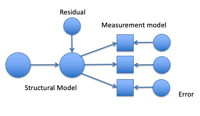
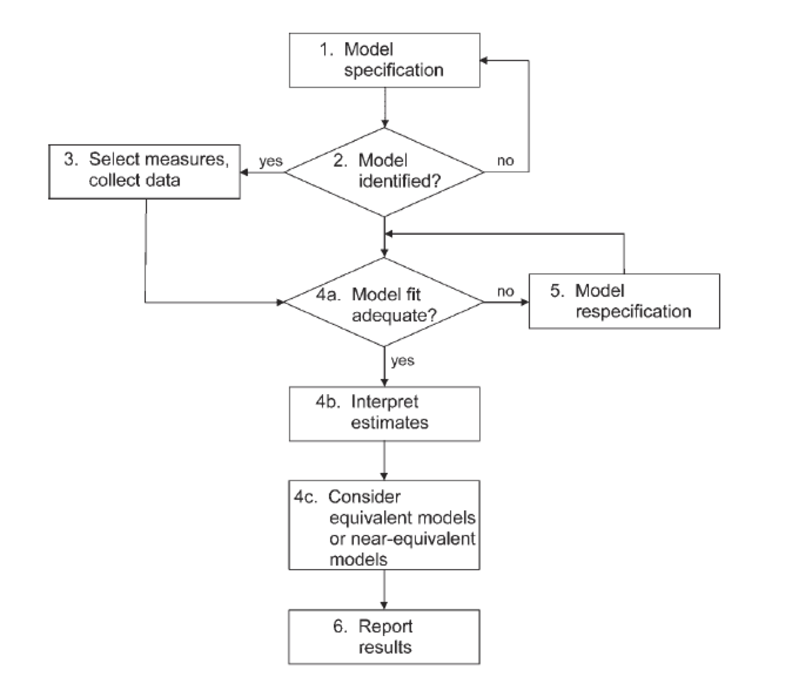

```{r echo = F, message = F, warning = F}
options(scipen = 999)
knitr::opts_chunk$set(echo = TRUE)
library(lavaan, quietly = T)
library(semPlot, quietly = T)
HS.model <- ' visual  =~ x1 + x2 + x3
              textual =~ x4 + x5 + x6
              speed   =~ x7 + x8 + x9 '

fit <- cfa(HS.model, data = HolzingerSwineford1939)

HS.model2 <- 'visual  =~ x1 + x2 + x3
              textual =~ x4 + x5 + x6
              speed   =~ x7 + x8 + x9 
              visual ~ speed'
fit2 <- cfa(HS.model2, data = HolzingerSwineford1939)

HS.model3 <- 'visual  =~ x1 + x2 + x3
              textual =~ x4 + x5 + x6
              speed   =~ x7 + x8 + x9 
              visual ~ speed
              speed ~ textual
              textual ~ visual'
fit3 <- cfa(HS.model3, data = HolzingerSwineford1939)
```

## Structural Equation Modeling

- Regression on steroids
- Model many relationships at once, rather than run single regressions
- Model variables that don't technically exist!

## Structural Equation Modeling

- Model theorized causal relationships
  - Even if we did not measure them in a causal way, we can specify direction
- A mostly *confirmatory* procedure   
  - Generally, you have a theory about the relationship before hand
  - Less descriptive/exploratory than traditional hypothesis testing
- Specific error control 
  - You can be more specific about the error terms, rather than just one overall residual 

## Concepts

- Latent variables 
  - Represented by circles
  - Abstract phenomena you are trying to model 
  - Are not represented by a number in the dataset
  - Linked to the measured variables
  - Represented indirectly by those variables

## Concepts

- Manifest or observed variables
  - Represented by squares 
  - Measured from participants, business data, or other sources
  - While most measured variables are continuous, you can use categorical and ordered measures as well

## Concepts 

```{r exo, echo=FALSE, out.width="75%", fig.align="center"}

```

- Exogenous
  - These are synonymous with independent variables 
  - They are thought to be the cause of something.
  - You can find these in a model where the arrow is leaving the variable
  - Exogenous (only) variables do not have an error term
  - Changes in these variables are represented by something else you aren't modeling (like age, gender, etc.)

## Concepts 

```{r endo, echo=FALSE, out.width="75%", fig.align="center"}

```

- Endogenous
  - These are synonymous with dependent variables 
  - They are caused by the exogenous variables
  - In a model diagram, the arrow will be coming into the variable
  - Endogenous variables have error terms (assigned automatically by the software)

## Concepts

- Remember that `Y ~ X +` $\epsilon$
- Here that is `Endogenous ~ Exogenous + Residual` 
- Sometimes people call residuals: *disturbances*

## Concepts

- Measurement model 
  - The relationship between an exogenous latent variable and measured variables only.
  - Generally used when describing a confirmatory factor analysis

```{r echo = F}
semPaths(fit,
         whatLabels = "std",
         edge.label.cex = 1)
```

## Concepts

- Full SEM or fully latent SEM
  - A measurement model + causal relationships between latent variables
  
```{r echo = F}
semPaths(fit2,
         whatLabels = "std",
         edge.label.cex = 1)
```

## Concepts

```{r full, out.width="75%", echo=FALSE, fig.align="center"}

```

## Concepts

- Recursive models – arrows go only in one direction

```{r echo = F}
semPaths(fit2,
         whatLabels = "std",
         edge.label.cex = 1)
```

## Concepts

- Nonrecursive models – arrows go backwards to original variables

```{r echo = F}
semPaths(fit3,
         whatLabels = "std", 
         edge.label.cex = 1)
```

## Interpreting a SEM Diagram

- Recap: 
- Circles are latent variables or error terms
  - They do not have numbers in the dataset
- Squares are measured or manifest variables
  - They will have a number in the dataset
- Single headed arrows indicate predicted direction of relationship (-->)
- Double headed arrows indicate variance or covariance (<-->)

## Parameters

Unstandardized estimates

- Single arrows are: 
  - Between two variables that aren't latent --> measured: `regressions ~`
  - Between measured and latents: `latent variables =~`
  - Indicate the coefficient *b* - the relationship between these two variables, like regression
- Double arrows are:
  - `Covariances ~~`: the amount two variables vary together 
  - Remember that covariance is not scaled 
  
## Parameters

```{r echo = F}
summary(fit2)
```

## Parameters

Standardized estimates: *note* there are several ways to "standardize" the solution, we will cover this more later

- Single arrows are: 
  - `Regressions ~`: the $\beta$ coefficient, *z*-scored *b*
  - `Latent variables =~`: the correlation between a measured and latent variable, usually called loadings like EFA
- Double arrows are:
  - `Covariance ~~`: the correlation between two variables 
- R-Squared: SMCs, Squared Multiple Correlation: variance accounted for in that endogenous variable 

## Parameters

```{r echo = F}
summary(fit2, standardized = T, rsquare = T)
```

## Types of Research Questions

- Adequacy of the model
  - Model fit, $\chi^2$, and fit indices
  - No errors or Heywood cases
  - Low residuals, modification indices
- Testing Theory
  - Path significance: *note* large sample sizes, instead path *size*
  - Are there better competing models? 
  - Modification indices
  
## Types of Research Questions

- Amount of variance (effect size): SMCS $R^2$
- Parameter Estimates: direction and strength
- Group differences:
  - Multi-group models, multiple indicators models (MIMIC)
- Longitudinal differences with Latent Growth Curves
- Multilevel modeling on repeated measures datasets

## Practical Issues

- Sample size: for parameter estimates to be accurate, you should have large samples
- How many? Hard to say, but often hundreds are necessary
- http://web.pdx.edu/~newsomj/semclass/ho_sample%20size.pdf
- https://www.ncbi.nlm.nih.gov/pmc/articles/PMC4334479/

## Practical Issues

- Sample Size: The N:q rule
  - Number of people, *N*
  - *q* number of estimated parameters
  - You want the N:q ratio to be 20:1 or greater in a perfect world, 10:1 if you can manage it.

## Hypothesis Testing 

- Theory + Model Building
- Get the data
- Build the model
- Run the model
- Examine model fit with fit statistics
- Update, replicate

## Hypothesis Testing

- Examining model fit is based on residuals
  - Residuals are the error terms
  - `Y ~ X +` $\epsilon$
  - Want the residuals to be as small as possible
  - Those residuals are estimated from model (i.e., they are circles)
  - Smaller error implies that the model and data match - a more accurate representation of the relationships you are trying to model 

## Approaches to Modeling 

- Strictly confirmatory
  - You have a theorized model and you accept or reject it only.
- Alternative models
  - Comparison between many different models of the construct
  - These models are common in scale development, comparing the number of expected factors
- Model generating
  - The original model doesn't work, so you improve it for further testing
  - Sometimes called E-SEM
  
## Approaches to Modeling

```{r model-steps, echo=FALSE, out.width="75%",  fig.align="center"}

```

## Specification

- Specification is:
  - Generating the model hypothesis 
  - Drawing out how you think the variables are related
  - Defining the model code 
- Errors:
  - LOVE: left out variable error
  - Omitted predictors that are important but left out
  - Practically: you diagrammed something wrong, typed the code incorrectly, etc. 

## Identification

- To be able to understand identification, you have to understand that SEM is an analysis of covariances
- You are trying to explain as much of the variance between variables with your model
- You can also estimate a mean structure 
  - Often used in multigroup analysis 
  
## Identification

- Models that are identified have a *unique* answer
  - `2x = 4` has *one* answer
  - `2x + y = 10` has *many* answers
- Models that are identified have one probable answer for all the parameters you are estimating

## Identification

- Identification is tied to:
  - Parameters to be estimated
  - Degrees of Freedom
- Most software programs help you out *but* always look for warnings

## Identification

- Free parameter – will be estimated from the data
- Fixed parameter – will be set to a specific value
  - Sometimes set to 1 as an *indicator* or *marker* variable\
  - Sometimes practically set when model issues arise 
- Constrained parameter – estimated from the data with some specific rule
  - Setting a value equal to another parameter
  - Also known as an equality constraint
  - Cross group equality constraints – mostly used in multigroup models, forces the same paths to be equal (but estimated) for each group

## Identifying What's What 

```{r echo = F}
semPaths(fit)
```

- 3 variances on latent variables 
- 3 covariances between latent variables 
- 6 latent variable loadings
- 9 error variances 

## Identifying What's What

- Degrees of Freedom
  - DF is *not* related to sample size
- Calculate possible parameters: $\frac{p \times (p+1)}{2}$
  - P is the number of measured variables 
  - $\frac{9 \times (9+1)}{2}$ = 45
- Subtract the number of estimated parameters
  - 45 - 21 = 24

## Identifying What's What

- Did we get it right?

```{r echo = F}
summary(fit)
```

## Identification

- Just identified models mean the *df* = 0
  - Generally, not a good sign
  - Cross panel lagged models are set up this way on purpose
- Over identified models mean *df* > 0
  - You want this!
- Under identified models mean the *df* < 0
  - You can't run this!

## Identification

- Empirical under identification
  - When two observed variables are highly correlated, which effectively reduces the number of parameters you can estimate
- Even if you have an over identified model, you can have under identified sections

## Identification

- How do I create identified models?
  - Scaling/reference/marker variables: a parameter you set to 1
  - Helps increase *df* by eliminating a free parameter
  - Gives the model a scale
  - Can be done in a couple of ways, generally on the measurement model 
  - Pay attention to the number of variables attached to a latent variable in a measurement model 

## Identification

- Does the marker variable matter?
  - No, it should not change the model if you change which variable you set it to
  - If it does, something is likely weird with your model
  - The reference variable will not have an estimated unstandardized parameter
  - You will get a standardized parameter, so you can check if the variable is loading like what you think it should
  - If you need a *p*-value for that parameter, you can run the model twice

## Identification

```{r echo = F}
summary(fit, standardized = T)
```

## Identification 

- If you have a complex model:
  - Start small – work with the measurement model components first, since they have simple identification rules
  - Then work up to adding variables to see where the problem occurs
  - `lavaan` gives you somewhat good warnings 
  - Page 130 Kline has a great set of references for identification 

## Positive Definite Matrices

- Dreaded: `hessian matrix not definite`
- What that indicates is the following:
  - Matrix is singular
  - Eigenvalues are negative
  - Determinants are zero or negative
  - Correlations are out of bounds

## Positive Definite Matrices

- Simply put: each column has to indicate something unique
  - Therefore, if you have two columns that are perfectly correlated OR are linear transformations of each other, you will have a singular matrix
- Negative eigenvalues – remember that eigenvalues are combinations of variance
  - And variance is positive (it's squared in the formula!)
- Determinants are the products of eigenvalues
  - Again, they cannot be negative
  - A zero determinant indicates a singular matrix
- Out of bounds – basically that means that the data has correlations over 1 or negative variances (Heywood case)

## Summary

In this lecture you've learned:
  
- Basic terminology 
- Beginning to map pictures to code definition (~) to output
- Beginning steps to specifying and creating identified models
- Degrees of freedom
- Errors you may encounter 
