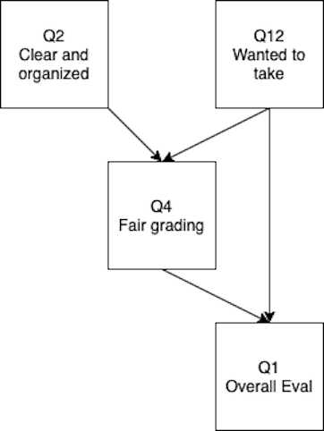
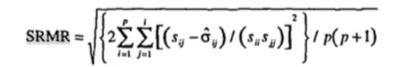

```{r echo = F, message = F, warning = F}
knitr::opts_chunk$set(echo = TRUE)
```

## Estimation

- Estimation is the math that goes on behind the scenes to give you parameter numbers
- Common types:
  - Maximum Likelihood (ML)
  - Asymptotically Distribution Free (ADF)
  - Unweighted Least Squares (ULS)
  - Two stage least squares (TSLS)

## Maximum Likelihood

- Estimates are the ones that maximize the likelihood that the data were drawn from the population
- Normal theory method - multivariate normality is assumed to use ML
  - Check your normality assumption!
  - Other types of estimations may work better for non-normal endogenous variables
- Full information method - estimates are calculated all at the same time
  - Partial information methods calculate part of the estimates, then use those to calculate the rest

## Maximum Likelihood 

- Fit function - the relationship between the sample covariances and estimated covariances
- We want our fit function to be:
  - High if we are measuring how much they match (goodness of fit)
  - Low if we are measuring how much they mismatch (residuals)

## Maximum Likelihood

- ML is an iterative process 
- The computer calculates a possible start solution
- Then runs several times to create the largest ML match
- Start values:
  - Usually generated by the computer
  - You can enter values if you are having problems converging to a solution

## Maximum Likelihood

- Scale free/invariant
  - Means that if you change the scale with a linear transform, the model is still the same
- Assumes unstandardized start variables
  - Otherwise you would be standardizing standardized estimates
- Interpretation of Estimates
  - Loadings/path coefficients - just like regression coefficients
  - Covariance/correlation - how much two items vary together 
  - Error variances tell you how much variance is not accounted for by the model (so you want to be small)
  - SMCs are the amount of variance accounted for in a endogenous variable 
  
## Other Methods

- For continuous variables with normal distributions:
  - Generalized Least Squares (GLS)
  - Unweighted Least Squares (ULS)
  - Fully Weighted Least Squares (WLS)

## Generalized Least Squares

- Pros:
  - Scale free
  - Faster computation time
- Cons:
  - Not commonly used?  If this runs usually so does ML

## Unweighted Least Squares

- Pros: 
  - Does not require positive definite matrices
  - Robust initial estimates
- Cons:
  - Not scale free
  - Not as efficient
  - All variables in the same scale

## Other Methods

- Nonnormal data
  - In ML, estimates might be accurate but standard errors may be large
  - Model fit tends to be overestimated
- Corrected normal method - uses ML but then adjusts the SEs to be normal (robust SE).
  - Satorra-Bentler statistic: Adjusts the chi square value from standard ML by the degree of kurtosis/skew
  - Corrected model test statistic

## Asymptotically Distribution Free

- Some books call this arbitrary distribution free
- Estimates the skew/kurtosis in the data to generate a model
- May not converge because of number of parameters to estimate

## Errors

- Inadmissible solutions - you get numbers in your output but clearly parameters are 
- Heywood cases
  - Parameter estimates are illogical (huge)
  - Negative variance estimates 
    - Just variances, covariances can be negative
  - Correlation estimates over 1 (SMCs)

## Why Errors Happen

- Specification error
- Nonidentification
- Outliers
- Small samples
- Two indicators per latent (more is always better)
- Bad start values (especially for errors)
- Very low or high correlations (empirical under identification)

## Path Models

- Reminder:
  - Circles are latent (unobserved) variables
  - Squares are manifest (observed) variables
  - Triangles can be used to represent intercepts (specific models use these)
- So what is a path model? 
  - A model with only manifest variables (measured/squares)

## Path Models

- Straight arrows are "causal" or directional
  - Non-standardized solution -> these are your b or slope values
  - Standardized solution -> these are your beta values
- Curved arrows are non-directional 
  - Non-standardized -> covariance
  - Standardized -> correlation

## Path Models

- All endogenous variables have an error term
- All exogenous variables will have a variance
- **All exogenous only variables are automatically correlated by lavaan**

## Solutions

- Why standardized?
  - Allows you to compare path coefficients for strength of relationship
  - Makes the non-directional relationships correlation (more interpretable)
  - Matches the values you are used to thinking about (EFA)
- Why unstandardized?
  - Allows you to estimate future scores and interpret path coefficients, in the original scale of the data 

## Let's do it!

- Install `lavaan`: latent variable analysis
- Install `semPlot`: helps us make pictures 

```{r eval = F}
install.packages("lavaan")
install.packages("semPlot")
```

## Syntax

- Note: there's a cheat sheet guide on Canvas
- First, we will define a "model"
  - Best practice: name the saved variable something like `name.model` where `name` is a descriptive name of the model you are building
- Model syntax
  - `~` indicates a regression
  - `~~` indicates a covariance/correlation
  - `=~` indicates a latent variable 
  
## Syntax 

- Automatically adds an error term to each endogenous variable
- Automatically constrains the path to 1 for you for the marker variable
- Automatically adds a covariance term between all exogenous variables
  - Very useful for analyses we will get to later
  - Not always required in path models, but you could constrain it to zero 
  - Important to note because it's often unexpected 

## A Path Example

```{r}
library(rio)
eval.data <- import("lecture_evals.csv")
```


## A Path Example

```{r echo=FALSE, out.width = "25%", fig.align="center"}

```

## Estimate df

- Possible = $\frac{4 \times (4+1)}{2} =  10$ 
- Estimated:
  - 4 regressions
  - 2 error variances
  - 2 variances
  - 1 covariance
- DF = 10 - 9 = 1

## Build the model

```{r echo=FALSE, out.width = "25%", fig.align="center"}

```

```{r}
library(lavaan)
eval.model <- '
q4 ~ q12 + q2
q1 ~ q4 + q12
'
```

## Important Notes

```{r}
eval.model
```

- Note that `\n` is code for new lines
  - These are important
  - Spacing is not important
  - You can use # in the code, it will ignore that line just like R

## Run the Model

- We can use the `sem()` function to apply the model to the data
- Save the analysis, use good naming like `eval.output`
- The default estimator is normal theory maximum likelihood
- Use `?sem` to learn more about the options

```{r}
eval.output <- sem(model = eval.model,
                   data = eval.data)
```

## View the Output

```{r}
summary(eval.output)
```

## Output

- Default output includes:
  - Sample size
  - Estimator
  - Minimum function test statistic $\chi^2$, *df*, *p*
  - Unstandardized parameter estimates, standard error, *Z*, *p*

## Improved Output

```{r}
summary(eval.output, 
        standardized = TRUE, # for the standardized solution
        fit.measures = TRUE, # for model fit
        rsquare = TRUE) # for SMCs
```

## Create a Picture

- Sometimes it's hard to know if you have modeled what you intended to diagram
- Let's create a plot to make sure it's what we meant to do

```{r}
library(semPlot)
semPaths(eval.output, # the analyzed model 
         whatLabels = "par", # what to add as the numbers, std for standardized
         edge.label.cex = 1, # make the font bigger
         layout = "spring") # change the layout tree, circle, spring, tree2, circle2
```

## Another Example

- You don't actually have to have the data to run an analysis
- If you have the correlation matrix, you can still run the analysis
- It's always better to use the raw data if you have it!

```{r}
regression.cor <- lav_matrix_lower2full(c(1.00,
                                         0.20,1.00,
                                         0.24,0.30,1.00,
                                         0.70,0.80,0.30,1.00))

# name the variables in the matrix
colnames(regression.cor) <-
  rownames(regression.cor) <-
  c("X1", "X2", "X3", "Y") 
```

## Build the Model

- Let's look at how we can label the paths 

```{r}
regression.model <- '
# structural model for Y
Y ~ a*X1 + b*X2 + c*X3 
# label the residual variance of Y
Y ~~ z*Y 
'
```

## Analyze the Model

```{r}
regression.fit <- sem(model = regression.model,
                      sample.cov = regression.cor, # instead of data
                      sample.nobs = 1000) # number of data points
```

## View the Summary

```{r}
summary(regression.fit, 
        standardized = TRUE,
        fit.measures = TRUE,
        rsquare = TRUE)
```

## Create a Picture

```{r}
semPaths(regression.fit, 
         whatLabels="par", 
         edge.label.cex = 1,
         layout="tree")
```

## Mediation Models

- Mediation models are regression models that imply that two variables are related (X and Y) *until* you add the mediator variable (M), which diminishes the relationship between X and Y
- You can model these with regression or a structural layout 

```{r}
beaujean.cov <- lav_matrix_lower2full(c(648.07, 
                                        30.05, 8.64, 
                                        140.18, 25.57, 233.21))
colnames(beaujean.cov) <-
  rownames(beaujean.cov) <-
  c("salary", "school", "iq")
```

## Build the Model

```{r}
beaujean.model <- '
salary ~ a*school + c*iq
iq ~ b*school # this is reversed in first printing of the book 
ind:= b*c # this is the mediation part 
'
```

## Analyze the Model

```{r}
beaujean.fit <- sem(model = beaujean.model, 
                    sample.cov = beaujean.cov, 
                    sample.nobs = 300)
```

## View the Summary

```{r}
summary(beaujean.fit, 
        standardized = TRUE,
        fit.measures = TRUE,
        rsquare = TRUE)
```

## Create a Picture

```{r}
semPaths(beaujean.fit, 
         whatLabels="par", 
         edge.label.cex = 1,
         layout="tree")
```

## Fit Indices

- Now that we've done a few examples, how can we know if our model is representative of the data? 
- We can use fit indices! 
- There are a lot of them
- They do not imply that you are perfectly right
- They have guidelines but they are not perfect either
- People misuse them.

## Limitations

- Fit statistics indicate an overall/average model fit
- That means there can be bad sections, but the overall fit is good
- No one magical number/summary
- They do not tell you where a misspecification occurs
- Do not tell you the predictive value of a model
- Do not tell you if it's theoretically meaningful

## "Rules"

- Everyone cites Hu and Bentler (1999) for the golden standards.
- Practically, these rules represent the same problems as rules about *p* values and effect sizes 
- Generally the rules fall into two categories:
  - Goodness of fit statistics: want values close to 1
    - Excellent > .95, Good > .90
  - Badness of fit statistics: want values close to 0
    - Excellent < .06, Good < .08, Acceptable < .10

## Model Test Statistic

- $\chi^2$
- Examines if the reproduced correlation matrix matches the sample correlation matrix
- Sometimes called "badness of fit"
- You want this value to be small as it measures the "mismatch" or error

## Model Test Statistic

- Traditional null hypothesis testing reject-support context
  - Generally, we *reject* the null to show that it's unlikely, and therefore, the research hypothesis is likely
  - However, here we want to support that the model represents the data, which is predicting the null 
  - So, it's an odd use of $\chi^2$ to "support" the null 

## Model Test Statistic
  
- $\chi^2 = (N-1) \times FML$
  - FML is the minimum fit function in maximum likelihood estimation
  - *p* values are based on the df for your model and the chi-square distribution
  - You want this value to be non-significant (minus the issues of predicting the null)
  - However, this non-significance is problematic!

## Model Test Statistic

- Chi-square is biased by: 
  - Multivariate non-normality 
  - Correlation size - large correlations can be hard to estimate
  - Unique variance 
  - Sample size **this is the big one**
  
## Model Test Statistic 

- Everyone reports chi-square, but people tend to ignore significant values
  - One suggestion was normed chi-square $\frac{\chi^2}{df}$ - however, it is known to be just as problematic
- Since $\chi^2$ is biased, you could use a robust estimator to correct for bias
  - Satorra-Bentler
  - Yuan-Bentler

## Alternative Fit Indices

- There are three types of models:
  - Your Model
  - Independence - a model assuming no relationships between the variables (i.e., parameters are not significant)
  - Saturated - a model assuming all parameters exist (i.e., df = 0).  
- We can use a ratio of your model compared to these other possible models as a way to determine fit. 
- These are less black and white, until we apply the "rules"
- It's easy to "cherry-pick" the best indices to support your model 

## Alternative Fit Indices 

- Absolute Fit Indices
- Incremental Fit Indices
- Parsimony-adjusted Indices
- Predictive Fit Indices

## Absolute fit indices 

- Proportion of the covariance matrix explained by the model
- You can think about these as sort of $R^2$
- Want these values be high
- Goodness of Fit Index (GFI), Adjusted Goodness of Fit Index (AGFI), Parsimonious Goodness of Fit Index (PGFI)
  - $1 - \frac{V_{residual}}{V_{total}}$
  - Where residual is the variance not explained by the model, total is the total amount of variance
- Research indicates these are positively biased, and they are not recommended for use

## Absolute Fit Indices

- Standardized root mean residual (SRMR)
- Want small values, as it's a badness of fit index

```{r echo=FALSE, out.width = "50%", fig.align="center"}

```

## Incremental Fit Indices

- Also known as comparative fit indices
  - Values are to 0 to 1, want high values
- Your model compared to the improvement over the independence model (no relationships)
- Comparative Fit Index (CFI)
  - $1 - \frac{\chi^2_{M} - df_{M}}{\chi^2_{B} - df_{B}}$
- Normed Fit Index (NFI)
  - A variation of the CFI, as it was said to underestimate for small samples
  - $1 - \frac{\chi^2_{model}}{\chi^2_{baseline}}$

## Incremental Fit Indices

- Incremental Fit Index (IFI)
  - Also known as Bollen's Non-normed fit index
  - Modified NFI that decreases emphasis on sample size
  - $\frac{\chi^2_{baseline} - \chi^2_{model}}{\chi^2_{baseline} - df_{model}}$
- Relative Fit Index (RFI)
  - Also known as Bollen's Normed Fit Index
  - $\frac{\frac{\chi^2_{model}}{df_{model}}}{\frac{\chi^2_{baseline}}{df_{baseline}}}$

## Incremental Fit Indices

- Tucker Lewis Index (TLI)
   - Also known as the Bentler-Bonet Non-Normed Fit Index
   - A popular fit index
   - $\frac{\frac{\chi^2_{baseline}}{df_{baseline}} - \frac{\chi^2_{model}}{df_{model}}}{\frac{\chi^2_{baseline}}{df_{baseline}} - 1}$

## Parsimony Adjusted Indices

- These include penalties for model complexity because added paths often result in better fit (overfitting)
- These will have smaller values for simpler models
- Root mean squared error of approximation (RMSEA)
  - The **most** popular index
  - Report the confidence interval
  - $\frac{\sqrt{\chi^2 - df_{model}}}{\sqrt{df_{model}\times(N - 1)}}$

## Predictive Fit Indices

- Estimate model fit in a hypothetical replication of the study with the same sample size randomly drawn from the population
- Most often used for model comparisons, rather than "fit"
- Often also considered parsimony adjusted indices

## Model Comparisons

- Let's say you want to adjust your model
  - You can compare the adjusted model to the original model to determine if the adjustment is better
- Let's say you want to compare two different models
  - You can compare their fits to see which is better

## Model Comparisons

- Nested models
  - If you can create one model from another by the addition or subtraction of parameters, then it is nested
  - Model A is said to be nested within Model B, if Model B is a more complicated version of Model A
  - For example, a one-factor model is nested within a two-factor as a one-factor model can be viewed as a two-factor model in which the correlation between factors is perfect 

## Model Comparisons Nested Models

- Chi-square difference test - is this difference in models significant?
- If yes, you say the model with the lower chi-square is better
- If no, you say they are the same and go with the simpler model

```{r}
chi_difference <- 12.6 - 4.3
df_difference <- 14 - 12
pchisq(chi_difference, df_difference, lower.tail = F)
```

## Model Comparisons Nested Models

- CFI difference test
- Subtract CFI model 1 - CFI model 2
- If the change is more than .01, then the models are considered different
- This version is not biased by sample size issues with chi-square

## Model Comparisons Nested Models

- So how can I tell what to change?
- Just change one thing at a time!
- Modification indices
  - Tell you what the chi-square change would be if you added the path suggested
  - Based on $\chi^2(1)$ (Lagrange Multiplier)
  - Anything with $\chi^2(1)$ > 3.84 is *p* < .05

## Model Comparisons Nested Models

- Instead of doing the math, you can use the `anova()` function
- `anova(model1.fit, model2.fit)`

## Model Comparisons Non-Nested Models

- Akaike Information Criterion (AIC)
- Bayesian Information Criterion (BIC)
- Sample size Adjusted Information Criterion (SABIC)
  - All of these penalize you for having more complex models. 
  - If all other things are equal, it is biased to the simpler model. 
- To compare, pick the model with the lower value (always lower, even when negative)

## Model Comparisons Non-Nested Models

- Expected Cross Validation Index (ECVI)
  - $FML + \frac{2\times t}{N - p - 2}$
  - t is the number of parameters estimated
  - p is the number of squares (measured variables)
- Same rules, pick the smallest value

## So what to report?

- We will use RMSEA, SRMR, CFI
- Generally, people also report chi-square and df 
- Determine the type of model change to use the right model comparison statistic

## Path Comparison Example

```{r}
compare.data <- lav_matrix_lower2full(c(1.00,
                                        .53,	1.00,	
                                        .15,	.18,	1.00,		
                                        .52,	.29,	-.05,	1.00,	
                                        .30,	.34,	.23,	.09,	1.00))

colnames(compare.data) <- 
  rownames(compare.data) <- 
  c("morale", "illness", "neuro", "relationship", "SES") 
```

## Build a Model

```{r}
#model 1
compare.model1 = '
illness ~ morale
relationship ~ morale
morale ~ SES + neuro
'

#model 2
compare.model2 = '
SES ~ illness + neuro
morale ~ SES + illness
relationship ~ morale + neuro
'
```

## Analyze the Model

```{r}
compare.model1.fit <- sem(compare.model1, 
                          sample.cov = compare.data, 
                          sample.nobs = 469)

summary(compare.model1.fit, 
        standardized = TRUE,
        fit.measures = TRUE,
        rsquare = TRUE)
```

## Analyze the Model

```{r}
compare.model2.fit <- sem(compare.model2, 
                          sample.cov = compare.data, 
                          sample.nobs = 469)

summary(compare.model2.fit, 
        standardized = TRUE,
        fit.measures = TRUE,
        rsquare = TRUE)
```

## View the Model

```{r}
semPaths(compare.model1.fit, 
         whatLabels="par", 
         edge.label.cex = 1,
         layout="spring")
```

```{r}
semPaths(compare.model2.fit, 
         whatLabels="par", 
         edge.label.cex = 1,
         layout="spring")
```

## Compare the Models

```{r}
anova(compare.model1.fit, compare.model2.fit)
fitmeasures(compare.model1.fit, c("aic", "ecvi"))
fitmeasures(compare.model2.fit, c("aic", "ecvi"))
```

## Summary

- In this lecture you've learned:
  
  - How to write basic lavaan model syntax
  - How to analyze a path model
  - How to summarize a path model
  - How to create sem pictures
  - Estimation and fit indices
