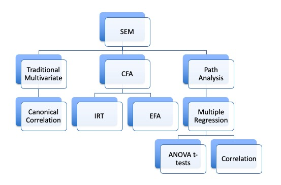

```{r echo = F, message = F, warning = F}
knitr::opts_chunk$set(echo = TRUE)
library(lavaan)
library(semPlot)
```

## Confirmatory Factor Analysis

```{r echo=FALSE, out.width = "75%", fig.align="center"}

```

## Relation to EFA

- You have a bunch of questions
- You have an idea (or sometimes not!) of how many factors to expect
- You let the questions go where they want
- You remove the bad questions until you get a good fit

## CFA models

- You set up the model with specific questions onto specific factors
- Forcing the cross loadings be zero
- You test to see if that model fits
- So, you may think about how confirmatory factor analysis is step two to exploring (exploratory factor analysis)

## CFA Models

- Reflective – the latent variable causes the manifest variables scores
- Purpose is to understand the relationships between the measured variables
- Same theoretical concept as EFA

## CFA Models Reflective Example

```{r}
# a famous example, build the model
HS.model <- ' visual  =~ x1 + x2 + x3
              textual =~ x4 + x5 + x6
              speed   =~ x7 + x8 + x9 '

# fit the model 
HS.fit <- cfa(HS.model, data = HolzingerSwineford1939)

# diagram the model
semPaths(HS.fit, 
         whatLabels = "std", 
         layout = "tree",
         edge.label.cex = 1)
```

## CFA Models

- Formative – latent variables are the result of manifest variables
- Similar to principal components analysis theoretical concept
- Potentially a use for demographics?

## CFA Models Formative Example

```{r}
# a famous example, build the model
HS.model <- ' visual  <~ x1 + x2 + x3'

# fit the model 
HS.fit <- cfa(HS.model, data = HolzingerSwineford1939)

# diagram the model
semPaths(HS.fit, 
         whatLabels = "std", 
         layout = "tree",
         edge.label.cex = 1)
```

## CFA Models

- The manifest variables in a CFA are sometimes called indicator variables
- Because they indicate what the latent variable should be since we do not directly measure the latent variable 

## General Set Up

- The latents will be correlated (because they are exogenous only)
- Similar to an oblique rotation
- Each factor section has to be identified
  - You should have three measured variables per latent
  - If you only have two, you need to set their coefficients to equal (estimated but equal)
- Arrows go from latent to measured (reflexive)
  - We think that latent caused the measured answers
- Error terms on the measured variables, variance on the latent variables 
  - If you are counting for degrees of freedom for identification

## Correlated Error

- Generally, you leave the error terms uncorrelated, as you think they are separate items
- However: 
- These questions all measure the same factor right?  
- Often they are pretty similar 
- Some answers will be related to other items
- So it's not too big of a idea to say that item's errors are related 
- We can use modification indices to see if they should be correlated
  - Make sure these make sense!

## Interpretation

- The latent variable section includes the `factor loadings` or coefficients
- These are the same idea as EFA - you want the relationship between the latent variable and the manifest variable to be strong
  - We used a rule of .300 before but for this rule, you should examine the standardized loading
  - Otherwise, why would we think this item measures the latent variable?

## Interpretation

- These coefficients are often called:
- Pattern coefficients (unstandardized): for every one unit in the latent variable, the manifest variable increases *b* units
- Structure coefficients (standardized): the correlation between the latent variable and the manifest variable 

## Identification Rules of Thumb:

- Latent variables should have four indicators
- Latent variables have three indicators AND error variances do not covary
- Latent variables have two indicators AND Error variances do not covary AND loadings are set to equal each other 

## Scaling

- Remember that scaling is the way we "set the scale" for the latent variable
- We usually do this by setting one of the pattern coefficients to 1 - the marker variable approach
- Another option is to to set the variance of the latent variable to 1 `std.lv` in the the standardized output 
  - What does that do?
  - Sets the scale to z-score
  - Makes double headed arrow between latents correlation
  - Make sure you are using unstandardized data!

## Scaling

- So what is the `std.all` as part of the "completely standardized solution?
- Both the latent variable variance and the manifest variable variance is set to 1
- If you are going to report the standardized solution, this version is the most common, as it matches EFA and regression 
- All of these options give you different loadings, but should not change model fit 

## Examples

- Reminder:
- When you use a correlation matrix as your input, the solution is already standardized!
- When you use a covariance matrix as your input, both the unstandardized and standardized solution can be viewed 

## One-Factor CFA Example

- IQ is often thought of as "g" or this overall cognitive ability
- Let's look at an example of the WISC, which is an IQ test for children
- We have five of the subtest scores including `information`, `similarities`, `word reasoning`, `matrix reasoning`, and `picture concepts` 

## Convert Correlations to Covariance

```{r}
wisc4.cor <- lav_matrix_lower2full(c(1,
                                     0.72,1,
                                     0.64,0.63,1,
                                     0.51,0.48,0.37,1,
                                     0.37,0.38,0.38,0.38,1))
# enter the SDs
wisc4.sd <- c(3.01 , 3.03 , 2.99 , 2.89 , 2.98)

# give everything names
colnames(wisc4.cor) <- 
  rownames(wisc4.cor) <-
  names(wisc4.sd) <- 
  c("Information", "Similarities", 
    "Word.Reasoning", "Matrix.Reasoning", "Picture.Concepts")

# convert
wisc4.cov <- cor2cov(wisc4.cor, wisc4.sd)
```

## WISC One-Factor Model

- The `=~` is used to define a reflexive latent variable 
- `~` can be interpreted as Y is predicted by X
- `=~` can be interpreted as X is indicated by Ys

```{r}
wisc4.model <- '
g =~ Information + Similarities + Word.Reasoning + Matrix.Reasoning + Picture.Concepts
'
```

## Analyze the Model

- Notice we changed to the `cfa()` function
- It has the same basic arguments
- The `std.lv` option can be used to only see the standardized solution on the latent variable, usually you want to set this to `FALSE`

```{r}
wisc4.fit <- cfa(model = wisc4.model, 
                sample.cov = wisc4.cov, 
                sample.nobs = 550,  
                std.lv = FALSE)
```

## Summarize the Model

- Logical solution: 
  - Positive variances
  - SMCs + Correlations < 1
  - No error messages
  - SEs are not "huge"
- Estimates: 
  - Do our questions load appropriately?
- Model fit:
  - What do the fit indices indicate?
  - Can we improve model fit without overfitting? 
  
## Summarize the Model

```{r}
summary(wisc4.fit,
        standardized=TRUE, 
        rsquare = TRUE,
        fit.measures=TRUE)
```

## New Functions

- `std.nox`: the standardized estimates are based on both the variances of both (continuous) observed and latent variables, but not the variances of exogenous covariates
- This output is the best way to get the confidence intervals for each parameter 

```{r}
parameterestimates(wisc4.fit,
                   standardized=TRUE)
```

## New Functions

```{r}
fitted(wisc4.fit) ## estimated covariances
wisc4.cov ## actual covariances
```

## All Fit Indices

```{r}
fitmeasures(wisc4.fit)
```

## Modification Indices

```{r}
modificationindices(wisc4.fit, sort = T)
```

## Diagram the Model

```{r}
semPaths(wisc4.fit, 
         whatLabels="std", 
         what = "std",
         layout ="tree",
         edge.color = "blue",
         edge.label.cex = 1)
```

## WISC Two-Factor Model

- Note that we only have two items on the latent variable
- If we see an identification error, we can set these to equal (homework hint!)

```{r}
wisc4.model2 <- '
V =~ Information + Similarities + Word.Reasoning 
F =~ Matrix.Reasoning + Picture.Concepts
'

# wisc4.model2 <- '
# V =~ Information + Similarities + Word.Reasoning 
# F =~ a*Matrix.Reasoning + a*Picture.Concepts
# '
```

## Analyze the Model

```{r}
wisc4.fit2 <- cfa(wisc4.model2, 
                  sample.cov=wisc4.cov, 
                  sample.nobs=550,
                  std.lv = F)
```

## Summarize the Model

```{r}
summary(wisc4.fit2,
        standardized=TRUE, 
        rsquare = TRUE,
        fit.measures=TRUE)
```

## Diagram the Model

```{r}
semPaths(wisc4.fit2, 
         whatLabels="std", 
         what = "std",
         edge.color = "pink",
         edge.label.cex = 1,
         layout="tree")
```

## Compare the Models

```{r}
anova(wisc4.fit, wisc4.fit2)
fitmeasures(wisc4.fit, c("aic", "ecvi"))
fitmeasures(wisc4.fit2, c("aic", "ecvi"))
```

## How to Tidy lavaan Output

- https://easystats.github.io/parameters/articles/efa_cfa.html

```{r}
#install.packages("parameters")
library(parameters)
model_parameters(wisc4.fit, standardize = TRUE)
```

## How to Tidy lavaan Output

```{r}
library(broom)
tidy(wisc4.fit)
glance(wisc4.fit)
```

## Summary

- In this lecture you've learned:
  
  - How to create a simple confirmatory factor analysis (measurement model)
  - How to view parameter estimates, modification indices, and more
  - Practiced building these models and comparing them 
