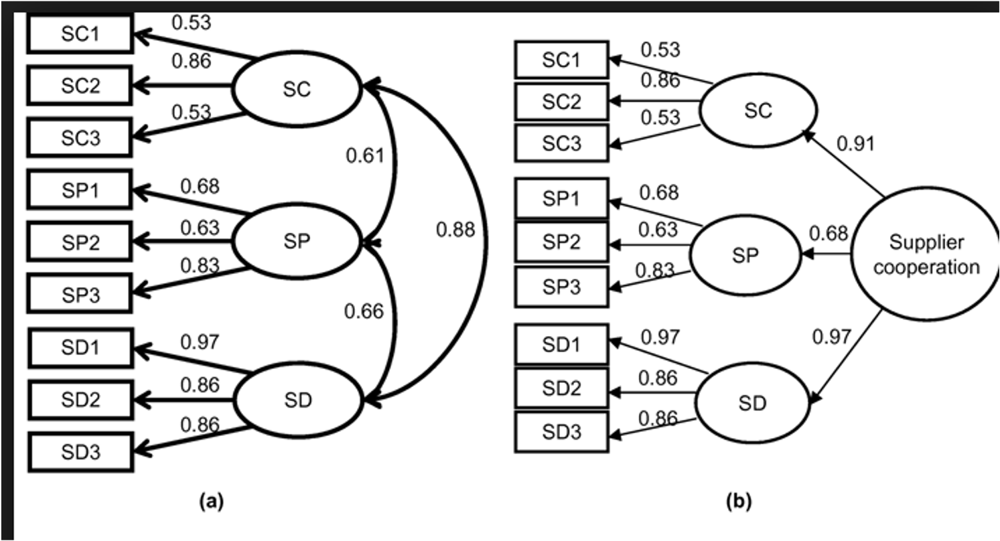
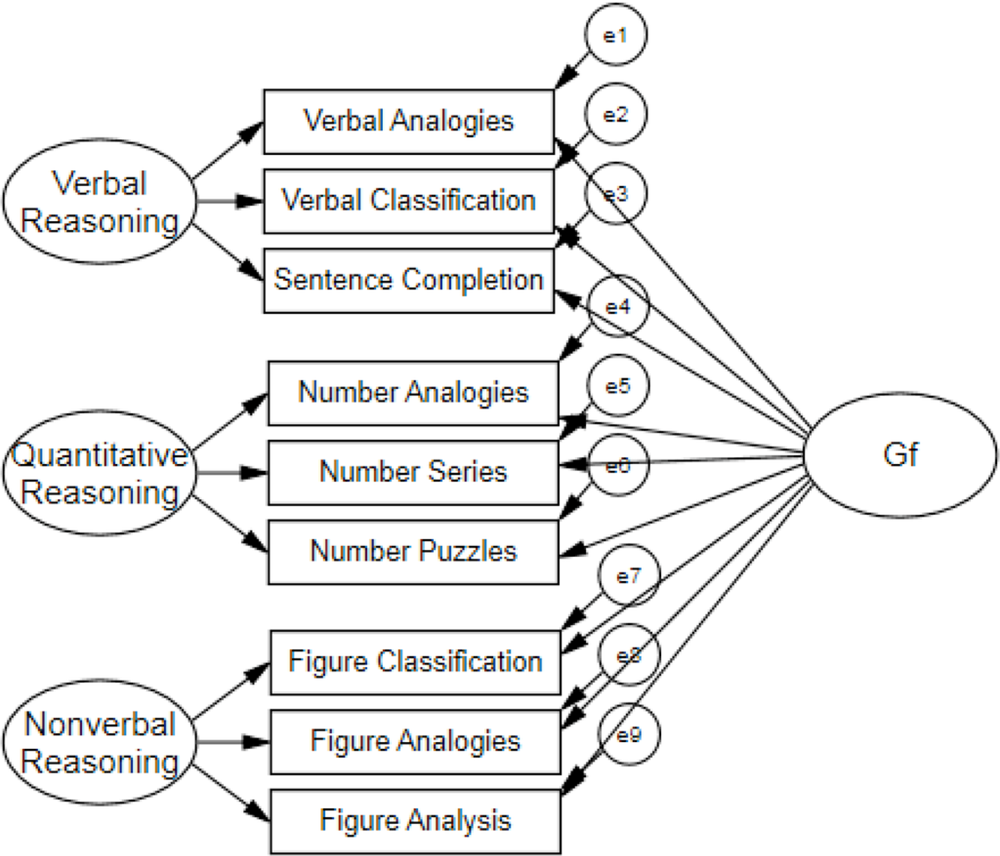

```{r echo = F, message = F, warning = F}
knitr::opts_chunk$set(echo = TRUE)
library(lavaan)
library(semPlot)
```

## Second Order Latent Models

- A second order model is one that is structured into an order or rank.
- Two types we will consider:

    - Higher-order: Describes when latent variables are structured so that latents influence other latents into levels.
    - Bi-factor: Generally used to describe a CFA with two sets of latent variables (not hierarchical).

## Second Order Models

- The idea of a higher order model is:

    - You have some latent variables that are measured by the observed variables.
    - A portion of the variance in the latent variables can be explained by a second (set) of latent variables.
    - Therefore, we are switching out the covariances between factors and using another latent to explain them.

## Second Order Models

- When are these used?
- When there are multiple latent variables that covary with each other (and a lot).
- A second set of latents explains that covariance.

## Second Order Models

```{r echo=FALSE, out.width = "75%", fig.align="center"}

```

## Higher Order Models

- The covariance of the first order is accounted for by the second order plus a *specific factor*.
- Specific factors are error that is not explained by the second order latents.
- The higher order is thought to indirectly influence the manifest variables through the first order.

## Identification

- Remember that each portion of the model has to be identified.

    - The section with each latent variable has to be identified.
    - The section with the latents has to be identified.
    
## Identification

- You can achieve identification in a couple of ways:

    - Set some of the loadings in the upper portion of the model to be equal by giving them the same name.
    - You can set the variance in the upper latent to be one.
    - You can set some of the error variances of the latents in the lower portion to be equal.
    
## Bi-Factor Models

- Special type of model with two sets of latents, but they are not hierarchically structured.
- Best used when:

    - *General factor* that accounts for variance in the manifest variables.
    - *Domain specific* areas that are thought to influence the manifest variables.

## Bi-Factor Models

```{r echo=FALSE, out.width = "75%", fig.align="center"}

```

## Bi-Factor Models

- One thing to note is that the latent variables are left uncorrelated in this type of model.
- This structure represents the domain specific part of the interpretation.

## Model Differences

- Differences between bi-factor and hierarchical:

    - In hierarchical models, the second order influences the first order, while the two sets of latents in bi-factors are uncorrelated.
    - What does that allow you to test differently?

## Model Differences

- Advantages:

    - Allows you to see how the first order latent variables influence the manifest variables separately from the other latent variables.
    - After accounting for the general latent variable, are the domain specific items still accounting for variance? 
    - You can compare models with and without the domain specific areas

## Examples: WISC

- Going back to the WISC data, this time with more of the subscales that are available.

```{r}
library(lavaan)
library(semPlot)

##import the data
wisc4.cov <- lav_matrix_lower2full(c(8.29,
                                    5.37,9.06,
                                    2.83,4.44,8.35,
                                    2.83,3.32,3.36,8.88,
                                    5.50,6.66,4.20,3.43,9.18,
                                    6.18,6.73,4.01,3.33,6.77,9.12,
                                    3.52,3.77,3.19,2.75,3.88,4.05,8.88,
                                    3.79,4.50,3.72,3.39,4.53,4.70,4.54,8.94,
                                    2.30,2.67,2.40,2.38,2.06,2.59,2.65,2.83,8.76,
                                    3.06,4.04,3.70,2.79,3.59,3.67,3.44,4.20,4.53,9.73))

wisc4.sd <- c(2.88,3.01,2.89,2.98,3.03,3.02,2.98,2.99,2.96,3.12) 

names(wisc4.sd) <- 
  colnames(wisc4.cov) <- 
  rownames(wisc4.cov) <- c("Comprehension", "Information", 
                         "Matrix.Reasoning", "Picture.Concepts", 
                         "Similarities", "Vocabulary",  "Digit.Span", 
                         "Letter.Number",  "Coding", "Symbol.Search") 
```

## Examples: WISC

- Let's start with a first order model for the WISC.
- By starting with the measurement model, we can ensure the measurement section is identified and works correctly. 
- You should also check out the correlations/covariances between factors to make sure that they are even related.  

## Examples: WISC Build the Model 

```{r}
##first order model
wisc4.fourFactor.model <- '
gc =~ Comprehension + Information +  Similarities + Vocabulary 
gf =~ Matrix.Reasoning + Picture.Concepts
gsm =~  Digit.Span + Letter.Number
gs =~ Coding + Symbol.Search
'   
```

## Examples: WISC Analyze the Model

```{r}
wisc4.fourFactor.fit <- cfa(model = wisc4.fourFactor.model, 
                            sample.cov = wisc4.cov, 
                            sample.nobs = 550)
```

## Examples: WISC Summarize the Model

- Logical solution: 

    - Positive variances
    - SMCs + Correlations < 1
    - No error messages
    - SEs are not "huge"
  
- Estimates: 

    - Do our questions load appropriately?

- Model fit:
    
    - What do the fit indices indicate?
    - Can we improve model fit without overfitting? 

```{r}
summary(wisc4.fourFactor.fit, 
        fit.measure = TRUE, 
        standardized = TRUE,
        rsquare = TRUE)
```

## Examples: WISC Diagram the Model

```{r}
semPaths(wisc4.fourFactor.fit, 
         whatLabels="std", 
         edge.label.cex = 1,
         edge.color = "black",
         what = "std",
         layout="tree")
```

## Examples: WISC Interpretation

- In the first order model, we find that the correlations are pretty high.
- That’s a good sign that maybe a second order model is appropriate.
- Or that the factors should be collapsed together, as they are not distinct. 

## Examples: Second-Order WISC

- Build the model:

```{r}
wisc4.higherOrder.model <- '
gc =~ Comprehension + Information + Similarities + Vocabulary 
gf =~ Matrix.Reasoning + Picture.Concepts
gsm =~  Digit.Span + Letter.Number
gs =~ Coding + Symbol.Search

g =~ gf + gc  + gsm + gs 
'
```

## Examples: Second-Order WISC

- Analyze the model:

```{r}
wisc4.higherOrder.fit <- cfa(model = wisc4.higherOrder.model, 
                             sample.cov = wisc4.cov, 
                             sample.nobs = 550)
```

## Examples: Second-Order WISC

- Summarize the model:

    - Note: the fit indices *should not* change.
    - Let's look at loadings, where the shift should have happened.

```{r}
summary(wisc4.higherOrder.fit, 
        fit.measure = TRUE, 
        standardized = TRUE, 
        rsquare = TRUE)
```

## Examples: Second-Order WISC

```{r}
semPaths(wisc4.higherOrder.fit, 
         whatLabels="std", 
         edge.label.cex = 1,
         edge.color = "black",
         what = "std",
         layout="tree")
```

## Examples: Bi-factor WISC

- Build the model:

    - In this particular model, because we have only two indicators, we have to set them equal for identification for a bifactor to run properly?
    - Why not the second order model? 
    - After you define the measurement model, you would define a second latent that every *variable* is related to.
    - Note: these are the *variables* not the latents like a hierarchical model. 

```{r}
wisc4.bifactor.model <- '
gc =~ Comprehension + Information +  Similarities + Vocabulary 
gf =~ a*Matrix.Reasoning + a*Picture.Concepts  
gsm =~  b*Digit.Span + b*Letter.Number
gs =~ c*Coding + c*Symbol.Search 
g =~ Information + Comprehension + Matrix.Reasoning + Picture.Concepts + Similarities + Vocabulary +  Digit.Span + Letter.Number + Coding + Symbol.Search
'
```

## Examples: Bi-factor WISC

- Analyze the model:

    - Last, we want to turn off the automatic exogenous only correlations, which we do with the `orthogonal = TRUE` model.
    - The argument is that all the correlations normally seen between the *domain specific* latents are due to the *general factor*.

```{r}
wisc4.bifactor.fit <- cfa(model = wisc4.bifactor.model, 
                          sample.cov = wisc4.cov,
                          sample.nobs = 550, 
                          orthogonal = TRUE)
```

## Examples: Bi-factor WISC

- Summarize the model:

    - Notice the covariances are zero. 
    - Notice the equal loading estimates for the variables set to the same.

```{r}
summary(wisc4.bifactor.fit, 
        fit.measure = TRUE, 
        rsquare = TRUE, 
        standardized = TRUE)
```

## Examples: Bi-factor WISC

- Diagram the model:

```{r}
semPaths(wisc4.bifactor.fit, 
         whatLabels="std", 
         edge.label.cex = 1,
         edge.color = "black",
         what = "std",
         layout="tree")
```

## Summary

- In this lecture you've learned:
  
    - How to account for strong correlations between latent variables
    - How to program and run a higher-order model (hierarchical)
    - How to program and run a bi-factor model (not hierarchical)
