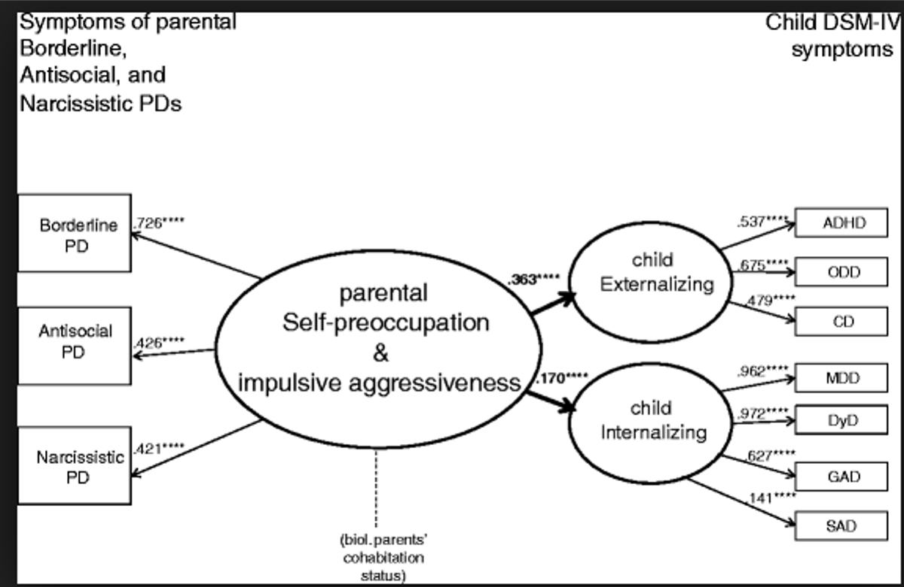
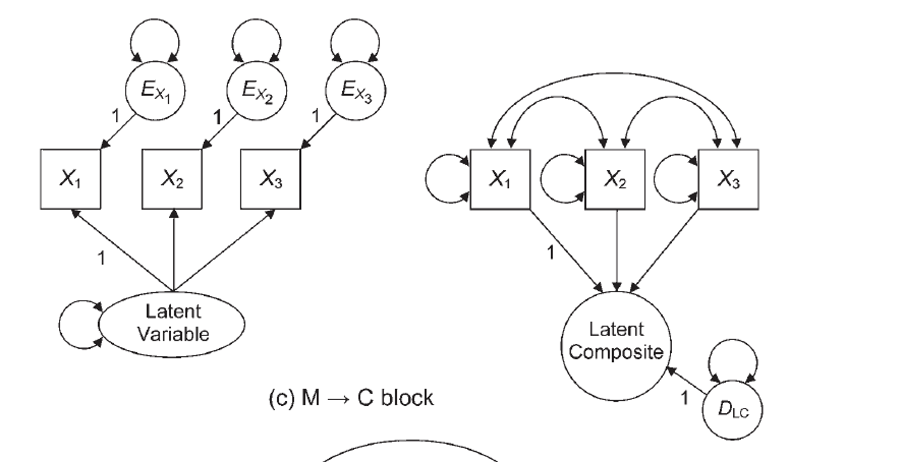
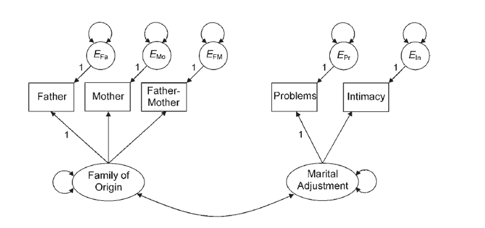
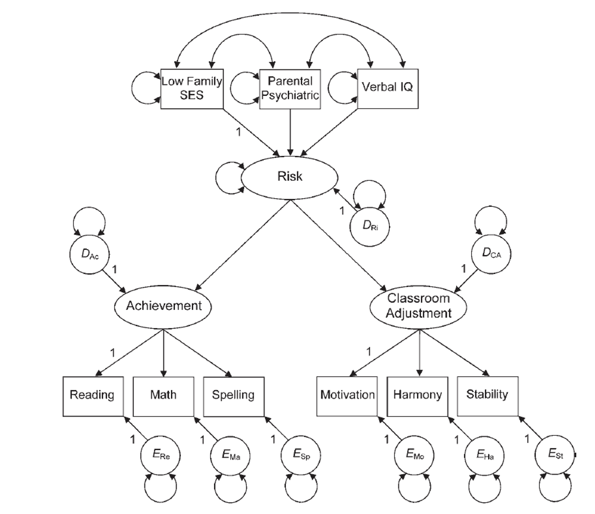

```{r echo = F, message = F, warning = F}
knitr::opts_chunk$set(echo = TRUE)
library(lavaan)
library(semPlot)
```

## Full Structural Models

- A fully latent or full structural model has two parts:
  
  - Measurement model: the latent variable with it's measured variables (CFA)
  - Structural model: the relationship between other variables and the measurement model 

- The structural model may be a second order latent, like we did last week
- The structural model could include other predictors
- Or you could simply convert from correlations to a specific prediction direction as part of your structural model

## Example Model

```{r echo=FALSE, out.width = "75%", fig.align="center"}

```

## Full Structural Models

- A reminder from earlier this semester:

    - Reflective indicators: we assume the latent variables are the cause, so they are exogenous
    - Formative indicators: we assume the latent variables are the criterion, so they are endogenous

## Full Structural Models

- Example of formative indicator

    - Income, education level, and occupation all predict your SES
    - Stress caused by outside factors

- Other names people use for these: 
    
    - Composite causes
    - MIMIC – multiple indicators, multiple causes models

## Example Model

```{r echo=FALSE, out.width = "75%", fig.align="center"}

```    

## Identification

- Identification rules of thumb:

    - Latent variables should have four indicators
    - Latent variables have three indicators AND Error variances do not covary
    - Latent variables have two indicators AND Error variances do not covary and Loadings are set to equal each other. 

## Structural Model Identification

- Scaling is also required to identify the structural part
- 2+ emitted paths rule
    
    - Composite variable must have direct effects on two other endogenous variables

## Things to Consider

- Parceling
    
    - When you have large structural models, they can be very complex to fit to a Full SEM if each latent variable has lots of indicators (items).
    - Parceling occurs when you create subsets of items to be able to get the model to run and to balance out the number of indicators on each latent. 
    - At the moment, this topic is still pretty controversial.
    
## How to Model 

- Test each CFA piece separately to make sure they run. 

    - CFAs that are bad, do not suddenly make good models when the structural component is added!
    
- Slowly add structural paths to see if you can get the full model to work.
    
    - If not, try parceling. 
    - Drop non-significant paths.

## How to Model

- As you add the structural components, you should not see a big change in the loadings to the indicators

    - If you do, it means the model is not invariant
    - Causes interpretation difficulties 
    
## When to Stop?

- We have discussed using `modificationindices()` and other tricks to improve model fit
- In theory, we could add all paths until the model is "perfect"
- What should the stopping rule be? 

    - Based on theory
    - Fit indices do not greatly improve
    - Parsimony 

## Example Model

```{r echo=FALSE, out.width = "75%", fig.align="center"}

```   

## Example Model: Setup

```{r}
library(lavaan)
library(semPlot)

family.cor <- lav_matrix_lower2full(c(1.00, 
                                      .74,	1.00,	
                                      .27,	.42,	1.00,	
                                      .31,	.40,	.79,	1.00,	
                                      .32,	.35,	.66,	.59,	1.00))
family.sd <- c(32.94,	22.75, 13.39,	13.68,	14.38)
rownames(family.cor) <- 
  colnames(family.cor) <-
  names(family.sd) <- c("father", "mother", "famo", "problems", "intimacy")

family.cov <- cor2cov(family.cor, family.sd)
```

## Example Model: Build the CFA

- First, we are going to test the measurement model – just the CFAs with a covariance between them.
- Then, we are going to change it to a full SEM, predicting the direction of the relationship between latents.
- We should ensure the measurement model does not change significantly.

## Example Model: Build the CFA

```{r}
family.model <- '
adjust =~ problems + intimacy
family =~ father + mother + famo'
```

## Example Model: Analyze the CFA

```{r}
family.fit <- cfa(model = family.model,
                  sample.cov = family.cov,
                  sample.nobs = 203)
```

## Example Model: Deal with Error

```{r}
inspect(family.fit, "cov.lv")
inspect(family.fit, "cor.lv")
```

## Example Model: Analyze the CFA

```{r}
family.fit <- cfa(model = family.model,
                  sample.cov = family.cor,
                  sample.nobs = 203)
```

## Example Model: Summarize the Model

```{r}
summary(family.fit, 
        rsquare = TRUE, 
        standardized = TRUE,
        fit.measures = TRUE)
```

## Example Model: Improve the Model?

```{r}
modificationindices(family.fit, sort = T)
```

## Example Model: Improve the Model?

```{r}
family.model2 <- '
adjust =~ problems + intimacy
family =~ father + mother + famo
father ~~ mother'

family.fit2 <- cfa(model = family.model2,
                  sample.cov = family.cov,
                  sample.nobs = 203)

inspect(family.fit2, "cor.lv")
```

## Example Model: Diagram the Model

```{r}
semPaths(family.fit, 
         whatLabels = "std", 
         layout = "tree", 
         edge.label.cex = 1)
```

## Example Model: Build Full SEM

```{r}
predict.model <- '
adjust =~ problems + intimacy
family =~ father + mother + famo
adjust~family'
```

## Example Model: Analyze Full SEM

```{r}
predict.fit <- sem(model = predict.model,
                   sample.cov = family.cor,
                   sample.nobs = 203)
```

## Example Model: Summarize Full SEM

```{r}
summary(predict.fit, 
        rsquare = TRUE, 
        standardized = TRUE,
        fit.measures = TRUE)
```

## Example Model: Diagram Full SEM

```{r}
semPaths(predict.fit, 
         whatLabels = "std", 
         layout = "tree", 
         edge.label.cex = 1)
```

## Example 2: Composite Variables

```{r echo=FALSE, out.width = "75%", fig.align="center"}

``` 

## Example 2: Setup

```{r}
family.cor <- lav_matrix_lower2full(c(1.00, 
                                     .42,	1.00, 
                                    -.43,	-.50,	1.00, 
                                    -.39,	-.43,	.78,	1.00,	
                                    -.24,	-.37,	.69,	.73,	1.00, 
                                    -.31,	-.33,	.63,	.87,	.72,	1.00,	
                                    -.25,	-.25,	.49,	.53,	.60,	.59,	1.00, 
                                     -.25,	-.26,	.42,	.42,	.44,	.45,	.77,	1.00,	
                                     -.16,	-.18,	.23,	.36,	.38,	.38,	.59,	.58, 1.00))

family.sd <- c(13.00,	13.50,	13.10,	12.50,	13.50,	14.20,	9.50,	11.10,	8.70)

rownames(family.cor) <- 
  colnames(family.cor) <-
  names(family.sd) <- c("parent_psych","low_SES","verbal",
                        "reading","math","spelling","motivation","harmony","stable")

family.cov <- cor2cov(family.cor, family.sd)
```

## Example 2: Build the Model

- How to define a composite variable?
- We have been using `=~` to define a latent variable that predicts manifest variables.
- Use `<~` to create a composite variable that is predicted by the manifest variables. 

## Example 2: Build the Model

```{r}
composite.model <- '
risk <~ low_SES + parent_psych + verbal
achieve =~ reading + math + spelling
adjustment =~ motivation + harmony + stable
risk =~ achieve + adjustment
'
```

## Example 2: Analyze the Model

```{r}
composite.fit <- sem(model = composite.model, 
                      sample.cov = family.cov, 
                      sample.nobs = 158)
```

## Example 2: Summarize the Model

```{r}
summary(composite.fit, 
        rsquare = TRUE, 
        standardized = TRUE,
        fit.measures = TRUE)
```

## Example 2: Improve the Model?

```{r}
modificationindices(composite.fit, sort = T)
```

## Example 2: Diagram the Model

```{r}
semPaths(composite.fit, 
         whatLabels = "std", 
         layout = "tree",
         edge.label.cex = 1)
```

## Summary

- In this lecture you've learned:
  
    - How to build on our previous work of measurement models
    - How to build a composite variable and run those models
    - How to examine for invariance when building a full SEM 
