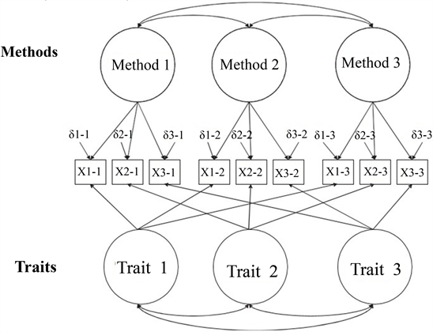
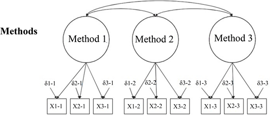
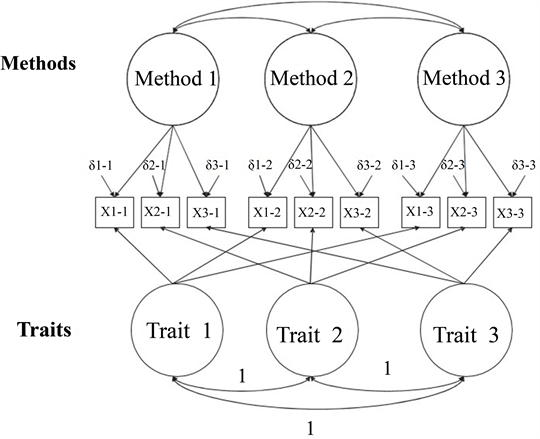

```{r echo = F, message = F, warning = F}
knitr::opts_chunk$set(echo = TRUE)
library(lavaan)
library(semPlot)
```

## Multi-Trait Multi-Method SEM

- Another good resource includes: http://davidakenny.net/cm/mtmm.htm
- Traits: the latent factors you are trying to measure.
- Methods: the way you are measuring the latent factors.

## When to Use

- Convergent validity: How much do different assessments measure the same traits?
  - We would like measurement 1 and measurement 2 to assess the trait equally well. 
- Discriminant validity: How much do different assessment methods diverge in measurement of different traits?
  - We would like measurement 1 and measurement 2 to assess each trait differently.
- Both of these together would indicate that each measurement is equally useful.

## When to Use 

- Method effects: How much do the measurements cause overlap in traits?
  - We want measurement 1 to measure trait 1 and trait 2 differently.

## Logic of MTMM

- We will build several different models that test the questions listed above and compare them using nested $\chi^2$ tests using the `anova()` function.
  - We could also use AIC or ECVI, but generally the chi-square test is preferred.
- Another popular model comparison rule is the $\Delta$ CFI > .01 would be considered a significant change in fit.

## The Steps

- There are two approaches to MTMM
  - Widaman (1985) approach
  - Correlated uniqueness approach

## The Steps

- Let's note that our model specification is slightly different than a normal CFA.
- We will not use the normal scaling on the manifest variables. 
- We will instead set the variance to each latent to one using `std.lv = TRUE`. 

## Model 1:  Correlated Traits / Correlated Methods

- You will correlate traits with each other.
- You will correlate methods with each other.
- You will NOT cross correlate methods and traits.
- So how can we force `lavaan` to do that?
  - `latent ~~ 0*latent`

## Model 1:  Correlated Traits / Correlated Methods

```{r echo=FALSE, out.width = "75%", fig.align="center"}

```

## Model 1:  Correlated Traits / Correlated Methods

- One of the big concerns/complaints with the traditional MTMM steps is that Model 1 is likely to create a Heywood case with a negative error variance.
- Generally, because these models are complex ... most of the latent variables are correlated on purpose, so it may be hard to estimate. 

## Model 1:  Correlated Traits / Correlated Methods

- If you get a Heywood case of negative variance:
  - If you know the variance by having the real data, set it to that. 
  - Set the value to something small and positive.
  - Set the value equal to another small positive parameter.
  
## Model 1:  Correlated Traits / Correlated Methods

- All other models are compared to Model 1.
- Model 1 represents the best case scenario, wherein traits are correlated but not perfectly and they are estimated by the measurements but not perfectly.

## Example Data

- Traits:
  - Meaning: MLQ 1, 2, 5, 10 and PIL 4, 12, 17
  - Purpose: MLQ 3, 4, 6, 8, 9, and PIL 3, 8, 20
- Methods:
  - Purpose in Life Test (p questions)
  - Meaning in Life Questionnaire (m questions)

```{r}
library(lavaan)
library(semPlot)
library(rio)

meaning.data <- import("lecture_mtmm.csv")
str(meaning.data)
```

## Build the Measurement Models

```{r}
methods.model <- '
mlq =~ m1 + m2 + m3 + m4 + m5 + m6 + m8 + m9 + m10
pil =~ p3 + p4 + p8 + p12 + p17 + p20
'

traits.model <- '
meaning =~ m1 + m2 + m5 + m10 + p4 + p12 + p17
purpose =~ m3 + m4 + m6 + m8 + m9 + p3 + p8 + p20
'
```

## Analyze the Measurement Models

```{r}
methods.fit <- cfa(model = methods.model, 
                   data = meaning.data,
                   std.lv = TRUE)
traits.fit <- cfa(model = traits.model,
                  data = meaning.data,
                  std.lv = TRUE)

lavInspect(traits.fit, "cor.lv")
```

## Summarize the Measurement Models

```{r}
summary(methods.fit, 
        rsquare = TRUE, 
        standardized = TRUE,
        fit.measures = TRUE)

summary(traits.fit, 
        rsquare = TRUE, 
        standardized = TRUE,
        fit.measures = TRUE)
```

## Diagram the Measurement Models

```{r}
semPaths(methods.fit, 
         whatLabels = "std", 
         layout = "tree", 
         edge.label.cex = 1)

semPaths(traits.fit, 
         whatLabels = "std", 
         layout = "tree", 
         edge.label.cex = 1)
```

## Model 1:  Correlated Traits / Correlated Methods

```{r}
step1.model <- '
mlq =~ m1 + m2 + m3 + m4 + m5 + m6 + m8 + m9 + m10
pil =~ p3 + p4 + p8 + p12 + p17 + p20
meaning =~ m1 + m2 + m5 + m10 + p4 + p12 + p17
purpose =~ m3 + m4 + m6 + m8 + m9 + p3 + p8 + p20

##fix the covariances
mlq ~~ 0*meaning
pil ~~ 0*meaning
mlq ~~ 0*purpose
pil ~~ 0*purpose
'
```

## Model 1:  Correlated Traits / Correlated Methods

```{r}
step1.fit <- cfa(model = step1.model, 
                 data = meaning.data,
                 std.lv = TRUE)

summary(step1.fit, 
        rsquare = TRUE, 
        standardized = TRUE,
        fit.measures = TRUE)
```

## Model 1:  Correlated Traits / Correlated Methods

```{r}
semPaths(step1.fit, 
         whatLabels = "std", 
         layout = "tree", 
         edge.label.cex = 1)
```

## Model 2: No Traits / Correlated Methods

- Completely delete the trait latent side.
- We are testing the methods only model.
- Model 1 versus Model 2
  - Convergent validity: Independent measures of the same trait are correlated
  - You want Model 2 to be worse than Model 1.
  - Model 1 has both traits and methods, while Model 2 only has methods. If Model 2 is good, that means that methods is the best estimate for the data and that traits are not useful (that's bad). 
  
## Model 2: No Traits / Correlated Methods

```{r echo=FALSE, out.width = "75%", fig.align="center"}

```

## Model 2: No Traits / Correlated Methods

- Model 2 is worse than Model 1, implying we need the traits to interpret the data, supporting convergent validity.

```{r}
##model 2 is the methods model 
##we've already checked it out
anova(step1.fit, methods.fit)

fitmeasures(step1.fit, "cfi") 
fitmeasures(methods.fit, "cfi")
```

## Model 3: Perfectly Correlated Traits / Freely Correlated Methods

- In this model, we will include both traits and methods.
- We will set the covariances for traits to one.
- By setting these to one, we are testing if the traits are exactly the same, which would indicate we are not measuring separate variables. 
- Discriminant validity: you want traits to measure different things.
- Therefore, we want Model 1 to be better than Model 3. 

## Model 3: Perfectly Correlated Traits / Freely Correlated Methods

```{r echo=FALSE, out.width = "75%", fig.align="center"}

```

## Model 3: Perfectly Correlated Traits / Freely Correlated Methods

```{r}
step3.model <- '
mlq =~ m1 + m2 + m3 + m4 + m5 + m6 + m8 + m9 + m10
pil =~ p3 + p4 + p8 + p12 + p17 + p20
meaning =~ m1 + m2 + m5 + m10 + p4 + p12 + p17
purpose =~ m3 + m4 + m6 + m8 + m9 + p3 + p8 + p20

##fix the covariances
mlq ~~ 0*meaning
pil ~~ 0*meaning
mlq ~~ 0*purpose
pil ~~ 0*purpose
meaning ~~ 1*purpose
'
```

## Model 3: Perfectly Correlated Traits / Freely Correlated Methods

```{r}
step3.fit <- cfa(model = step3.model,
                 data = meaning.data,
                 std.lv = TRUE)

summary(step3.fit, 
        rsquare = TRUE, 
        standardized = TRUE, 
        fit.measure = TRUE)
```

## Model 3: Perfectly Correlated Traits / Freely Correlated Methods

```{r}
semPaths(step3.fit, 
         whatLabels = "std", 
         layout = "tree", 
         edge.label.cex = 1)
```

## Model 3: Perfectly Correlated Traits / Freely Correlated Methods

- Oh no! These models are exactly the same. 
- This result implies that our traits are not discriminating (meaning = purpose). 

```{r}
anova(step1.fit, step3.fit)

fitmeasures(step1.fit, "cfi")
fitmeasures(step3.fit, "cfi")
```

## Model 4: Freely Correlated Traits / Uncorrelated Methods

- In this last step, we set the covariances between methods to zero.
- This result would imply that the methods are not measuring exactly the same way. 
- Discriminant validity of the methods: different measures each assess different parts of the latent variables 
- You want to find that Model 1 and Model 4 are equal. 

## Model 4: Freely Correlated Traits / Uncorrelated Methods

```{r echo=FALSE, out.width = "75%", fig.align="center"}
knitr::include_graphics("model4_mtmm.png")
```

## Model 4: Freely Correlated Traits / Uncorrelated Methods

```{r}
step4.model <- '
mlq =~ m1 + m2 + m3 + m4 + m5 + m6 + m8 + m9 + m10
pil =~ p3 + p4 + p8 + p12 + p17 + p20
meaning =~ m1 + m2 + m5 + m10 + p4 + p12 + p17
purpose =~ m3 + m4 + m6 + m8 + m9 + p3 + p8 + p20

##fix the covariances
mlq ~~ 0*meaning
pil ~~ 0*meaning
mlq ~~ 0*purpose
pil ~~ 0*purpose
pil ~~ 0*mlq
'
```

## Model 4: Freely Correlated Traits / Uncorrelated Methods

```{r}
step4.fit <- cfa(model = step4.model, 
                  data = meaning.data,
                  std.lv = TRUE)

summary(step4.fit, 
        rsquare = TRUE, 
        standardized = TRUE, 
        fit.measure = TRUE)
```

## Model 4: Freely Correlated Traits / Uncorrelated Methods

```{r}
semPaths(step4.fit, 
         whatLabels = "std", 
         layout = "tree", 
         edge.label.cex = 1)
```

## Model 4: Freely Correlated Traits / Uncorrelated Methods

- These two models are equal, which is a good thing, indicating our two scales assess these measures differently. 

```{r}
anova(step1.fit, step4.fit)

fitmeasures(step1.fit, "cfi")
fitmeasures(step4.fit, "cfi")
```

## Correlated Uniqueness

- Another type of analysis would be to examine for convergent and discriminant validity using correlated uniqueness approach.
- You would create the traits side of the model, which is the same as the first `traits.model` we created.
- Instead of using latent variables to predict each observed items for the measurement side, we would simply correlate the error terms for each of the observed items on the same scale. 
- From this model, you would interpret parameters (which you can also do with Model 1 from the other analysis).

## Interpreting Parameters

- Convergent validity: the trait loadings are higher than the methods loadings.
- This finding would tell you if the trait effect is greater than the method effects.

```{r}
parameterestimates(step1.fit, standardized = T)
```

## Interpreting Parameters

- Discriminant validity: you want traits correlations to be low, which implies that the traits are different things.
- Discriminant validity: you want the methods correlations to be low, which implies that the methods are not exactly the same.

```{r}
parameterestimates(step1.fit, standardized = T)
```

## Summary

- In this lecture you've learned:
  
  - How to examine for confirmatory and discriminant validity using multi-trait multi-method analysis.
  - How to examine parameter estimates for confirmation of the model findings.
  - How to compare models.
  - How to add cross-loadings set to zero and one. 
